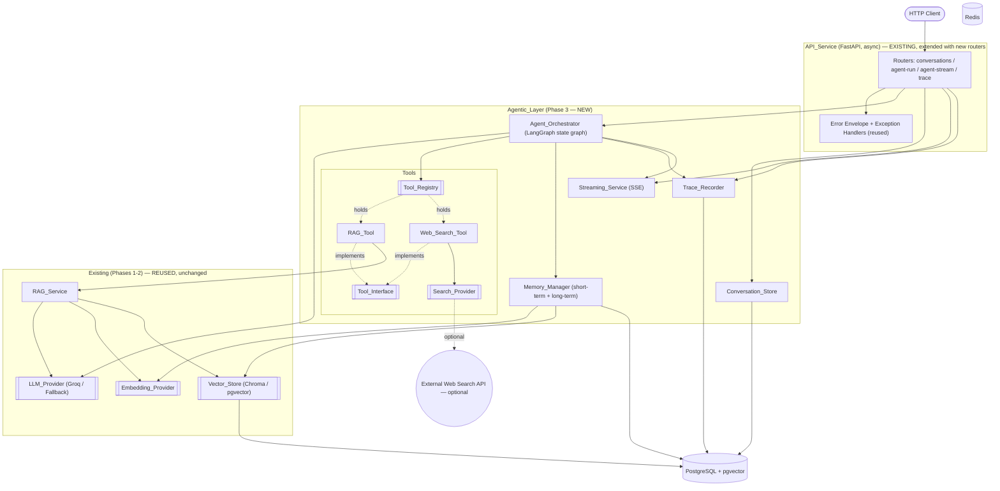
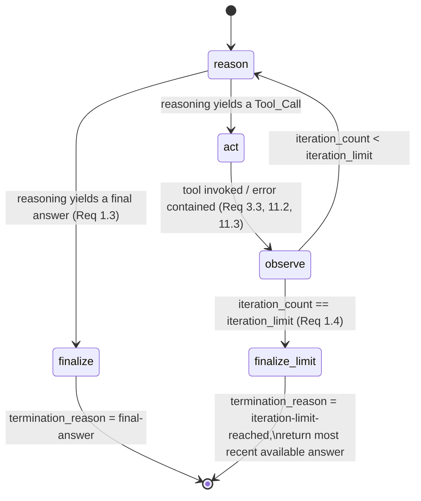

# Design Document

## Overview

This design covers **Phase 3 (Agentic Layer)** of the AgentForge platform. Phases 1
(Foundation) and 2 (Core RAG) are already built and provide the reusable, pluggable
seams this phase depends on. Phase 3 adds an **agent** that reasons in a bounded loop,
calls tools (the existing RAG pipeline and an optional web search), maintains
short-term and long-term memory, persists multi-turn conversations, streams incremental
output over Server-Sent Events (SSE), and records lightweight traces of every step.

The agentic layer is implemented on **LangGraph** (a stateful graph runtime for LLM
agents) and is exposed through the **existing** async FastAPI `API_Service` using the
**existing** uniform error envelope. It **reuses — never reimplements** — the
`LLM_Provider`, `RAG_Service`, `Embedding_Provider`, `Vector_Store`, Postgres/pgvector,
and Redis seams established in Phases 1–2, and it is deliberately structured so new
tools and new agent node types can be added **without modifying the agent core**,
setting up the later multi-agent phase (planner/researcher/writer/critic) and the later
observability phase.

Everything in this design remains **fully runnable and testable with no external
credentials**: the default `Fallback_Provider` drives deterministic reasoning and
tool selection, and the `Web_Search_Tool` reports itself disabled when no search key is
configured.

Explicitly **out of scope** (reserved for later phases and enabled — but not designed —
by the seams here): multi-agent collaboration, human-approval workflows, enterprise
auth/RBAC/multi-tenancy, cost/token analytics, the React frontend, third-party
integrations, and cloud deployment.

### Design Goals

| Goal | How this design achieves it |
| --- | --- |
| **Bounded, terminating agent loop** | The `Agent_Orchestrator` runs a LangGraph state graph whose conditional edges enforce the `Iteration_Limit` as a hard upper bound; every `Agent_Run` ends with exactly one termination reason (`final-answer` or `iteration-limit-reached`). |
| **Tool extensibility without core changes** | Tools implement a single `Tool_Interface` and are registered in a `Tool_Registry`. The orchestrator only ever talks to the registry, so a new tool is "implement + register" — no orchestrator edit (Req 2.5, 12). |
| **Keyless runnability** | The default `Fallback_Provider` selects tools deterministically and produces deterministic answers; the `Web_Search_Tool` is disabled without a key; long-term memory uses the local `SentenceTransformer_Embeddings` + `Chroma_Store` defaults. The whole suite runs with zero credentials (Req 13). |
| **Reuse of existing seams** | Reasoning and tool selection go through the existing `LLM_Provider`; the `RAG_Tool` wraps the existing `RAG_Service`; long-term memory uses the existing `Embedding_Provider` + `Vector_Store`; endpoints use the existing `API_Service` + error envelope (Req 12). |
| **Sets up the multi-agent phase** | Agent nodes are plain graph nodes over a typed `AgentState`; the `Trace_Recorder` exposes an ordered `Trace` behind an interface. A later phase adds planner/researcher/writer/critic nodes and richer observability by adding nodes/consumers, not by rewriting the core (Req 10.4, 14.2). |
| **Deterministic observability** | Every `Agent_Step` is recorded by the `Trace_Recorder` with an ordinal; streamed events preserve production order and terminate with exactly one terminal event. |

### Key Design Decisions (summary)

- **LangGraph for the loop.** The reason → act → observe cycle is a small state
  machine. Modeling it as an explicit typed graph (rather than an ad-hoc `while` loop)
  makes the bound, the termination reasons, and the node boundaries first-class and
  testable, and it is the natural substrate for the later multi-agent phase.
- **Tools behind an interface + registry.** The orchestrator depends on the abstract
  `Tool_Interface`/`Tool_Registry`, mirroring the Phase 1–2 "interfaces at the seams"
  rule. New capabilities never touch the core.
- **Reuse, don't reinvent.** The `LLM_Provider`, `RAG_Service`, `Embedding_Provider`,
  and `Vector_Store` are consumed as-is. This keeps behavior consistent and preserves
  the keyless promise.
- **Deterministic fallback everywhere.** Tool selection and answer generation both go
  through the `LLM_Provider`; when it is the `Fallback_Provider`, selection and output
  are a pure function of the run state, which is what makes property-based testing of
  the loop, streaming order, and determinism possible.

A dedicated **Design Decisions & Why** section at the end records the full rationale for
learning purposes (Req 14).

## Architecture

### High-Level Architecture

The new Phase 3 components sit on top of the existing platform. New components are
grouped in the `Agentic_Layer`; everything in the `Existing (Phases 1-2)` group is
reused unchanged.



**How the new pieces connect to the existing platform:**

- `Agent_Orchestrator` uses the **existing** `LLM_Provider` for both reasoning and tool
  selection (Req 3.1, 12.1) — it introduces **no** new text-generation implementation.
- `RAG_Tool` delegates to the **existing** `RAG_Service` (Req 4.2, 12.2).
- `Memory_Manager` long-term store uses the **existing** `Embedding_Provider` +
  `Vector_Store` (Req 7.1, 7.5, 12.3).
- `Conversation_Store` and `Trace_Recorder` persist to the **existing** Postgres
  instance via new tables added through the **existing** migration runner.
- All endpoints are added to the **existing** `API_Service` and use the **existing**
  error envelope (Req 12.4).

### Layering and Dependency Rule

Phase 3 follows the same inward dependency rule as Phases 1–2: **core logic depends on
interfaces, never on concrete implementations.**

1. **Transport layer** (`API_Service`) — new routers, request/response schemas. Knows
   nothing about LangGraph internals or which tool/LLM is active.
2. **Agent core** (`Agent_Orchestrator`, graph nodes, `AgentState`) — pure orchestration
   over the abstract `Tool_Registry`, `LLM_Provider`, `Memory_Manager`,
   `Trace_Recorder`, and `Streaming_Service` seams.
3. **Adapter layer** — concrete tools (`RAG_Tool`, `Web_Search_Tool`), concrete
   `Search_Provider`, concrete memory/conversation/trace stores.
4. **Infrastructure** — Postgres + pgvector, Redis, and the reused Phase 1–2 providers.

The **existing** `config/container.py` composition root is extended to wire the new
graph exactly as it wires the RAG object graph today — the agent core never constructs
its own providers.

### Repository / Module Layout

New Phase 3 modules follow the Phase 1–2 convention: every `base.py` holds an abstract
contract; sibling files hold concrete implementations; only `config/container.py`
references concrete classes.

```text
src/agentforge/
├── main.py                       # EXTENDED: register new routers (agent, conversations, trace)
├── config/
│   ├── settings.py               # EXTENDED: iteration_limit, memory_size_budget, search_* settings
│   └── container.py              # EXTENDED: build_agent_context() wires the new graph
├── agent/                        # NEW — the agent core
│   ├── state.py                  # AgentState (typed run state) + TerminationReason
│   ├── orchestrator.py           # Agent_Orchestrator: builds & runs the LangGraph graph
│   ├── graph.py                  # node functions (reason / act / observe) + edge routing
│   └── selection.py              # Tool_Call parsing from LLM text + deterministic fallback selection
├── tools/                        # NEW — tool interface, registry, built-in tools
│   ├── base.py                   # Tool_Interface (ABC), Tool_Call, Tool_Result, ToolError
│   ├── registry.py               # Tool_Registry (duplicate-name rejection, resolve, list specs)
│   ├── rag_tool.py               # RAG_Tool (wraps existing RAG_Service)
│   ├── web_search_tool.py        # Web_Search_Tool (graceful degradation)
│   └── search/
│       ├── base.py               # Search_Provider (ABC) + SearchResult
│       └── disabled.py           # Disabled_Search_Provider (keyless default, no network)
├── memory/                       # NEW — short-term + long-term memory
│   ├── base.py                   # Memory_Manager (ABC), MemoryError, MemoryEntry
│   ├── short_term.py             # Short_Term_Memory (Size_Budget FIFO)
│   └── long_term.py              # Long_Term_Memory (Embedding_Provider + Vector_Store)
├── conversation/                 # NEW — persistent multi-turn history
│   ├── base.py                   # Conversation_Store (ABC), Conversation, Message
│   └── store.py                  # PgConversation_Store (Postgres-backed)
├── streaming/                    # NEW — SSE streaming
│   ├── base.py                   # Streaming_Service (ABC), StreamEvent, StreamEventType
│   └── sse.py                    # SSE_Streaming_Service (event serialization + terminal guarantee)
└── tracing/                      # NEW — lightweight observability
    ├── base.py                   # Trace_Recorder (ABC), Trace, Trace_Entry
    └── recorder.py               # In-memory + Postgres-backed recorder

migrations/                       # EXTENDED (same runner, same templating)
├── 0003_create_conversations.sql # conversations + messages tables
└── 0004_create_agent_traces.sql  # agent_runs + trace_entries tables
```

**Interfaces vs implementations:** the agent core imports only from `base.py` modules.
Concrete tools, search providers, memory/conversation/trace stores are referenced solely
by `config/container.py`, so a new tool or node type is added by implementing an
interface and registering it — never by editing `orchestrator.py` (Req 2.5, 14.2).

## Components and Interfaces

### Agent_Orchestrator and the LangGraph State Graph (`agent/`)

The `Agent_Orchestrator` builds and runs a LangGraph `StateGraph` over a typed
`AgentState`. The graph alternates three node types — **reason**, **act** (tool call),
and **observe** — until a reasoning step decides no further tool is needed (→
`final-answer`) or the completed-cycle count reaches the `Iteration_Limit` (→
`iteration-limit-reached`) (Req 1.1, 1.3, 1.4, 1.7).

#### AgentState (`agent/state.py`)

`AgentState` is the explicit run state carried across every `Agent_Step` (Req 1.2). It
is a typed structure (a `TypedDict`/dataclass usable as LangGraph state):

```python
class TerminationReason(str, Enum):
    FINAL_ANSWER = "final-answer"
    ITERATION_LIMIT_REACHED = "iteration-limit-reached"


@dataclass
class Observation:
    """One recorded outcome fed back into the loop."""
    kind: str            # "tool_result" | "tool_not_found" | "validation_error" | "tool_execution_error"
    tool_name: str | None
    content: str


@dataclass
class AgentState:
    run_id: str
    conversation_id: str
    user_request: str                       # the current user request (never evicted)
    conversation_context: list[Message]     # prior turns loaded from Conversation_Store
    observations: list[Observation]          # accumulated observations (scratchpad)
    iteration_count: int = 0                 # non-negative; +1 per completed cycle (Req 1.2)
    iteration_limit: int = 10                # resolved bound for this run (Req 1.5)
    pending_tool_call: Tool_Call | None = None
    final_answer: str | None = None
    termination_reason: TerminationReason | None = None
    invalid_limit_flagged: bool = False      # set when configured limit was invalid (Req 1.6)
```

Key invariants enforced by the graph:

- `iteration_count` starts at 0, is a non-negative integer, and increments by **exactly
  1** after each completed reason → act → observe cycle (Req 1.2).
- `iteration_count` **never exceeds** `iteration_limit` (Req 1.4, 11.1).
- On termination exactly one of `{FINAL_ANSWER, ITERATION_LIMIT_REACHED}` is set
  (Req 1.7).

#### Nodes and Edges (`agent/graph.py`, `agent/orchestrator.py`)

- **reason node** — presents the available tool specs (name/description/input schema)
  and the current state to the `LLM_Provider`, and asks for either a final answer or a
  `Tool_Call` (Req 3.1). It parses the provider's text output into a structured decision
  (see `agent/selection.py`). Emits a `step` event and a `Trace_Entry`.
- **act node** — validates the `Tool_Call` arguments against the resolved tool's input
  schema, then invokes the tool via the `Tool_Registry`. Emits a `tool_call` event and a
  `Trace_Entry` recording the tool name + outcome (Req 3.2, 10.2, 11.2, 11.4).
- **observe node** — records the `Tool_Result` (or an error observation) into
  `state.observations`, increments `iteration_count` by 1, and loops back to reason
  (Req 3.3).

**Conditional routing** (the bound enforcement):



The bound is enforced **structurally**: after `observe` increments the counter, the
conditional edge routes to `finalize_limit` the instant `iteration_count ==
iteration_limit`, so a new reason → act → observe cycle can never push the count past the
limit (Req 1.4, 11.1). LangGraph's own `recursion_limit` is also set as a defensive
backstop derived from `iteration_limit`, but correctness does not rely on it.

#### Iteration_Limit resolution (Req 1.5, 1.6)

The orchestrator obtains the limit from the `Configuration_Manager` and normalizes it:

```python
DEFAULT_ITERATION_LIMIT = 10
MIN_ITERATION_LIMIT, MAX_ITERATION_LIMIT = 1, 100

def resolve_iteration_limit(configured: object | None) -> tuple[int, bool]:
    """Return (limit, invalid_flag). Invalid or absent -> default 10 (Req 1.5, 1.6)."""
    if configured is None:
        return DEFAULT_ITERATION_LIMIT, False
    if isinstance(configured, int) and not isinstance(configured, bool) \
            and MIN_ITERATION_LIMIT <= configured <= MAX_ITERATION_LIMIT:
        return configured, False
    return DEFAULT_ITERATION_LIMIT, True   # rejected; default applied + flagged (Req 1.6)
```

When the configured value is invalid, the run proceeds with the default 10 and records
`invalid_limit_flagged = True` (surfaced in the trace) (Req 1.6).

### Tool_Interface, Tool_Call, Tool_Result (`tools/base.py`)

```python
@dataclass(frozen=True)
class Tool_Spec:
    name: str
    description: str
    input_schema: dict            # JSON-Schema describing arguments

@dataclass(frozen=True)
class Tool_Call:
    tool_name: str
    arguments: dict

@dataclass(frozen=True)
class Tool_Result:
    tool_name: str
    ok: bool
    content: str
    data: dict = field(default_factory=dict)   # structured payload (e.g. citations)

class ToolError(RuntimeError):
    """Raised by a Tool's invoke() on execution failure (contained by the orchestrator)."""

class Tool_Interface(ABC):
    @property
    @abstractmethod
    def name(self) -> str: ...
    @property
    @abstractmethod
    def description(self) -> str: ...
    @property
    @abstractmethod
    def input_schema(self) -> dict:
        """JSON-Schema for arguments; used for validation before invoke (Req 11.2, 11.4)."""
    @property
    def available(self) -> bool:
        """Whether this tool is currently usable (e.g. web search with a key). Default True."""
        return True
    @abstractmethod
    def invoke(self, arguments: dict) -> Tool_Result:
        """Execute the tool. Raise ToolError on failure (Req 11.3)."""
```

The interface declares a name, description, input schema, and invoke operation
independently of any concrete tool (Req 2.1).

### Tool_Registry (`tools/registry.py`)

```python
class DuplicateToolNameError(RuntimeError):
    """Raised when registering a tool under an already-registered name (Req 2.4)."""

class Tool_Registry:
    def register(self, tool: Tool_Interface) -> None:
        """Register under the tool's unique name; reject duplicates (Req 2.2, 2.4)."""
    def resolve(self, name: str) -> Tool_Interface | None:
        """Return the tool registered under name, or None if unknown (Req 2.2, 3.4)."""
    def list_specs(self) -> list[Tool_Spec]:
        """Return name/description/input_schema of each AVAILABLE tool (Req 2.3, 3.1)."""
```

- `register` rejects a duplicate name with `DuplicateToolNameError` and does not overwrite
  the existing tool (Req 2.4).
- `resolve` returns the tool by name, or `None` so the orchestrator can emit a
  `tool-not-found` observation (Req 3.4).
- `list_specs` returns specs for **available** tools only, so a disabled `Web_Search_Tool`
  is not offered to the LLM as a callable option (Req 2.3, 5.3, 5.4).
- A new tool is added by implementing `Tool_Interface` and calling `register` — the
  `Agent_Orchestrator` is untouched (Req 2.5).

### Tool selection with a text LLM (`agent/selection.py`)

The existing `LLM_Provider.generate(prompt) -> GenerationResult` returns **text**, not a
structured tool call. Selection therefore has two cooperating parts:

1. **Prompt construction.** The reason node builds a prompt containing the user request,
   the accumulated observations, and a serialized list of available `Tool_Spec`s
   (name + description + input schema), plus a fixed instruction describing the expected
   response shape: either a final answer or a single tool call encoded as a small JSON
   object `{"action": "tool", "tool": "<name>", "arguments": { ... }}` or
   `{"action": "final", "answer": "..."}` (Req 3.1).
2. **Parsing.** `parse_decision(text)` extracts the first well-formed JSON decision
   object from the provider's text. A parsed `{"action":"tool", ...}` becomes a
   `Tool_Call`; `{"action":"final", ...}` becomes a final answer. If nothing parseable
   is found, the decision defaults to a final answer using the text as-is (so a plain
   text provider still terminates cleanly).

**Deterministic fallback selection (Req 3.5, 1.8).** When the active provider is the
`Fallback_Provider`, its text output is a pure function of the prompt. To make tool
selection *useful* yet deterministic and keyless, the fallback selection strategy is a
pure function of the run state:

- On the **first** reasoning step, if the `RAG_Tool` is registered and available, select
  it with `arguments = {"query": user_request}` (ground the answer in the knowledge base).
- After a `RAG_Tool` observation has been recorded, select **final answer**, composing
  the answer deterministically from the recorded observations (via the `Fallback_Provider`
  over the grounding prompt).
- If no tools are available, select **final answer** immediately.

This strategy lives behind a `Selection_Strategy` seam so the LLM-driven path and the
deterministic fallback path share the reason node. Identical inputs therefore yield an
identical sequence of tool calls and an identical final answer (Req 1.8, 3.5).

### RAG_Tool (`tools/rag_tool.py`)

Wraps the existing `RAG_Service` and does **not** reimplement retrieval or generation
(Req 4.2, 12.2).

```python
class RAG_Tool(Tool_Interface):
    name = "rag_search"
    description = "Answer a question grounded in the ingested knowledge base, with citations."
    input_schema = {
        "type": "object",
        "properties": {
            "query": {"type": "string", "minLength": 1},
            "top_k": {"type": "integer", "minimum": 1, "maximum": 10},
        },
        "required": ["query"],
    }
    def __init__(self, rag_service: RAG_Service) -> None: ...
    def invoke(self, arguments: dict) -> Tool_Result:
        answer = self._rag.answer(arguments["query"], arguments.get("top_k"))
        return Tool_Result(
            tool_name=self.name, ok=True, content=answer.text,
            data={"citations": [asdict(c) for c in answer.citations],
                  "grounded": answer.grounded, "provider": answer.provider},
        )
```

- Input schema accepts a query string and optional result count (Req 4.1).
- Returns the grounded answer text **and** the associated citations (Req 4.3).
- With no LLM credential, `RAG_Service` already runs through the `Fallback_Provider`, so
  the `RAG_Tool` returns a deterministic grounded result keylessly (Req 4.4).

### Web_Search_Tool and Search_Provider (`tools/web_search_tool.py`, `tools/search/`)

```python
@dataclass(frozen=True)
class SearchResult:
    title: str
    url: str
    snippet: str

class Search_Provider(ABC):
    @property
    @abstractmethod
    def available(self) -> bool: ...
    @abstractmethod
    def search(self, query: str) -> list[SearchResult]: ...

class Disabled_Search_Provider(Search_Provider):
    """Keyless default: never performs a network request (Req 5.4)."""
    available = False
    def search(self, query: str) -> list[SearchResult]:
        raise RuntimeError("web search is disabled")   # never called; tool guards on availability
```

```python
class Web_Search_Tool(Tool_Interface):
    name = "web_search"
    description = "Search the public web for information beyond the knowledge base."
    input_schema = {"type": "object",
                    "properties": {"query": {"type": "string", "minLength": 1}},
                    "required": ["query"]}
    def __init__(self, provider: Search_Provider) -> None: ...
    @property
    def available(self) -> bool:
        return self._provider.available            # disabled when no key (Req 5.4)
    def invoke(self, arguments: dict) -> Tool_Result:
        if not self._provider.available:
            return Tool_Result(self.name, ok=False,
                               content="web search is unavailable")   # Req 5.5
        results = self._provider.search(arguments["query"])
        return Tool_Result(self.name, ok=True, content=_format(results),
                           data={"results": [asdict(r) for r in results]})
```

- The tool performs searches through a pluggable `Search_Provider` selected by the
  `Configuration_Manager` (Req 5.2).
- **Registration policy:** `build_agent_context` registers the `Web_Search_Tool` only
  when a search credential is present (a real `Search_Provider`). When no key is
  configured, the tool is either not registered or registered as **unavailable**, so
  `Tool_Registry.list_specs()` never offers it, it performs **no** network request, and a
  direct invocation returns a `Tool_Result` indicating web search is unavailable
  (Req 5.3, 5.4, 5.5).

### Memory_Manager (`memory/`)

The `Memory_Manager` provides short-term (within-run working context) and long-term
(cross-conversation, semantic) memory to the orchestrator.

```python
class MemoryError(RuntimeError):
    """Raised when Short_Term_Memory cannot be initialized/satisfied (Req 6.3, 6.6)."""

@dataclass
class MemoryEntry:
    id: str
    text: str
    metadata: dict

class Memory_Manager(ABC):
    # --- short-term ---
    @abstractmethod
    def init_short_term(self, user_request: str, size_budget: object) -> None:
        """Validate Size_Budget; reject absent/non-numeric/<=0 (Req 6.2, 6.3)."""
    @abstractmethod
    def add_short_term(self, entry: str) -> None:
        """Add a working-context entry; FIFO-evict to satisfy the budget (Req 6.4, 6.5)."""
    @abstractmethod
    def short_term_entries(self) -> list[str]:
        """Return retained working context (current user request always present)."""
    # --- long-term ---
    @abstractmethod
    def persist_long_term(self, text: str, metadata: dict) -> str:
        """Store an entry as an embedding via Embedding_Provider + Vector_Store (Req 7.1, 7.5)."""
    @abstractmethod
    def retrieve_long_term(self, query: str, k: int) -> list[MemoryEntry]:
        """Return <= K entries ordered by descending similarity; [] if none (Req 7.2-7.4)."""
```

**Short-term memory (`memory/short_term.py`).**

- Maintains recent messages + agent scratchpad for the run (Req 6.1), obtaining the
  `Size_Budget` (a positive token/character count) from the `Configuration_Manager` at
  run start (Req 6.2).
- **Validation:** if the `Size_Budget` is absent, non-numeric, or `<= 0`,
  `init_short_term` raises `MemoryError` and **no** short-term memory is maintained
  (Req 6.3).
- **Size measurement:** a pluggable `size_fn` (default: character count) measures entry
  size; the invariant is that after every `add`/`evict` the total retained size is
  `<= Size_Budget` (Req 6.5).
- **FIFO eviction:** when adding would exceed the budget, evict working-context entries
  oldest-first, **excluding the current user request**, until the total is within budget
  (Req 6.4). The current user request is retained through every add/evict (Req 6.5).
- **Request-alone-exceeds-budget:** if, after evicting all other entries, the current
  user request alone still exceeds the budget, retain the request and raise/emit a
  `MemoryError` indicating the budget cannot be satisfied by the request (Req 6.6). The
  request is never dropped.

**Long-term memory (`memory/long_term.py`).**

- Persists an entry by embedding its text through the existing `Embedding_Provider` and
  upserting into the existing `Vector_Store` (Req 7.1, 7.5) — no re-implementation of
  embedding or vector storage.
- Retrieves by embedding the query and calling `Vector_Store.query(vec, k)`, returning at
  most K `MemoryEntry` records ordered by descending similarity (Req 7.2, 7.3); returns
  `[]` when nothing has been stored (Req 7.4).
- Long-term entries reuse a dedicated namespace/`document_id` prefix (e.g.
  `ltm:<conversation_id>`) so they coexist with RAG chunks in the same `Vector_Store`
  without collision.

### Conversation_Store (`conversation/`)

```python
@dataclass
class Message:
    role: str          # "user" | "assistant" | "tool" | "system"
    content: str
    position: int      # ordinal position within the conversation (0-based, ascending)

@dataclass
class Conversation:
    id: str
    messages: list[Message]

class Conversation_Store(ABC):
    @abstractmethod
    def create(self) -> str:
        """Create a Conversation with a unique id in Postgres; return the id (Req 8.1)."""
    @abstractmethod
    def append(self, conversation_id: str, role: str, content: str) -> Message:
        """Append a Message with role/content/next ordinal; auto-create unknown id (Req 8.2, 8.4)."""
    @abstractmethod
    def history(self, conversation_id: str) -> list[Message]:
        """Return messages ordered by ascending ordinal position (Req 8.3)."""
```

- `create` inserts a `conversations` row with a generated UUID (Req 8.1).
- `append` computes the next ordinal position as `max(position)+1` within the
  conversation and inserts a `messages` row with role, content, and position (Req 8.2).
- **Auto-create on unknown id:** if `append` targets a conversation id that does not
  exist, the store first creates a conversation with that id, then persists the message
  (Req 8.4).
- `history` returns messages in ascending ordinal order (Req 8.3).
- When an `Agent_Run` completes, the orchestrator appends the final assistant message
  through this store (Req 8.5).

### Streaming_Service (`streaming/`)

```python
class StreamEventType(str, Enum):
    STEP = "step"
    TOOL_CALL = "tool_call"
    DELTA = "delta"
    COMPLETION = "completion"     # terminal
    ERROR = "error"              # terminal

@dataclass
class StreamEvent:
    type: StreamEventType
    data: dict
    sequence: int                # monotonic, preserves production order (Req 9.4)

class Streaming_Service(ABC):
    @abstractmethod
    def run_stream(self, run_input: AgentRunInput) -> Iterator[StreamEvent]:
        """Yield events in production order; exactly one terminal event, then close."""
```

- Opens an SSE stream and emits the **first** event within 5 seconds of accepting the
  request (Req 9.1) — an initial `step` event is emitted as soon as the graph starts,
  before any slow work.
- Emits each unit of incremental output as a separate SSE event as it is produced,
  without waiting for the run to finish (Req 9.2).
- Every event carries exactly one type from `{step, tool_call, delta, completion, error}`
  (Req 9.3); intermediate steps and tool calls are emitted as `step`/`tool_call` events
  (Req 9.5).
- Events are emitted in production order and that order is preserved end-to-end via the
  monotonic `sequence` field (Req 9.4).
- **Terminal-event guarantee:** each stream emits **exactly one** terminal event —
  `completion` on success (Req 9.6) **xor** `error` on failure (Req 9.8) — and then
  closes (Req 9.9). An `error` stream never also emits `completion` (Req 9.8).
- Under the `Fallback_Provider`, the produced event sequence is deterministic: two runs
  with identical input yield identical ordered event sequences (Req 9.7).

The SSE serialization uses FastAPI's `StreamingResponse` with
`media_type="text/event-stream"`; each `StreamEvent` becomes an SSE frame
`event: <type>\ndata: <json>\n\n`. The orchestrator drives the stream by yielding events
from the graph node callbacks (reason → `step`, act → `tool_call`, token output →
`delta`), and the service wraps the generator to guarantee the single terminal event
even if the underlying generator raises (translating the exception into one `error`
event).

### Trace_Recorder (`tracing/`)

```python
@dataclass
class Trace_Entry:
    run_id: str
    ordinal: int                 # ascending position within the run (Req 10.1, 10.3)
    step_type: str               # "reason" | "tool_call" | "observe"
    tool_name: str | None        # set for tool_call entries (Req 10.2)
    outcome: str | None          # tool invocation outcome (Req 10.2)
    detail: dict

@dataclass
class Trace:
    run_id: str
    entries: list[Trace_Entry]   # ordered by ordinal (Req 10.3)

class Trace_Recorder(ABC):
    @abstractmethod
    def record(self, run_id: str, step_type: str, *,
               tool_name: str | None = None, outcome: str | None = None,
               detail: dict | None = None) -> Trace_Entry:
        """Append a Trace entry with the next ordinal for the run (Req 10.1, 10.2)."""
    @abstractmethod
    def get_trace(self, run_id: str) -> Trace:
        """Return the ordered Trace for a run (Req 10.3, 10.4)."""
```

- Records a `Trace_Entry` for each executing `Agent_Step` with step type, run id, and
  ordinal (Req 10.1).
- Records the tool name and invocation outcome for each tool call (Req 10.2).
- `get_trace` returns entries ordered by ordinal (Req 10.3).
- The `Trace` is exposed through this interface so a later observability phase can consume
  it **without modifying the Agent_Orchestrator** (Req 10.4). A default in-memory recorder
  keeps the keyless path free; a Postgres-backed recorder persists entries for later
  inspection.

### Composition Root Extension (`config/container.py`)

A new `build_agent_context` mirrors the existing `build_app_context`: it reuses the
existing `AppContext` (RAG_Service, Embedding_Provider, Vector_Store, LLM_Provider) and
wires the new agent object graph. All collaborators are injectable so tests pass keyless
in-memory doubles.

```python
@dataclass
class AgentContext:
    app: AppContext                       # the existing wired RAG graph (reused)
    tool_registry: Tool_Registry
    memory_manager: Memory_Manager
    conversation_store: Conversation_Store
    trace_recorder: Trace_Recorder
    streaming_service: Streaming_Service
    orchestrator: Agent_Orchestrator

def build_agent_context(settings: Settings, app: AppContext | None = None, **overrides) -> AgentContext:
    app = app or build_app_context(settings)
    registry = Tool_Registry()
    registry.register(RAG_Tool(app.rag_service))                 # always available (Req 4)
    search = build_search_provider(settings)                     # Disabled_Search_Provider by default
    if search.available:                                         # register only when keyed (Req 5.3)
        registry.register(Web_Search_Tool(search))
    memory = Long_And_Short_Memory(app.embedding_provider, app.vector_store, settings)
    ...
    orchestrator = Agent_Orchestrator(
        llm=app.llm_provider, registry=registry, memory=memory,
        trace=trace_recorder, iteration_limit=resolve_iteration_limit(settings.iteration_limit)[0],
    )
    return AgentContext(app=app, tool_registry=registry, ...)
```

`main.py` is extended to build the `AgentContext` at startup (respecting a pre-injected
context for tests) and register the new routers — exactly the pattern used for the RAG
context today.

### New Settings (`config/settings.py`)

Added to the existing `Settings` (all optional / defaulted, preserving keyless boot):

```python
iteration_limit: int | None = None            # resolved to 1..100, default 10 (Req 1.5, 1.6)
memory_size_budget: int | None = None          # positive token/char budget (Req 6.2, 6.3)
search_provider: Literal["disabled", "tavily", ...] = "disabled"
search_api_key: SecretStr | None = None        # optional; absence disables web search (Req 5.4)

def active_search(self) -> str:
    return self.search_provider if self.search_api_key else "disabled"
```

## Data Models

### Agent domain models (`agent/state.py`, `tools/base.py`, etc.)

Summarized above: `AgentState`, `Observation`, `TerminationReason`, `Tool_Spec`,
`Tool_Call`, `Tool_Result`, `SearchResult`, `MemoryEntry`, `Message`, `Conversation`,
`StreamEvent`, `Trace_Entry`, `Trace`. These are plain framework-agnostic dataclasses
(consistent with `models/domain.py`), depending on neither FastAPI nor SQLAlchemy.

### PostgreSQL Schema (new migrations)

New migrations use the **existing** runner (`db/migrations.py`), which tracks applied
ids in `schema_migrations` and runs on startup, halting on failure with the failing id.

```sql
-- 0003_create_conversations.sql
CREATE TABLE IF NOT EXISTS conversations (
    id          UUID PRIMARY KEY,
    created_at  TIMESTAMPTZ NOT NULL DEFAULT now()
);

CREATE TABLE IF NOT EXISTS messages (
    id               UUID PRIMARY KEY,
    conversation_id  UUID NOT NULL REFERENCES conversations(id) ON DELETE CASCADE,
    role             TEXT NOT NULL,          -- user | assistant | tool | system
    content          TEXT NOT NULL,
    position         INTEGER NOT NULL,        -- ordinal within the conversation (Req 8.2, 8.3)
    created_at       TIMESTAMPTZ NOT NULL DEFAULT now(),
    UNIQUE (conversation_id, position)
);

CREATE INDEX IF NOT EXISTS messages_conversation_pos_idx
    ON messages (conversation_id, position);
```

```sql
-- 0004_create_agent_traces.sql
CREATE TABLE IF NOT EXISTS agent_runs (
    id               UUID PRIMARY KEY,
    conversation_id  UUID REFERENCES conversations(id) ON DELETE CASCADE,
    termination_reason TEXT,                  -- final-answer | iteration-limit-reached (Req 1.7)
    created_at       TIMESTAMPTZ NOT NULL DEFAULT now()
);

CREATE TABLE IF NOT EXISTS trace_entries (
    id         UUID PRIMARY KEY,
    run_id     UUID NOT NULL REFERENCES agent_runs(id) ON DELETE CASCADE,
    ordinal    INTEGER NOT NULL,              -- ascending within the run (Req 10.1, 10.3)
    step_type  TEXT NOT NULL,                 -- reason | tool_call | observe
    tool_name  TEXT,                          -- set for tool_call entries (Req 10.2)
    outcome    TEXT,                          -- invocation outcome (Req 10.2)
    detail     JSONB NOT NULL DEFAULT '{}'::jsonb,
    UNIQUE (run_id, ordinal)
);

CREATE INDEX IF NOT EXISTS trace_entries_run_ordinal_idx
    ON trace_entries (run_id, ordinal);
```

Long-term memory does **not** introduce a new vector table: it reuses the existing
`Vector_Store` (Chroma locally, `chunk_embeddings` in production), storing entries under
a long-term-memory namespace so no schema change to the vector store is required
(Req 7.5).

### API request/response schemas (`api/schemas.py`, extended)

New typed Pydantic models (consistent with the existing `QueryRequest`/`QueryResponse`
style) back the new endpoints — see **API Endpoints** below.


## API Endpoints

All new endpoints are added to the **existing** `API_Service`, use typed Pydantic
request/response models, and render errors through the **existing** uniform error
envelope `{ "error": { "code", "message", "details" } }` (Req 12.4). New routers live in
`api/routers/` (`conversations.py`, `agent.py`) and are registered in `main.py`.

### `POST /conversations` — Create a conversation

- Request: empty body.
- Success `201`: `{ "conversation_id": "…" }` (Req 8.1).

### `POST /conversations/{id}/messages` — Append a message

- Request: `{ "role": "user" | "assistant" | "tool" | "system", "content": "…" }`.
- Success `201`: the persisted message `{ "role", "content", "position" }` (Req 8.2).
- If `{id}` does not exist, the conversation is auto-created and the message persisted
  (Req 8.4) — still `201`.

### `GET /conversations/{id}` — Conversation history

- Success `200`: `{ "conversation_id", "messages": [ { "role", "content", "position" } ] }`
  ordered by ascending `position` (Req 8.3).

### `POST /agent/run` — Run the agent (non-streaming)

- Request:
  ```json
  { "conversation_id": "…", "message": "…" }
  ```
  `conversation_id` optional; when absent a new conversation is created.
- Behavior: appends the user message, executes a bounded `Agent_Run`, persists the final
  assistant message (Req 8.5), and returns the result.
- Success `200`:
  ```json
  {
    "run_id": "…",
    "conversation_id": "…",
    "answer": "…",
    "termination_reason": "final-answer",
    "citations": [ { "document_id": "…", "chunk_id": "…" } ]
  }
  ```
  `termination_reason` is exactly one of `final-answer` / `iteration-limit-reached`
  (Req 1.7).

### `POST /agent/stream` — Run the agent (streaming, SSE)

- Request: same shape as `/agent/run`.
- Response: `text/event-stream`. Emits the first event within 5 s (Req 9.1); each event
  is one of `{step, tool_call, delta, completion, error}` (Req 9.3) in production order
  (Req 9.4); exactly one terminal event (`completion` xor `error`) then the stream closes
  (Req 9.6, 9.8, 9.9). Under the `Fallback_Provider` the event sequence is deterministic
  (Req 9.7).
- SSE frame example:
  ```text
  event: step
  data: {"sequence": 0, "step_type": "reason"}

  event: tool_call
  data: {"sequence": 1, "tool": "rag_search", "arguments": {"query": "…"}}

  event: completion
  data: {"sequence": 4, "answer": "…", "termination_reason": "final-answer"}
  ```

### `GET /agent/runs/{run_id}/trace` — Retrieve an agent run trace

- Success `200`:
  ```json
  {
    "run_id": "…",
    "entries": [
      { "ordinal": 0, "step_type": "reason", "tool_name": null, "outcome": null },
      { "ordinal": 1, "step_type": "tool_call", "tool_name": "rag_search", "outcome": "ok" }
    ]
  }
  ```
  Entries ordered by ascending `ordinal` (Req 10.3), exposed through the `Trace_Recorder`
  interface for the later observability phase (Req 10.4).
- Unknown `run_id` → `404 not_found` via the existing envelope.


## Correctness Properties

*A property is a characteristic or behavior that should hold true across all valid
executions of a system — essentially, a formal statement about what the system should
do. Properties serve as the bridge between human-readable specifications and
machine-verifiable correctness guarantees.*

The properties below were derived from the acceptance criteria via the prework analysis,
then consolidated to remove redundancy (e.g. the iteration bound of Req 1.4 and Req 11.1
are one property; the streaming ordering/labeling/terminal criteria of Req 9.3–9.9 are
one property; the fallback-determinism criteria of Req 1.8, 3.5, and 9.7 are one
property). Structural, infrastructure, documentation, and one-shot criteria (interface
declarations, reuse claims, SSE timing, keyless boot, test-suite presence,
decision docs) are validated by example/integration/smoke tests instead and are listed
in the Testing Strategy. Every property is testable **keyless** through the
`Fallback_Provider` and a disabled/stub `Search_Provider`.

### Property 1: Bounded loop never exceeds the Iteration_Limit

*For any* user request, any Iteration_Limit L in [1, 100], and any selection strategy
(including one that always requests a tool), the number of completed reason-act-observe
cycles at termination is at most L, and when the loop reaches L cycles the Agent_Run
terminates with termination reason `iteration-limit-reached` and returns the most recent
available answer.

**Validates: Requirements 1.1, 1.4, 11.1**

### Property 2: Iteration counter is monotonic and increments by exactly one

*For any* Agent_Run, the `iteration_count` begins at 0, is always a non-negative integer,
and increases by exactly 1 after each completed reason-act-observe cycle (never skips,
never decreases).

**Validates: Requirements 1.2**

### Property 3: Every run terminates with exactly one termination reason

*For any* Agent_Run, the run terminates with the `termination_reason` set to exactly one
value from the set {`final-answer`, `iteration-limit-reached`} — never unset and never
both.

**Validates: Requirements 1.3, 1.7**

### Property 4: Iteration_Limit resolution

*For any* configured Iteration_Limit value, the resolved limit equals that value when it
is an integer in [1, 100]; when the value is absent it resolves to the default 10 with no
invalid flag; and when the value is a non-integer, a boolean, or an integer outside
[1, 100], it resolves to the default 10 and the invalid-limit indication is recorded.

**Validates: Requirements 1.5, 1.6**

### Property 5: Tool registry register/resolve/list round-trip

*For any* set of tools with pairwise-distinct names, after registering all of them the
registry resolves each name back to the exact tool registered, returns `None` for any
unregistered name, and `list_specs()` returns exactly the name, description, and input
schema of each registered available tool.

**Validates: Requirements 2.2, 2.3**

### Property 6: Duplicate tool-name registration is rejected

*For any* registered tool and any second tool sharing its name, registering the second
tool raises a duplicate-tool-name error and leaves the originally registered tool
resolvable and unchanged.

**Validates: Requirements 2.4**

### Property 7: Successful tool dispatch records an observation and continues

*For any* reasoning step that produces a Tool_Call naming a registered tool with valid
arguments, the orchestrator resolves and invokes that tool and records its Tool_Result as
an observation in the run state, and the loop continues rather than terminating on that
step.

**Validates: Requirements 3.2, 3.3**

### Property 8: Unregistered tool calls are contained

*For any* Tool_Call naming a tool that is not registered, the orchestrator records a
`tool-not-found` observation and continues the Agent_Run without terminating on that
step.

**Validates: Requirements 3.4**

### Property 9: A tool is invoked if and only if its arguments conform to the schema

*For any* Tool_Call, the named tool's `invoke` is called exactly when the provided
arguments conform to the tool's input schema; when the arguments do not conform, `invoke`
is never called, a `validation-error` observation is recorded, and the loop continues.

**Validates: Requirements 11.2, 11.4**

### Property 10: Tool execution errors are contained

*For any* tool whose `invoke` raises an error during a run, the orchestrator records a
`tool-execution-error` observation and continues the Agent_Run to a normal termination
without crashing the process.

**Validates: Requirements 11.3**

### Property 11: Disabled web search returns an unavailable result without network access

*For any* query, when the Web_Search_Tool is disabled (no search credential), invoking it
returns a Tool_Result indicating web search is unavailable and performs no external
network request.

**Validates: Requirements 5.4, 5.5**

### Property 12: RAG_Tool mirrors the RAG_Service answer and citations

*For any* grounded answer produced by the RAG_Service, the RAG_Tool's Tool_Result content
equals the answer text and carries exactly the answer's citations, without altering or
inventing citations.

**Validates: Requirements 4.3**

### Property 13: Short-term memory size invariant with request retention and FIFO eviction

*For any* valid positive Size_Budget and any sequence of add operations, after each
operation the current user request remains present and the total retained size is less
than or equal to the Size_Budget; when an add would exceed the budget, working-context
entries are evicted oldest-first (FIFO) excluding the current user request; and if the
current user request alone exceeds the budget after all other entries are evicted, the
request is retained and a budget-cannot-be-satisfied indication is produced.

**Validates: Requirements 6.4, 6.5, 6.6**

### Property 14: Invalid Size_Budget is rejected

*For any* Size_Budget value that is absent, non-numeric, or less than or equal to zero,
initializing the Short_Term_Memory produces an error indication and no Short_Term_Memory
is maintained.

**Validates: Requirements 6.3**

### Property 15: Long-term memory top-K bound and ordering

*For any* set of stored Long_Term_Memory entries, any query, and any requested count K,
retrieval returns exactly `min(K, stored_count)` entries ordered by non-increasing
similarity, and returns an empty result when no entries have been stored.

**Validates: Requirements 7.2, 7.3, 7.4**

### Property 16: Conversation append/history ordering with auto-create

*For any* sequence of message appends to a conversation (including the first append to a
previously unknown conversation id, which auto-creates the conversation), retrieving the
history returns exactly those messages in append order, with contiguous ascending ordinal
positions and their roles and contents preserved.

**Validates: Requirements 8.2, 8.3, 8.4**

### Property 17: Streaming emits exactly one terminal event and preserves order

*For any* Agent_Run (successful or failing), the streamed events each carry exactly one
type from {step, tool_call, delta, completion, error}, are delivered in strictly
increasing production order, and the stream ends with exactly one terminal event —
`completion` on success or `error` on failure, never both — after which the stream
closes.

**Validates: Requirements 9.3, 9.4, 9.5, 9.6, 9.8, 9.9**

### Property 18: Trace is complete and ordered by ordinal

*For any* Agent_Run, the recorded Trace contains one entry per executed Agent_Step with
contiguous ascending ordinals matching execution order, each tool-call entry carries its
tool name and invocation outcome, and `get_trace` returns the entries ordered by ordinal.

**Validates: Requirements 10.1, 10.2, 10.3**

### Property 19: Fallback determinism of answer and event sequence

*For any* two Agent_Runs with identical input executed under the Fallback_Provider with no
LLM or search credential, the runs produce an identical final answer, an identical ordered
sequence of tool calls, and an identical ordered sequence of streamed events.

**Validates: Requirements 1.8, 3.5, 9.7**

## Error Handling

The agentic layer reuses the existing uniform error envelope
`{ "error": { code, message, details } }` and the existing FastAPI exception-handler
layer (`api/errors.py`, `AppError`). In-loop failures are **contained as observations**
so a single bad step never aborts the whole Agent_Run.

| Condition | Requirement | Behavior | Surface |
| --- | --- | --- | --- |
| Iteration limit reached | 1.4, 11.1 | Terminate run; return most recent available answer; `termination_reason = iteration-limit-reached` | `200` run result / `completion` event |
| Invalid configured Iteration_Limit | 1.6 | Reject value; apply default 10; set `invalid_limit_flagged` (visible in trace detail) | run proceeds; trace note |
| Reasoning yields no tool | 1.3 | Produce final answer; `termination_reason = final-answer` | `200` / `completion` |
| Tool_Call args fail schema validation | 11.2, 11.4 | Do **not** invoke tool; record `validation-error` observation; continue loop | in-loop observation + `step` event |
| Tool not registered | 3.4 | Record `tool-not-found` observation; continue loop | in-loop observation + `step` event |
| Tool raises during invocation | 11.3 | Record `tool-execution-error` observation; continue loop; process stays up | in-loop observation + `step` event |
| Web search disabled (no key) | 5.4, 5.5 | Tool not offered in specs; direct invoke returns `ok=false`, "web search is unavailable"; no network call | `Tool_Result` observation |
| Size_Budget absent / non-numeric / <= 0 | 6.3 | Raise `MemoryError`; do not maintain Short_Term_Memory | `AppError` `config_error` (400) on run start |
| Current request alone exceeds Size_Budget | 6.6 | Retain the request; produce budget-cannot-be-satisfied indication | `MemoryError` note; run may still proceed with request only |
| Append to unknown conversation id | 8.4 | Auto-create conversation with that id, then persist message | `201` |
| Unknown conversation / run id on GET | 8.3, 10.3 | `404 not_found` via existing envelope | `404` |
| Error during streaming run | 9.8 | Emit exactly one `error` terminal event, then close; never emit `completion` | `error` SSE event |
| Unknown route / unhandled exception | 12.4 | Existing `not_found` (404) / `internal_error` (500) handlers, no stack-trace leak | envelope |

**Containment principle:** validation errors, tool-not-found, and tool-execution errors
are recorded as observations and fed back into the loop (Req 3.4, 11.2, 11.3) so the
agent can react (e.g. choose a different tool) rather than aborting — while the
Iteration_Limit still guarantees termination.

## Testing Strategy

Property-based testing **is appropriate** for the agentic layer's core logic: the
bounded loop, iteration-limit resolution, tool registry, tool-call validation/dispatch,
memory eviction, long-term top-K retrieval, conversation ordering, streaming
well-formedness, trace ordering, and fallback determinism are all pure or
deterministically-driven behaviors with universal properties over large input spaces.
Infrastructure, timing, structural, and one-shot concerns use example/integration/smoke
tests instead.

### Dual approach

- **Property-based tests** — the 19 properties above, each implemented by a **single**
  property test.
- **Unit / example tests** — interface declarations (Req 2.1, 4.1, 5.1), prompt
  construction includes tool specs (Req 3.1), RAG_Tool delegates to RAG_Service
  (Req 4.2, 12.2), search registration policy with/without key (Req 5.2, 5.3),
  Size_Budget acquisition from config (Req 6.2), final-message persistence (Req 8.5),
  conversation-id uniqueness (Req 8.1), error-envelope shape on error paths (Req 12.4).
- **Integration tests (1–3 examples)** — SSE first-event-within-5s and incremental
  emission (Req 9.1, 9.2), keyless end-to-end `/agent/stream` run under the
  Fallback_Provider with a disabled web search, and the new migrations applying against
  Postgres.
- **Smoke / structural checks** — module layout and interface abstractness, orchestrator
  depends only on the seams (Req 2.5, 10.4, 12.1, 12.3, 7.5), keyless boot selects
  defaults (Req 13.1), test suite runs keyless (Req 13.2, 13.3), decisions doc present
  and documents adding a tool/node type (Req 14.1, 14.2).

### Property-based testing configuration

- Use an established PBT library for Python — **Hypothesis** — do **not** hand-roll
  property testing.
- Each property test runs a **minimum of 100 iterations**.
- Each property test is tagged with a comment referencing its design property in the
  format: **Feature: agentforge-agentic-layer, Property {number}: {property_text}**.
- Each of the 19 correctness properties is implemented by a **single** property-based
  test.
- Generators cover edge cases explicitly: iteration limits at the 1/100 boundaries and
  outside the range; non-integer/boolean limit values; empty and whitespace requests;
  Size_Budgets that are absent/zero/negative and that are smaller than the request;
  tool-call arguments that satisfy and that violate the schema; requested K values of 0,
  1, and greater than the stored count; empty long-term stores; and runs that always call
  a tool (to force the iteration-limit branch).

### Keyless execution (critical)

The entire suite runs with **no external LLM credential and no search credential**: the
composition root selects the `Fallback_Provider`, `SentenceTransformer_Embeddings`, the
in-memory `Chroma_Store`, and the `Disabled_Search_Provider`. Because the
`Fallback_Provider` drives both reasoning and tool selection deterministically, the
LangGraph graph is fully deterministic and testable end-to-end — the bounded-loop
termination behavior is exercised directly under the Fallback_Provider (Req 13.4). The
Groq path and any real search provider are covered separately by mocked unit tests.

## Design Decisions & Why

This section records the rationale for the major choices, per Requirement 14. It is
mirrored into `docs/decisions.md` in the repository, alongside a short guide on how to
add a new Tool and a new agent node type without modifying the Agent_Orchestrator
(Req 14.2).

- **Why LangGraph for the loop.** The reason → act → observe cycle is a small, explicit
  state machine with conditional termination. Modeling it as a typed LangGraph
  `StateGraph` (rather than an ad-hoc `while` loop) makes the nodes, the edges, the bound,
  and the two termination reasons first-class and independently testable, and it gives us
  the natural substrate for the later multi-agent phase — planner/researcher/writer/critic
  become additional nodes over the same `AgentState`, added without rewriting the core.
- **Why bound the loop (and enforce it structurally).** An autonomous agent that can loop
  forever is a stability and cost hazard. Enforcing the `Iteration_Limit` via the
  conditional edge after `observe` guarantees the completed-cycle count can never exceed
  the limit, and pairing it with exactly-one-termination-reason makes "every run ends,
  and we always know why" a checkable invariant rather than a hope (Req 1.4, 1.7, 11.1).
- **Why tools behind an interface + registry.** This mirrors the Phase 1–2 "interfaces at
  the seams" rule. The orchestrator depends only on `Tool_Registry`/`Tool_Interface`, so
  a new capability is "implement `Tool_Interface` + `register`" with zero core edits
  (Req 2.5). Duplicate-name rejection keeps the tool namespace unambiguous for selection.
- **Why reuse the existing seams.** Consuming the existing `LLM_Provider`, `RAG_Service`,
  `Embedding_Provider`, and `Vector_Store` keeps behavior consistent across phases,
  avoids duplicated logic, and — crucially — preserves the keyless promise, because those
  seams already default to deterministic/local implementations (Req 12).
- **How tool selection works with a text LLM + deterministic fallback.** The existing
  `LLM_Provider.generate` returns text, so the reason node asks for a small JSON decision
  (`final` or `tool` + arguments) and parses it. For the keyless `Fallback_Provider`,
  a pure `Selection_Strategy` chooses tools as a deterministic function of the run state
  (prefer the `RAG_Tool` first, then finalize). This keeps the same node code on both
  paths while making the whole run reproducible — the foundation for Property 19.
- **Short-term vs long-term memory.** Short-term memory is the *bounded working context*
  of a single run (recent turns + scratchpad) with a strict Size_Budget and FIFO eviction
  that always retains the current request — it keeps prompts within limits and prevents
  runaway context growth. Long-term memory is *semantic recall across conversations*,
  which is exactly what the existing `Embedding_Provider` + `Vector_Store` already do, so
  we reuse them rather than build a second storage mechanism (Req 6, 7).
- **Why SSE over WebSockets for streaming.** The agent streams a one-directional sequence
  of events (steps, tool calls, deltas, one terminal event) to the client; it needs no
  bidirectional channel. Server-Sent Events are simpler, ride on plain HTTP (works through
  the existing FastAPI `StreamingResponse` and standard proxies), auto-reconnect on the
  client, and map cleanly onto the typed event schema with a single terminal event. A
  WebSocket would add connection-management complexity for no benefit here. If a later
  phase needs client→agent mid-run messaging, a WebSocket transport can be added behind
  the same `Streaming_Service` interface without changing the orchestrator (Req 9).
- **How this sets up the multi-agent phase.** The `AgentState` + node/edge model, the
  tool registry, and the `Trace_Recorder` interface are all extension points: additional
  agent roles are new nodes, their capabilities are new tools, and their activity is
  observable through the same ordered `Trace` — so the later phase extends the graph and
  consumes the trace without modifying the Phase 3 core (Req 10.4, 14.2).

---

*Scope note:* this design intentionally covers only Phase 3 (the agentic layer). The
multi-agent orchestration, human-approval workflows, enterprise auth/RBAC, cost/token
analytics, frontend, third-party integrations, and cloud deployment are reserved for
later phases and are enabled — but not designed — by the modular seams established here.
