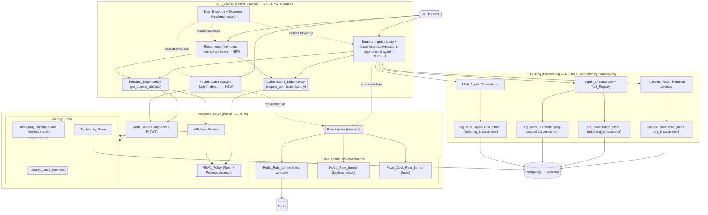

# Design Document

## Overview

This design covers **Phase 5 (Enterprise Controls)** of the AgentForge platform. Phases 1
(Foundation), 2 (Core RAG), 3 (Agentic Layer), and 4 (Multi-Agent Collaboration) are
already built and provide the reusable, pluggable seams this phase builds on **and MUST
NOT reimplement**: the async FastAPI `API_Service` with its uniform error envelope
`{ "error": { code, message, details } }` and typed request/response schemas; the
`Configuration_Manager` (`Settings` + `load_settings`) that reads env vars, treats every
credential as optional, and keeps the platform bootable with no external credentials; the
composition root (`config/container.py` with `build_app_context` / `build_agent_context` /
`build_multi_agent_context`) as the only place concrete implementations are named;
Postgres + pgvector plus the templated migration runner (`db/migrations.py`); Redis; and
every existing router/store — `documents`, `chunks`, `conversations`, `messages`,
`agent_runs`, `trace_entries`, `multi_agent_runs`, `approval_decisions`, `run_checkpoints`.

Phase 5 adds an **Enterprise_Layer** that makes the platform safe for multiple tenants:
local **Auth_Service** (password hashing + JWT issue/verify), an **Identity_Store**
(users, organizations, teams, memberships, team_memberships), an **RBAC_Policy** (a static
role→permission map applied uniformly), an **API_Key_Service** (org-scoped, hashed at
rest, one-time-return, revocable), a **Rate_Limiter** (per-principal fixed-window over
Redis), a reusable **Principal_Dependency** and **Authorization_Dependency** (declarative
`Depends(require_permission(...))` on every existing endpoint), and the **strict
multi-tenant boundary**: every tenant-owned resource acquires an `org_id`, every existing
store gains an `org_id`-scoped query surface, and cross-tenant read/mutation always
returns 404 — **enforced at the data-access layer, not only in handlers**.

Everything remains **fully runnable and testable with no external credentials**: the
default `Settings` generates a development `jwt_secret` in the local profile (production
requires one, aborting startup if missing); the `NoOp_Rate_Limiter` (or the deterministic
`Fake_Clock_Rate_Limiter` in tests) is the keyless default; and an in-memory
`Identity_Store` + `API_Key_Service` back the keyless suite. The complete Phase 5 test
suite runs deterministically end-to-end with **zero** external services beyond an
optional integration lane against real Postgres + Redis.

Explicitly **out of scope** (reserved for later phases, but enabled by the seams here):
production observability (LangSmith tracing, cost/token analytics, prompt versioning,
evaluation frameworks, guardrails); the React frontend; third-party integrations; cloud
deployment; single-sign-on and OAuth social login (the `Auth_Service` seam is designed so
an external identity provider drops in later without touching any endpoint).

### Design Goals

| Goal | How this design achieves it |
| --- | --- |
| **Keyless dev boot preserved** | `jwt_secret: SecretStr \| None`; in the local profile `load_settings` generates a per-boot dev secret when unset; in production the secret is required and its absence raises `ConfigError` before any handler is reachable (Req 1.7, 1.8). `NoOp_Rate_Limiter` and in-memory `Identity_Store` / `API_Key_Store` are the keyless defaults (Req 6.5, 10.1). |
| **Strict tenant isolation at the data-access layer** | Every tenant-owned store gains an `org_id` parameter on every read/write and filters/constrains every query by `org_id`; cross-tenant read/mutate returns `AppError("not_found", 404)` **uniformly** — the handler cannot forget, because the store cannot return cross-tenant rows (Req 4.5, 4.6). |
| **RBAC extensible without endpoint edits** | Endpoints declare `Depends(require_permission(Permission.X))` — never touch the mapping. Adding a role or permission is a **single edit** to `ROLE_PERMISSIONS`, no handler is rewritten (Req 3.6). |
| **Reusable Principal + Authorization dependencies** | `get_current_principal` resolves `Authorization: Bearer <jwt>` or `X-API-Key` uniformly; `require_permission(perm)` is a **dependency factory** returning a callable that raises `AppError` 403 if the principal lacks the permission. New endpoints adopt both by declaration alone (Req 7.6, 7.7). |
| **Secure-by-default hashing** | Passwords hashed with **argon2id** (`argon2-cffi`); constant-time verification via the library's `verify`. API-key secrets stored as argon2 hashes plus an indexed `key_prefix` for O(1) lookup; the plaintext is returned exactly once at creation. No plaintext credential ever hits the database or the logs (Req 1.1, 1.6, 5.2, 8.5). |
| **Reuse of every existing seam** | New endpoints live on the existing `API_Service` and render errors through the existing envelope; new state persists through the existing `db/migrations.py` runner in the existing Postgres; the `Rate_Limiter` uses the existing Redis; the composition root is **extended** — not duplicated — with `Auth_Service`, `Identity_Store`, `RBAC_Policy`, `API_Key_Service`, and `Rate_Limiter` builders (Req 9). |
| **Additive-only migrations** | `0006_create_enterprise_identity.sql` creates identity + api-key tables; `0007_add_org_id_to_tenant_resources.sql` adds `org_id UUID NOT NULL REFERENCES organizations(id) ON DELETE CASCADE` to `documents`, `conversations`, `agent_runs`, `multi_agent_runs`, with composite `(org_id, id)` indexes. No production data exists yet, so no backfill is required (Req 8). |

### Key Design Decisions (summary)

- **JWT + local credential store, behind an `Auth_Service` seam.** Local auth today
  (registration + login + password hashing + JWT); a later phase drops in OAuth/SSO by
  implementing the same seam. No endpoint knows how tokens are issued or resolved.
- **Argon2id chosen over bcrypt.** Memory-hard, modern default (OWASP-recommended),
  configurable `time_cost` / `memory_cost` / `parallelism`. `argon2-cffi` provides
  constant-time `verify` we reuse for both passwords and API keys.
- **RBAC as a static role→permission map.** Simple, testable, extensible; endpoints stay
  ignorant of the mapping. Roles nest (`viewer ⊆ member ⊆ admin ⊆ owner`) and every role
  grants `read`.
- **Tenancy at the data-access layer.** Even if a handler forgets `require_permission` or
  fails to check `org_id`, the store cannot return cross-org rows. Cross-tenant results
  are `404 not_found` — never `403` — to avoid leaking existence.
- **Redis fixed-window rate limiter.** `INCR` + `EXPIRE(window_seconds)` per
  `(principal_key, window_start)`, chosen over sliding-log for simplicity and
  deterministic testability. `NoOp_Rate_Limiter` is the keyless default; a
  `Fake_Clock_Rate_Limiter` gives deterministic tests.

A dedicated **Design Decisions & Why** section at the end records the full rationale for
learning purposes (Req 11).

## Architecture

### High-Level Architecture

The new Phase 5 components form the `Enterprise_Layer`; everything in the `Existing
(Phases 1-4)` group is reused unchanged. New Auth / Identity / RBAC / API-key /
rate-limiter components attach to the **existing** `API_Service`, `Settings`, Postgres,
Redis, and every existing router/store.



**How the new pieces connect to the existing platform:**

- `Principal_Dependency` sits on the **existing** `API_Service` and resolves credentials
  through the new `Auth_Service` / `API_Key_Service`. Existing routers add
  `Depends(get_current_principal)` and `Depends(require_permission(...))` — no other
  handler changes (Req 7.6, 7.7).
- Every existing tenant-owned store (`DBDocumentStore`, `PgConversation_Store`,
  `Pg_Trace_Recorder`, `Pg_Multi_Agent_Run_Store`) is **extended** to accept and
  constrain by `org_id`; their in-memory counterparts do the same. The store's SQL always
  carries `WHERE org_id = :org_id`, so cross-tenant results are structurally impossible
  (Req 4.5, 4.6).
- `Rate_Limiter` sits behind an interface; the composition root selects
  `Redis_Rate_Limiter` when Redis is configured and `settings.rate_limit_enabled` is
  true, otherwise `NoOp_Rate_Limiter`. Tests inject `Fake_Clock_Rate_Limiter` for
  determinism (Req 6.4, 6.5).
- All Phase 5 endpoints render errors through the **existing** `AppError` envelope (Req
  9.1). No new configuration or persistence mechanism is introduced (Req 9.2, 9.3, 9.4).

### Layering and Dependency Rule

Phase 5 follows the same inward dependency rule as Phases 1-4: **core logic depends on
interfaces, never on concrete implementations.**

1. **Transport layer** (`API_Service`) — two new routers (`auth`, `orgs`) plus
   `Depends(...)` on every existing router. Knows nothing about hashing, JWT internals,
   the identity storage backend, or the rate-limit backend.
2. **Enterprise core** (`Auth_Service`, `API_Key_Service`, `RBAC_Policy`, `Rate_Limiter`,
   `Principal`) — pure logic over the abstract `Identity_Store` / `API_Key_Store` /
   `Rate_Limiter` seams. Reusable across transports.
3. **Adapter layer** — concrete `Pg_Identity_Store`, `Pg_API_Key_Store`,
   `Redis_Rate_Limiter` (and the `InMemory` / `NoOp` / `Fake_Clock` doubles for
   keyless / test paths).
4. **Infrastructure** — the reused Phase 1-4 providers, Postgres + pgvector, Redis.

`config/container.py` is the **only** module that references concrete implementations; it
is extended with `build_auth_service`, `build_identity_store`, `build_api_key_service`,
`build_rate_limiter`, and `build_enterprise_context` — the enterprise core never
constructs its own store or rate limiter (Req 9.5).

### Repository / Module Layout

New Phase 5 modules follow the established convention: every `base.py` holds abstract
contracts, sibling files hold concrete implementations, and `config/container.py` is the
only module that names concretes.

```text
src/agentforge/
├── main.py                             # EXTENDED: register auth + orgs routers, wire enterprise context
├── config/
│   ├── settings.py                     # EXTENDED: jwt_*, argon2_*, rate_limit_*, auth_enabled, ...
│   └── container.py                    # EXTENDED: build_enterprise_context(), builders for Auth / RBAC / KeySvc / RL
├── enterprise/                         # NEW — the enterprise core
│   ├── base.py                         # Identity_Store, API_Key_Store, Rate_Limiter (ABCs)
│   ├── models.py                       # User, Organization, Team, Membership, Team_Membership,
│   │                                   #   API_Key, Access_Token_Claims, Principal (dataclass)
│   ├── auth.py                         # Auth_Service (register, login, issue/verify JWT, argon2id)
│   ├── identity.py                     # Pg_Identity_Store + InMemory_Identity_Store
│   ├── rbac.py                         # Role, Permission, ROLE_PERMISSIONS, RBAC_Policy
│   ├── api_keys.py                     # API_Key_Service + Pg_API_Key_Store + InMemory_API_Key_Store
│   ├── rate_limit.py                   # Redis_Rate_Limiter / NoOp_Rate_Limiter / Fake_Clock_Rate_Limiter
│   ├── principal.py                    # get_current_principal, require_permission, get_org_id
│   └── store.py                        # thin re-exports / convenience factories
├── api/
│   ├── deps.py                         # EXTENDED: get_current_principal, require_permission, get_org_id
│   ├── schemas.py                      # EXTENDED: LoginRequest, TokenResponse, CreateOrgRequest, ApiKeyResponse, ...
│   └── routers/
│       ├── auth.py                     # NEW — POST /auth/register-self, /auth/login, /auth/refresh
│       ├── orgs.py                     # NEW — POST /orgs, /orgs/{id}/members, /orgs/{id}/teams, /orgs/{id}/api-keys ...
│       ├── ingest.py                   # EXTENDED — Depends(require_permission(ingest_documents)) + org-scoped
│       ├── query.py                    # EXTENDED — Depends(require_permission(run_agents)) + org-scoped
│       ├── documents.py                # EXTENDED — read / ingest_documents + org-scoped
│       ├── conversations.py            # EXTENDED — read + org-scoped
│       ├── agent.py                    # EXTENDED — run_agents / read + org-scoped
│       └── multi_agent.py              # EXTENDED — run_agents / read + org-scoped
└── (rag/, agent/, tools/, multiagent/, memory/, conversation/, streaming/, tracing/ — REUSED,
   with tenant-scoped org_id added to their store SQL only)

migrations/                             # EXTENDED (same runner, same templating)
├── 0006_create_enterprise_identity.sql # organizations, users, memberships, teams, team_memberships, api_keys
└── 0007_add_org_id_to_tenant_resources.sql  # + org_id UUID NOT NULL FK on documents / conversations /
                                            #   agent_runs / multi_agent_runs (+ composite indexes)
```

**Interfaces vs implementations.** The enterprise core imports only from
`enterprise/base.py`, `enterprise/models.py`, and `enterprise/rbac.py`. Concrete stores /
rate limiters are referenced solely by `config/container.py`; endpoints reference only
the FastAPI dependencies. A new role, permission, rate-limit backend, or identity backend
is added by extending `ROLE_PERMISSIONS` or implementing the interface — never by
editing a router (Req 3.6, 9.6).

## Components and Interfaces

### Auth_Service (`enterprise/auth.py`)

The `Auth_Service` owns credential verification, JWT issue/verify, and user registration.
It depends only on the abstract `Identity_Store` and on the configured hashing +
signing parameters — everything else is a swappable seam, so a future OAuth/SSO provider
implements the same interface and drops in via the composition root (Req 9.6).

```python
class Auth_Service:
    def __init__(
        self,
        identity: Identity_Store,
        *,
        jwt_secret: str,             # resolved by build_auth_service (generated in dev if absent)
        jwt_algorithm: str = "HS256",
        jwt_expiry_seconds: int = 3600,
        password_hasher: PasswordHasher | None = None,   # argon2.PasswordHasher, injected for tests
    ) -> None: ...

    # --- registration + login ---
    def register(self, email: str, password: str, org_id: UUID, role: Role) -> User: ...
    def login(self, email: str, password: str) -> Access_Token: ...      # raises auth_failed (401)

    # --- token round-trip (used by get_current_principal) ---
    def issue(self, user_id: UUID, org_id: UUID, role: Role, *, now: datetime | None = None) -> str: ...
    def verify(self, token: str, *, now: datetime | None = None) -> Access_Token_Claims | None: ...
    # verify returns None on bad signature / expiry / malformed / wrong-secret; NEVER raises for bad tokens.

    # --- password hashing (constant-time verify, never plaintext compare) ---
    def hash_password(self, password: str) -> str: ...                    # argon2id
    def verify_password(self, hashed: str, password: str) -> bool: ...    # argon2's constant-time verify
```

**Hashing algorithm.** Argon2id via `argon2-cffi.PasswordHasher(time_cost, memory_cost,
parallelism)`; parameters come from `Settings`. Argon2id is chosen over bcrypt/pbkdf2
because it is **memory-hard** — resistant to GPU/ASIC brute force — and is the OWASP-recommended
default for new systems. Verification always goes through `PasswordHasher.verify`, never
a direct plaintext comparison (Req 1.6).

**JWT.** `PyJWT` with HS256 by default. Claims: `sub=user_id`, `org_id`, `role`, `exp`.
`verify` returns `None` on **any** invalid condition (expired, bad signature, wrong
secret, malformed) so callers cannot accidentally accept a bad token; the
`Principal_Dependency` maps `None` → `AppError("unauthorized", 401)` (Req 1.5).

**Registration → hash → persist.** `register` computes `hash_password(password)` and
persists a `User(email, password_hash)` via the `Identity_Store`; the plaintext password
never leaves the call frame (Req 1.1).

### Identity_Store (`enterprise/base.py` + `enterprise/identity.py`)

```python
class Identity_Store(ABC):
    # --- users ---
    @abstractmethod
    def create_user(self, email: str, password_hash: str) -> User: ...
    @abstractmethod
    def get_user_by_email(self, email: str) -> User | None: ...
    @abstractmethod
    def get_user(self, user_id: UUID) -> User | None: ...

    # --- organizations ---
    @abstractmethod
    def create_organization(self, name: str) -> Organization: ...
    @abstractmethod
    def get_organization(self, org_id: UUID) -> Organization | None: ...

    # --- memberships (UNIQUE(user_id, org_id)) ---
    @abstractmethod
    def add_membership(self, user_id: UUID, org_id: UUID, role: Role) -> Membership: ...
    @abstractmethod
    def get_membership(self, user_id: UUID, org_id: UUID) -> Membership | None: ...
    @abstractmethod
    def list_org_members(self, org_id: UUID) -> list[Membership]: ...

    # --- teams (org-scoped) + team memberships (must be a member of the team's org) ---
    @abstractmethod
    def create_team(self, org_id: UUID, name: str) -> Team: ...
    @abstractmethod
    def add_team_member(self, team_id: UUID, user_id: UUID) -> Team_Membership: ...
    # Enforces Req 2.5: if the user has no Membership in the team's org, raises AppError
    # ("org_mismatch", 400) with a membership-required detail (Req 2.5, matrix 12.M).
```

Two implementations ship: `Pg_Identity_Store` (synchronous SQLAlchemy, mirroring
`PgConversation_Store`) and `InMemory_Identity_Store` (dict-backed doubles for the
keyless/test path). The interface never leaks a plaintext password anywhere: only
`password_hash` is accepted or returned.

### RBAC_Policy (`enterprise/rbac.py`)

```python
class Role(str, Enum):
    OWNER  = "owner"
    ADMIN  = "admin"
    MEMBER = "member"
    VIEWER = "viewer"

class Permission(str, Enum):
    MANAGE_MEMBERS   = "manage_members"
    MANAGE_API_KEYS  = "manage_api_keys"
    INGEST_DOCUMENTS = "ingest_documents"
    RUN_AGENTS       = "run_agents"
    READ             = "read"

ROLE_PERMISSIONS: dict[Role, frozenset[Permission]] = {
    Role.VIEWER: frozenset({Permission.READ}),
    Role.MEMBER: frozenset({Permission.READ, Permission.RUN_AGENTS,
                            Permission.INGEST_DOCUMENTS}),
    Role.ADMIN:  frozenset({Permission.READ, Permission.RUN_AGENTS,
                            Permission.INGEST_DOCUMENTS, Permission.MANAGE_API_KEYS}),
    Role.OWNER:  frozenset({Permission.READ, Permission.RUN_AGENTS,
                            Permission.INGEST_DOCUMENTS, Permission.MANAGE_API_KEYS,
                            Permission.MANAGE_MEMBERS}),
}

class RBAC_Policy:
    def is_authorized(self, role: Role, permission: Permission) -> bool:
        return permission in ROLE_PERMISSIONS[role]

    def permissions_for(self, role: Role) -> frozenset[Permission]:
        return ROLE_PERMISSIONS[role]
```

**Subset/nesting invariant.** By construction, `ROLE_PERMISSIONS[VIEWER] ⊆
ROLE_PERMISSIONS[MEMBER] ⊆ ROLE_PERMISSIONS[ADMIN] ⊆ ROLE_PERMISSIONS[OWNER]`, and
`Permission.READ` is in every role's set (Req 3.2, 3.5).

**Extension.** Adding a new role or permission is a **one-file edit** to
`ROLE_PERMISSIONS`. Endpoints declare `require_permission(Permission.X)` — never touch
the mapping (Req 3.6). Because `RBAC_Policy` is a pure function of the map,
`is_authorized` is trivially testable via a parameterized property test.

### Principal + FastAPI dependencies (`enterprise/principal.py` + `api/deps.py`)

```python
class PrincipalKind(str, Enum):
    USER    = "user"
    API_KEY = "api_key"

@dataclass(frozen=True)
class Principal:
    kind: Literal["user", "api_key"]
    user_id:  UUID | None            # set iff kind == "user"
    key_id:   UUID | None            # set iff kind == "api_key"
    org_id:   UUID
    role:     Role
    permissions: frozenset[Permission]   # derived once from role via RBAC_Policy
```

The dependency chain:

```python
# api/deps.py — Phase 5 additions
async def get_current_principal(
    request: Request,
    settings: Settings         = Depends(get_settings),
    auth:     Auth_Service     = Depends(get_auth_service),
    keys:     API_Key_Service  = Depends(get_api_key_service),
    rbac:     RBAC_Policy      = Depends(get_rbac_policy),
    rl:       Rate_Limiter     = Depends(get_rate_limiter),
) -> Principal:
    """Resolve either an Authorization: Bearer <jwt> or an X-API-Key header.

    - No credential OR both present with neither valid   -> AppError("unauthorized", 401)
    - Bearer token: auth.verify(token) returns claims    -> User Principal
      returns None                                       -> AppError("unauthorized", 401)
    - X-API-Key: keys.resolve_key(secret) returns key    -> API-key Principal
      returns None or key.revoked_at is not None         -> AppError("unauthorized", 401)
    After resolution, applies the Rate_Limiter (may raise AppError("rate_limited", 429)).
    """

def require_permission(permission: Permission) -> Callable[..., Principal]:
    """Dependency factory. Returns a callable that depends on get_current_principal and
    raises AppError("forbidden", 403) if `permission not in principal.permissions`."""
    def _dep(principal: Principal = Depends(get_current_principal)) -> Principal:
        if permission not in principal.permissions:
            raise AppError("forbidden", "Missing required permission.",
                           status.HTTP_403_FORBIDDEN, {"required": permission.value})
        return principal
    return _dep

def get_org_id(principal: Principal = Depends(get_current_principal)) -> UUID:
    """Convenience wrapper: returns principal.org_id for stores that only need the tenant."""
    return principal.org_id
```

**How endpoints use them.** A protected handler declares — and only declares —
`Depends(require_permission(Permission.X))` and passes the returned `principal.org_id`
(or the `get_org_id` shortcut) into the org-scoped store call. Neither the endpoint nor
the store performs bespoke authorization logic (Req 7.6, 7.7).

### Multi-tenancy design (`enterprise/*.py` + every existing store)

**This is the most important invariant of Phase 5.** It is enforced structurally, not
by convention.

**Column change (migration `0007`, defense-in-depth on top-level tables).** Every
top-level tenant-owned table acquires `org_id UUID NOT NULL REFERENCES organizations(id)
ON DELETE CASCADE`:

- `documents.org_id`
- `conversations.org_id`
- `agent_runs.org_id`
- `multi_agent_runs.org_id`

**Descendant tables inherit tenancy through their parent FK.** `chunks` belongs to a
`document`; `messages` belongs to a `conversation`; `trace_entries` belongs to an
`agent_run`; `approval_decisions` and `run_checkpoints` belong to a `multi_agent_run`.
The stores' SQL always joins/filters through the parent, so a descendant read/mutate
never bypasses the tenant guard even without a direct `org_id` column on the descendant.
This is a deliberate choice: **parent-join enforcement + defense-in-depth `org_id` on the
top-level tables**. A single column on all descendants would be redundant (the parent's
FK is already the single authoritative tenant edge) and would risk drift; the top-level
column combined with parent-joined queries gives us the audit-friendly "which org owns
this row" answer without a full column-explosion.

Long-term memory records live in either Chroma (development) or the pgvector table
(production). Both are extended with an `org_id` metadata field (Chroma: `metadata`
key; pgvector: an added `org_id` filter on the query), and every write/query is
constrained by `org_id`.

**Tenant_Scoped store pattern.** Every existing Pg store gains a required `org_id`
parameter on `create` / `query` / `mutate` / `delete`, and its SQL is uniformly extended
with `WHERE org_id = :org_id` (top-level) or `AND parent.org_id = :org_id` (via join for
descendants). The in-memory counterparts do the same by keying their internal dicts on
`(org_id, id)` — the keyless doubles are preserved, they just gain an extra key column.
Concretely:

```python
# EXTENDED — every existing tenant store gains an org_id parameter.

class DocumentStore(ABC):                                        # existing seam
    @abstractmethod
    def create(self, org_id: UUID, doc: Document) -> Document: ...
    @abstractmethod
    def get(self, org_id: UUID, doc_id: UUID) -> Document | None: ...   # None on cross-tenant
    @abstractmethod
    def delete(self, org_id: UUID, doc_id: UUID) -> None: ...
    @abstractmethod
    def list_for_org(self, org_id: UUID) -> list[Document]: ...

class Conversation_Store(ABC):                                   # existing seam
    @abstractmethod
    def create(self, org_id: UUID, conv: Conversation) -> Conversation: ...
    @abstractmethod
    def get(self, org_id: UUID, conv_id: UUID) -> Conversation | None: ...
    # messages inherit org via their conversation_id FK.

# same shape applied to Pg_Trace_Recorder, Pg_Multi_Agent_Run_Store, and the vector
# store (metadata['org_id'] on write; filter on read).
```

**Cross-tenant contract.** A `get` / `mutate` / `delete` for a resource whose `org_id`
differs from the caller's is **structurally indistinguishable** from a non-existent
resource — the SQL returns zero rows. The store surfaces `None` (or an empty list), and
the router raises `AppError("not_found", 404)`. **Cross-tenant returns 404, never 403**,
so existence itself is not leaked (Req 4.3, 4.6, 7.5).

**Creation.** On any create for a tenant-owned resource, the router passes
`principal.org_id` and the store sets the row's `org_id` to that value (Req 4.4). It is
structurally impossible to create a resource whose `org_id` differs from the principal's:
the store's `create` signature *requires* `org_id`, and the router passes
`principal.org_id`.

**Cascading FKs make cleanup follow the org.** `ON DELETE CASCADE` from
`organizations(id)` sweeps documents/chunks (via document), conversations/messages,
agent_runs/trace_entries, multi_agent_runs/approval_decisions/run_checkpoints — all in a
single organizational delete. No orphan rows survive.

### API_Key_Service (`enterprise/api_keys.py`)

An API key is an org-scoped credential; it authenticates programmatic clients that do
not log in as a user. Its permissions are **derived from its role** through the same
`RBAC_Policy`, so a role change or new permission propagates to API-key principals
without extra plumbing (Req 5.1).

**Secret + hash format.**

```python
API_KEY_PREFIX = "af_"
API_KEY_PREFIX_LEN = 8   # first 8 chars after the "af_" prefix, indexed for O(1) lookup

def create(org_id: UUID, role: Role) -> tuple[API_Key, str]:
    """Generate a new key. Returns (metadata, plaintext_secret)."""
    # 32 URL-safe random bytes; 43 chars of base64url without padding.
    raw = secrets.token_urlsafe(32)               # cryptographically random
    secret = f"{API_KEY_PREFIX}{raw}"             # e.g. "af_JZk...b2s"
    key_prefix = secret[:API_KEY_PREFIX_LEN]      # indexed prefix for lookup
    key_hash   = hasher.hash(secret)              # argon2id, same hasher as passwords
    key = api_key_store.create(
        API_Key(id=uuid4(), org_id=org_id, role=role,
                key_prefix=key_prefix, key_hash=key_hash,
                revoked_at=None, created_at=utcnow()),
    )
    return key, secret                            # secret returned ONCE (Req 5.1)
```

The **plaintext secret is returned exactly once** in the creation response and is never
persisted or logged (Req 5.1, 5.2). `key_prefix` is stored unhashed so lookup can filter
candidates in O(1) via an indexed WHERE, then `argon2.verify` selects the one match in
constant time.

**Resolution (`X-API-Key` header).**

```python
def resolve_key(self, presented: str) -> API_Key | None:
    if not presented.startswith(API_KEY_PREFIX):
        return None
    prefix = presented[:API_KEY_PREFIX_LEN]
    # Prefix-indexed narrow scan: at most one active row in practice; collisions are handled
    # by iterating the tiny candidate set and doing an argon2 constant-time verify per row.
    for candidate in self._store.list_active_by_prefix(prefix):
        try:
            if self._hasher.verify(candidate.key_hash, presented):
                return candidate
        except VerifyMismatchError:
            continue
    return None
```

- **Unknown / malformed** → `None` → `AppError("unauthorized", 401)`.
- **Revoked** (`revoked_at IS NOT NULL`) → excluded by `list_active_by_prefix`, so
  `None` → 401 (Req 5.6).
- **Match** → `API_Key` metadata; the caller builds the API-key `Principal` with
  `permissions = RBAC_Policy.permissions_for(key.role)`.

**Create / list / revoke endpoints.** All require `manage_api_keys` (Req 5.1, 5.4, 5.5).
`list` returns metadata only — **never** the hash or the secret (Req 5.4). Cross-org
list/revoke (a caller in org A referencing a key in org B) is a **404** via the store's
`org_id` scoping (Req 5.7).

**Uniqueness.** UUID primary keys guarantee id-collision-freeness; secret collisions are
negligible for 32 random URL-safe bytes (~256 bits of entropy). Should a prefix collide,
the argon2 verify still discriminates.

### Rate_Limiter (`enterprise/rate_limit.py`)

A per-principal fixed-window counter over Redis. Chosen over sliding-log for two reasons:
(1) an atomic `INCR + EXPIRE` in Redis is the simplest correct implementation with
predictable memory (`O(active principals)`); (2) a fixed window is trivially
deterministic under an injected clock, which makes property testing of the bound
straightforward.

```python
class Rate_Limiter(ABC):
    @abstractmethod
    def check(self, principal_key: str) -> None: ...  # raises AppError("rate_limited", 429)

class Redis_Rate_Limiter(Rate_Limiter):
    def __init__(self, redis, *, max_requests: int, window_seconds: int,
                 clock: Callable[[], float] = time.time) -> None: ...

    def check(self, principal_key: str) -> None:
        window_start = int(self._clock()) // self._window * self._window
        key = f"rl:{principal_key}:{window_start}"
        # Pipelined atomic INCR + EXPIRE:
        current = self._pipeline(key).incr().expire(self._window).execute()[0]
        if current > self._max:
            raise AppError("rate_limited", "Rate limit exceeded.",
                           status.HTTP_429_TOO_MANY_REQUESTS,
                           {"limit": self._max, "window_seconds": self._window})

class NoOp_Rate_Limiter(Rate_Limiter):
    """Keyless default; check is a no-op so runs proceed unhindered (Req 6.5)."""
    def check(self, principal_key: str) -> None: ...

class Fake_Clock_Rate_Limiter(Rate_Limiter):
    """Deterministic in-memory limiter for tests; uses an injected clock (Req 6.5, 10.7)."""
    def __init__(self, *, max_requests: int, window_seconds: int, clock) -> None: ...
    def check(self, principal_key: str) -> None: ...
```

**Principal key.** `f"user:{user_id}"` for User Principals, `f"key:{key_id}"` for API-key
Principals. Because the key is per-principal, one principal reaching the limit **does
not affect any other principal** (Req 6.6). Concretely: `INCR` operates on the key
`f"rl:{principal_key}:{window_start}"`, so two different principals write to two
different Redis keys and their counters are independent.

**Bound behavior.** With max `M` and window `W`, the counter is incremented on every
check; the first `M` checks in a window succeed (counter values 1..M), the `(M+1)`-th
raises 429 (Req 6.2, 6.3). At window rollover a new key is used, resetting the count.

**Config (`Settings`).** `rate_limit_max` (default 60, `[1, 100_000]`),
`rate_limit_window_seconds` (default 60, `[1, 86_400]`), `rate_limit_enabled` (default
true; force `False` in tests). When `rate_limit_enabled=False` the composition root wires
a `NoOp_Rate_Limiter` regardless of Redis availability, so tests never depend on real
Redis (Req 6.5, 10.7).

### Applying auth + tenancy to existing endpoints

Every existing router acquires two additions and **nothing else**: a
`Depends(require_permission(...))` on each handler, and `principal.org_id` threaded into
the store call (which is already accepting `org_id` after the store extension). The
routers do not perform tenant checks themselves — the store cannot return cross-org
rows.

The permission map for every existing endpoint:

| Endpoint | Required Permission | Rationale |
| --- | --- | --- |
| `POST /documents` (ingest) | `ingest_documents` | Mutates the corpus. |
| `GET /documents`, `GET /documents/{id}` | `read` | Read-only. |
| `DELETE /documents/{id}` | `ingest_documents` | Corpus mutation. |
| `POST /query` | `run_agents` | Invokes the LLM (chosen over `read` because a query triggers reasoning + tool calls, which is an agent invocation, not a passive read). |
| `POST /conversations` | `read` | Creates a conversation container (no LLM invoked yet). |
| `POST /conversations/{id}/messages` | `read` | Appends a message (LLM is invoked by `/agent/run`, not here). |
| `GET /conversations/{id}` | `read` | Read-only. |
| `POST /agent/run` | `run_agents` | Invokes the reasoning loop. |
| `POST /agent/stream` | `run_agents` | Invokes the reasoning loop. |
| `GET /agent/runs/{id}/trace` | `read` | Read-only. |
| `POST /multi-agent/runs` | `run_agents` | Invokes the multi-agent graph. |
| `POST /multi-agent/runs/{id}/stream` | `run_agents` | Invokes/resumes the graph. |
| `POST /multi-agent/runs/{id}/approval` | `run_agents` | Resumes the graph with a decision. |
| `GET /multi-agent/runs/{id}` | `read` | Read-only. |
| `POST /auth/register-self` | anonymous | Bootstraps a new user (no principal). |
| `POST /auth/login` | anonymous | Verifies credentials to issue a JWT. |
| `POST /auth/refresh` | anonymous *(uses a valid non-expired token)* | Renews a JWT. |
| `GET /orgs/{id}/members` | `manage_members` | Sensitive identity data. |
| `POST /orgs/{id}/members` | `manage_members` | Grants access. |
| `POST /orgs/{id}/teams`, team member ops | `manage_members` | Team administration. |
| `POST /orgs/{id}/api-keys` | `manage_api_keys` | Credential issuance. |
| `GET /orgs/{id}/api-keys` | `manage_api_keys` | Credential listing. |
| `DELETE /orgs/{id}/api-keys/{key_id}` | `manage_api_keys` | Credential revocation. |

**Error surface uniformly.** Unauthenticated → **401** `unauthorized`; authenticated but
missing permission → **403** `forbidden`; cross-tenant (or unknown-in-tenant) → **404**
`not_found`; rate-limited → **429** `rate_limited`. All rendered through the existing
`AppError` envelope (Req 7.1-7.5).

## Data Models

### Enterprise domain models (`enterprise/models.py`)

Plain, framework-agnostic dataclasses (consistent with the Phase 3/4 domain models). No
model ever holds a plaintext password or a plaintext API-key secret.

```python
@dataclass
class Organization:
    id: UUID
    name: str
    created_at: datetime

@dataclass
class User:
    id: UUID
    email: str                     # UNIQUE
    password_hash: str             # argon2id, never plaintext (Req 1.1, 8.5)
    created_at: datetime

@dataclass
class Membership:
    user_id: UUID
    org_id: UUID
    role: Role                     # from enterprise/rbac.py
    created_at: datetime
    # UNIQUE (user_id, org_id)      (Req 2.7)

@dataclass
class Team:
    id: UUID
    org_id: UUID
    name: str
    created_at: datetime

@dataclass
class Team_Membership:
    team_id: UUID
    user_id: UUID
    created_at: datetime
    # UNIQUE (team_id, user_id)

@dataclass
class API_Key:
    id: UUID
    org_id: UUID
    role: Role
    key_prefix: str                # indexed (first 8 chars of the secret)
    key_hash: str                  # argon2id hash of the secret (Req 5.2, 8.5)
    revoked_at: datetime | None    # None => active
    created_at: datetime

@dataclass(frozen=True)
class Access_Token_Claims:
    sub: UUID                      # user_id
    org_id: UUID
    role: Role
    exp: int                       # unix seconds

@dataclass(frozen=True)
class Principal:                   # see Components section above
    kind: Literal["user", "api_key"]
    user_id: UUID | None
    key_id:  UUID | None
    org_id:  UUID
    role:    Role
    permissions: frozenset[Permission]
```

### `Settings` additions (`config/settings.py`)

Every added field is either optional with a bounded default or a boolean toggle, so the
keyless dev boot is preserved. `load_settings` is extended with a single production
guard for `jwt_secret`.

```python
class Settings(BaseSettings):
    # ... existing fields ...

    # --- Phase 5: auth + JWT ---
    auth_enabled:       bool = True                          # toggle; test suite may set False
    jwt_secret:         SecretStr | None = None              # optional; generated in dev if None
    jwt_algorithm:      Literal["HS256"] = "HS256"
    jwt_expiry_seconds: int = 3600                           # [60, 86_400]

    # --- Phase 5: argon2id parameters (sensible defaults, tunable per env) ---
    argon2_time_cost:   int = 2                              # [1, 10]
    argon2_memory_cost: int = 64 * 1024                      # KiB; [8 * 1024, 1_048_576]
    argon2_parallelism: int = 2                              # [1, 8]

    # --- Phase 5: rate limiting ---
    rate_limit_enabled:        bool = True                   # test suite sets False for determinism
    rate_limit_max:            int = 60                      # [1, 100_000]  (Req 6.4)
    rate_limit_window_seconds: int = 60                      # [1, 86_400]   (Req 6.4)


_REQUIRED_NON_SECRET = ("database_url", "redis_url")           # unchanged

def load_settings() -> Settings:
    settings = _base_load()   # existing validation logic
    # Production guard: jwt_secret is REQUIRED in production, optional in local (Req 1.7, 1.8).
    if settings.profile == "production" and settings.auth_enabled and settings.jwt_secret is None:
        raise ConfigError(["jwt_secret"], detail="required in production profile")
    return settings
```

**Local profile / dev secret generation.** When `settings.jwt_secret is None` and the
profile is `local`, `build_auth_service` generates a per-boot random `token_urlsafe(64)`
and passes it into the `Auth_Service`; nothing is written to disk, and every restart
naturally invalidates outstanding tokens (which is the correct dev behavior — no
persistence of a dev secret). This preserves keyless boot end-to-end (Req 1.7, 10.1).

### PostgreSQL schema — additive migrations

Two new migrations, both applied through the **existing** runner (discovered by filename
order, tracked in `schema_migrations`, halts on failure naming the failing migration id —
Req 8.3, 8.4). Both are strictly additive: no existing column is dropped or altered, so
Phases 1-4 continue to run untouched (Req 8.3). No production data exists, so no
backfill step is required (Req 8.6).

#### `0006_create_enterprise_identity.sql`

```sql
-- 0006_create_enterprise_identity.sql
-- Enterprise identity: organizations, users, memberships, teams, api_keys (Req 8.1).

CREATE TABLE IF NOT EXISTS organizations (
    id         UUID PRIMARY KEY,
    name       TEXT NOT NULL,
    created_at TIMESTAMPTZ NOT NULL DEFAULT now()
);

CREATE TABLE IF NOT EXISTS users (
    id            UUID PRIMARY KEY,
    email         TEXT NOT NULL UNIQUE,
    password_hash TEXT NOT NULL,                       -- argon2id; never plaintext (Req 8.5)
    created_at    TIMESTAMPTZ NOT NULL DEFAULT now()
);

CREATE TABLE IF NOT EXISTS memberships (
    user_id    UUID NOT NULL REFERENCES users(id)         ON DELETE CASCADE,
    org_id     UUID NOT NULL REFERENCES organizations(id) ON DELETE CASCADE,
    role       TEXT NOT NULL,                           -- owner | admin | member | viewer
    created_at TIMESTAMPTZ NOT NULL DEFAULT now(),
    PRIMARY KEY (user_id, org_id)                       -- at most one membership per (user, org) (Req 2.7)
);
CREATE INDEX IF NOT EXISTS memberships_org_idx ON memberships (org_id);

CREATE TABLE IF NOT EXISTS teams (
    id         UUID PRIMARY KEY,
    org_id     UUID NOT NULL REFERENCES organizations(id) ON DELETE CASCADE,
    name       TEXT NOT NULL,
    created_at TIMESTAMPTZ NOT NULL DEFAULT now(),
    UNIQUE (org_id, name)
);

CREATE TABLE IF NOT EXISTS team_memberships (
    team_id    UUID NOT NULL REFERENCES teams(id) ON DELETE CASCADE,
    user_id    UUID NOT NULL REFERENCES users(id) ON DELETE CASCADE,
    created_at TIMESTAMPTZ NOT NULL DEFAULT now(),
    PRIMARY KEY (team_id, user_id)
);

CREATE TABLE IF NOT EXISTS api_keys (
    id         UUID PRIMARY KEY,
    org_id     UUID NOT NULL REFERENCES organizations(id) ON DELETE CASCADE,
    role       TEXT NOT NULL,                           -- role granted to this key
    key_prefix TEXT NOT NULL,                           -- first 8 chars of the secret (indexed)
    key_hash   TEXT NOT NULL,                           -- argon2id hash of the secret (Req 8.5)
    revoked_at TIMESTAMPTZ,                             -- NULL => active
    created_at TIMESTAMPTZ NOT NULL DEFAULT now()
);
CREATE INDEX IF NOT EXISTS api_keys_prefix_active_idx
    ON api_keys (key_prefix) WHERE revoked_at IS NULL;
CREATE INDEX IF NOT EXISTS api_keys_org_idx ON api_keys (org_id);
```

#### `0007_add_org_id_to_tenant_resources.sql`

```sql
-- 0007_add_org_id_to_tenant_resources.sql
-- Tenant column on the top-level tenant-owned tables (Req 8.2).
-- Descendant tables inherit tenancy through their parent FK (chunks -> documents,
-- messages -> conversations, trace_entries -> agent_runs, approval_decisions and
-- run_checkpoints -> multi_agent_runs), so tenant guards join through the parent's
-- org_id; the top-level org_id is defense-in-depth.

ALTER TABLE documents         ADD COLUMN IF NOT EXISTS org_id UUID NOT NULL
    REFERENCES organizations(id) ON DELETE CASCADE;
ALTER TABLE conversations     ADD COLUMN IF NOT EXISTS org_id UUID NOT NULL
    REFERENCES organizations(id) ON DELETE CASCADE;
ALTER TABLE agent_runs        ADD COLUMN IF NOT EXISTS org_id UUID NOT NULL
    REFERENCES organizations(id) ON DELETE CASCADE;
ALTER TABLE multi_agent_runs  ADD COLUMN IF NOT EXISTS org_id UUID NOT NULL
    REFERENCES organizations(id) ON DELETE CASCADE;

CREATE INDEX IF NOT EXISTS documents_org_id_idx        ON documents        (org_id, id);
CREATE INDEX IF NOT EXISTS conversations_org_id_idx    ON conversations    (org_id, id);
CREATE INDEX IF NOT EXISTS agent_runs_org_id_idx       ON agent_runs       (org_id, id);
CREATE INDEX IF NOT EXISTS multi_agent_runs_org_id_idx ON multi_agent_runs (org_id, id);
```

**Migration guarantees.** The runner discovers `0006` and `0007` by filename order and
tracks them in `schema_migrations`; a failure halts and reports the failing id, per the
existing runner behavior (Req 8.3, 8.4). No `${EMBEDDING_DIMENSION}` templating is used
in these files. The migrations are pure `CREATE`/`ALTER ... ADD COLUMN IF NOT EXISTS`,
so re-running them is a no-op.

### API request/response schemas (`api/schemas.py`, extended)

New typed Pydantic models back the new endpoints, e.g. `RegisterRequest`,
`LoginRequest`, `TokenResponse`, `CreateOrgRequest`, `CreateMembershipRequest`,
`CreateApiKeyResponse` (returns the plaintext secret **once**), `ApiKeyMetadata` (no
secret / no hash). All error responses render through the existing envelope.

## Correctness Properties


*A property is a characteristic or behavior that should hold true across all valid
executions of a system — essentially, a formal statement about what the system should
do. Properties serve as the bridge between human-readable specifications and
machine-verifiable correctness guarantees.*

The 10 properties below were derived from the acceptance criteria via the prework
analysis, then consolidated to remove redundancy (e.g. the RBAC iff-invariant of
Req 3.3 folds into Property 2; the "read granted to every role" claim of Req 3.5 folds
into Property 3's subset-nesting; the password hashing acceptance criteria 1.1/1.6/8.5
fold into Property 5; the api-key acceptance criteria 5.1/5.2/5.5/5.6/5.7/10.6 fold into
Property 6; the tenant isolation criteria 4.3/4.5/4.6/7.5/10.4 fold into Property 1;
the "creates inherit org_id" of Req 4.4/7.3 folds into Property 9). Structural, schema,
configuration, migration, and documentation criteria (interface declarations, schema
FKs, `Settings` defaults, jwt_secret production guard, migration runner reuse, seam
reuse, decisions doc) are validated by SMOKE / integration / example tests instead and
are enumerated explicitly in the Testing Strategy. Every property is testable
**keyless** through the in-memory `Identity_Store`, in-memory `API_Key_Store`,
`Fake_Clock_Rate_Limiter`, and the dev-generated `jwt_secret`.

### Property 1: Tenant isolation invariant across every resource type

*For any* two distinct organizations `A` and `B`, any tenant-owned resource created in
`A` — a Document, a Conversation, an Agent_Run, or a Multi_Agent_Run — and any authenticated
Principal whose `org_id = B`, every read, mutate, and delete attempt by that Principal
against that resource returns `AppError("not_found", 404)` and leaves the resource
unchanged; and for descendant resources (Chunks, Messages, Trace entries,
Approval_Decisions, Run_Checkpoints, long-term memory records) accessed through their
parent's identifier, the same 404 outcome holds through the parent-join tenant guard.

**Validates: Requirements 4.3, 4.5, 4.6, 7.5, 10.4**

### Property 2: RBAC iff-invariant

*For any* Role `r` and any Permission `p`, `RBAC_Policy.is_authorized(r, p)` returns
`True` if and only if `p ∈ ROLE_PERMISSIONS[r]`; equivalently, for any (Role, Permission)
pair, the pure authorization function reflects exactly the static mapping and nothing
else.

**Validates: Requirements 3.3**

### Property 3: Role-permission subset nesting with universal read

*For any* pair of roles `r1, r2` in `{viewer, member, admin, owner}` with `r1 ≺ r2`
(viewer ≺ member ≺ admin ≺ owner), `ROLE_PERMISSIONS[r1] ⊆ ROLE_PERMISSIONS[r2]`; and for
any role `r`, `Permission.READ ∈ ROLE_PERMISSIONS[r]`.

**Validates: Requirements 3.2, 3.5**

### Property 4: JWT issue/verify round-trip and rejection of tampered tokens

*For any* `(user_id, org_id, role)` triple and any `exp > now`, `Auth_Service.issue(...)`
produces a token that `verify(...)` decodes back to exactly those claims; for any token
whose payload, signature, secret, or expiry has been tampered — bit-flipped payload,
wrong secret, HS256 signature stripped, or `exp <= now` — `verify(...)` returns `None`
without raising.

**Validates: Requirements 1.2, 1.5**

### Property 5: Password hash correctness and plaintext non-disclosure

*For any* password `pw` and any distinct password `pw' != pw`,
`verify_password(hash_password(pw), pw)` is `True`, `verify_password(hash_password(pw),
pw')` is `False`, and the resulting hash string does not contain `pw` as a substring;
verification always goes through the argon2 verifier (constant-time), never a plaintext
comparison.

**Validates: Requirements 1.1, 1.6, 8.5**

### Property 6: API key lifecycle — create, resolve, revoke, cross-org

*For any* organization `A` and any role `r`, `API_Key_Service.create(A, r)` returns a
plaintext secret exactly once such that (a) `resolve_key(secret)` returns the created
key metadata with `org_id = A` and derived `permissions =
RBAC_Policy.permissions_for(r)`; (b) `revoke(key.id)` followed by `resolve_key(secret)`
returns `None`; (c) no two created keys share an id; (d) the plaintext secret is not
persisted (the stored `key_hash != secret` and does not contain `secret` as a
substring); and for any organization `B != A`, `list_keys(B)` never contains a key whose
`org_id = A`, and `revoke` of `A`'s key when invoked with caller `org_id = B` yields
`AppError("not_found", 404)`.

**Validates: Requirements 5.1, 5.2, 5.4, 5.5, 5.6, 5.7, 8.5, 10.6**

### Property 7: Rate limiter bound and per-principal isolation

*For any* `Max` in `[1, 100_000]`, any `Window` in `[1, 86_400]`, a deterministic clock,
and any two distinct principal keys `k1, k2`, the `Rate_Limiter` permits exactly the
first `Max` calls to `check(k1)` within a single window (raises `AppError("rate_limited",
429)` on the `(Max + 1)`-th and every subsequent call in that window) while calls to
`check(k2)` are counted independently and follow the same per-principal bound; at window
rollover the count for each key resets so a further `Max` calls succeed.

**Validates: Requirements 6.1, 6.2, 6.3, 6.6, 10.7**

### Property 8: Principal resolution from any valid credential; 401 for any invalid one

*For any* valid, non-expired JWT with claims `(sub, org_id, role)` issued by
`Auth_Service`, `get_current_principal` returns a `Principal` whose `kind = "user"`,
`user_id = sub`, `org_id = org_id`, `role = role`, and `permissions =
RBAC_Policy.permissions_for(role)`; for any valid non-revoked API key with `org_id, role`
presented via `X-API-Key`, it returns a `Principal` whose `kind = "api_key"`, `org_id`
and `role` match, and `permissions` derive from the same policy; for any request with no
credential, a malformed/expired/wrong-secret JWT, or an unknown/revoked API key,
`get_current_principal` raises `AppError("unauthorized", 401)`.

**Validates: Requirements 1.4, 1.5, 5.3, 7.1**

### Property 9: Tenant-scoped store round-trip

*For any* organization `A`, any tenant-owned resource type `T` in `{Document,
Conversation, Agent_Run, Multi_Agent_Run}`, and any resource created by a Principal with
`org_id = A`, the resource's persisted `org_id` equals `A`, a subsequent read/list
scoped to `org_id = A` returns it, and every read/list scoped to any `org_id = B != A`
does not return it — parametric across resource types.

**Validates: Requirements 4.1, 4.2, 4.4, 7.3, 7.4**

### Property 10: Endpoint permission mapping — accepts iff role grants required permission

*For any* protected endpoint `E` in the fixed permission table (documents/conversations/
agent/multi-agent/orgs), any Role `r`, and an authenticated Principal with that role in
the resource's org, `E` accepts the request (does not raise 403) if and only if the
Permission required by `E` is in `ROLE_PERMISSIONS[r]`; a request with no credential
yields 401 and a request whose principal lacks the required permission yields 403,
uniformly rendered through the existing error envelope.

**Validates: Requirements 3.4, 7.1, 7.2, 10.5**

## Error Handling

Phase 5 reuses the existing uniform error envelope `{ "error": { code, message, details } }`
and the existing FastAPI exception handlers (`api/errors.py`, `AppError`). All new error
conditions raise `AppError` with a stable code so responses stay consistent, and no
plaintext credential or hash ever appears in an error body or in server logs.

| Condition | Requirement | Behavior | Surface |
| --- | --- | --- | --- |
| Missing / malformed `Authorization` and `X-API-Key` | 1.5, 7.1 | `AppError("unauthorized", 401)` | envelope |
| Invalid signature / wrong secret / expired JWT | 1.5 | `verify` returns None → `AppError("unauthorized", 401)` | envelope |
| Login: unknown email OR wrong password | 1.3 | `AppError("auth_failed", 401)`; no token issued | envelope |
| Registration: weak password / duplicate email | 1.1 | `AppError("validation_error", 400)` naming the failing field; password hash never computed on duplicate-email path | envelope |
| Presented API_Key unknown / revoked | 5.6 | `resolve_key` returns None → `AppError("unauthorized", 401)` | envelope |
| Authenticated principal lacks required permission | 3.4, 7.2 | `AppError("forbidden", 403)` with `details = {"required": <perm>}` | envelope |
| Cross-tenant read / mutate / delete | 4.3, 4.6, 7.5 | Store returns None (SQL scoped by `org_id`) → `AppError("not_found", 404)` — **never** 403, so existence is not leaked | envelope |
| Cross-org list / revoke of an API key | 5.7 | `AppError("not_found", 404)` | envelope |
| Rate limit exceeded | 6.3 | `Redis_Rate_Limiter.check` raises `AppError("rate_limited", 429)` with `details = {"limit", "window_seconds"}` | envelope |
| Production profile lacking `jwt_secret` | 1.8 | `load_settings` raises `ConfigError(["jwt_secret"], detail="required in production profile")` **before** startup, aborting boot | server exit |
| `add_team_member` when user has no membership in the team's org | 2.5 | `AppError("org_mismatch", 400)` with `details = {"required": "membership"}` | envelope |
| Unknown route / unhandled exception | reused | Existing `not_found` (404) / `internal_error` (500) handlers, no stack-trace leak | envelope |

**Containment principle.** Authentication and authorization failures are contained as
`AppError`s and never surface an internal exception or credential value. The
`Auth_Service.verify` deliberately returns `None` (not raises) for any invalid token so
the caller cannot accidentally treat a decode failure as a code path bug — the caller
maps `None` → 401 uniformly. Cross-tenant results are structurally 404 because the
store's SQL is scoped by `org_id` in the very query — the router doesn't have to
remember to check.

## Testing Strategy

Property-based testing **is appropriate** for the enterprise core's logic: hashing,
JWT round-trip, RBAC mapping, principal resolution, tenant scoping at the store, the
API-key lifecycle, and the rate-limit bound are all pure or deterministically-driven
behaviors with universal properties over large input spaces. Schema, configuration
guards, seam reuse, and CRUD-shape concerns use example / integration / smoke tests
instead.

### Dual approach

- **Property-based tests (Hypothesis, >=100 iterations each)** — one property test per
  correctness property listed above (10 total).
- **Unit / example tests** — login with unknown email / wrong password (Req 1.3);
  registration duplicate-email + weak-password validation (Req 1.1 example branch);
  add_team_member without a membership raises `org_mismatch` (Req 2.5); one-membership-
  per-(user, org) uniqueness (Req 2.7); role/permission enum coverage (Req 3.1);
  read-only listings return metadata only for API keys (Req 5.4 shape); rate-limit
  window rollover under `Fake_Clock_Rate_Limiter`; and the org-scoped store round-trips
  for each of the four in-memory doubles.
- **Integration tests (`@pytest.mark.integration`, 1-3 examples each)** — the
  0006 + 0007 migrations apply against real Postgres and the `schema_migrations` table
  advances; the `Redis_Rate_Limiter` bounds requests against a real Redis instance and
  respects `EXPIRE`; the end-to-end keyless boot serves `POST /auth/register-self` →
  `POST /auth/login` → `POST /agent/run` under the in-memory identity store; cascading
  delete on `organizations` sweeps documents/conversations/agent_runs/multi_agent_runs
  (via `ON DELETE CASCADE`).
- **Smoke / structural checks** — `load_settings` generates a dev `jwt_secret` in local
  profile and raises `ConfigError` in production (Req 1.7, 1.8); every existing router
  declares `Depends(require_permission(...))` on every protected handler (Req 7.6);
  no router imports `ROLE_PERMISSIONS` directly (Req 3.6); the four in-memory doubles
  key by `(org_id, id)`; the `docs/decisions.md` file is present and covers hashing,
  RBAC extension, tenant enforcement, and the `Auth_Service` seam (Req 11).

### Property-based testing configuration

- Use **Hypothesis** — do **not** hand-roll property testing.
- Each property test runs a **minimum of 100 iterations**.
- Each test carries a tag comment referencing its design property, in the format:
  **Feature: agentforge-enterprise, Property {number}: {property_text}**.
- Each of the 10 correctness properties is implemented by a **single** property-based
  test.
- Strategies cover the important edges explicitly: passwords with unicode, whitespace,
  and empty strings; token `exp` at the boundary (`now`, `now - 1`, `now + 1`); the
  argon2 verifier's `VerifyMismatchError` path for API keys; role/permission cartesian
  product for RBAC properties; two-org / three-org shrinking for tenant isolation;
  rate-limit `Max` at boundaries (`1`, `100_000`) and window rollover at exact `Window`
  seconds; a mixture of Bearer and X-API-Key credentials for the principal resolution
  property; and the fixed endpoint × role cartesian product for the endpoint mapping
  property.

### Keyless execution (critical)

The entire property + example suite runs with **no external LLM credential, no search
credential, no external identity provider, and no real Redis**. `settings.auth_enabled =
True` (with the dev-generated `jwt_secret`), `settings.rate_limit_enabled = False` (so
the composition root selects `NoOp_Rate_Limiter` — Property 7's tests inject
`Fake_Clock_Rate_Limiter` directly for determinism), `settings.profile = "local"`, and
in-memory `Identity_Store` + `API_Key_Store`. Because the enterprise core is a pure
function of the `Identity_Store` / `API_Key_Store` / `Rate_Limiter` seams, every
property is decidable in-process. The Groq / real search / real Redis / real Postgres
paths are covered separately by mocked unit tests and the integration lane.

## Design Decisions & Why

This section records the rationale for the major choices, per Requirement 11. It is
mirrored into `docs/decisions.md` alongside a short guide on adding a role or permission
without touching endpoints (Req 11.2), how tenant isolation is enforced at the DAL and
how new endpoints adopt the Principal + Authorization dependencies (Req 11.3), and the
chosen password / API-key hashing approach with secrets flowing through `Settings` while
preserving keyless dev boot (Req 11.4).

- **Why argon2id over bcrypt / pbkdf2.** Argon2id is the OWASP-recommended default for
  new systems: **memory-hard**, so GPU / ASIC brute-force attacks are dramatically more
  expensive per guess than for bcrypt or pbkdf2, and its parameters (`time_cost`,
  `memory_cost`, `parallelism`) are tunable per environment via `Settings`.
  `argon2-cffi.PasswordHasher.verify` gives us a constant-time verifier we reuse for
  both passwords and API keys — one hashing seam, two consumers, no plaintext compare
  anywhere (Req 1.6, 11.4).
- **Why JWT + local credential store, behind an `Auth_Service` seam.** Local auth is
  sufficient today (Req 1) and is the simplest correct thing that ships end-to-end. Wrapping
  issuance and verification behind an `Auth_Service` interface — with `Identity_Store` as
  the only backing seam — means a later phase drops in OAuth/SSO by implementing the
  same interface: **no endpoint is rewritten** (Req 9.6, 11.4). PyJWT + HS256 is the
  standard combination; RS256 would only matter if we were issuing tokens for external
  verification, which is not in scope.
- **Why RBAC as a static role → permission map.** A static map is simple, testable
  (`is_authorized` is a pure function), and extensible with a **single-file edit** to
  `ROLE_PERMISSIONS`. Endpoints declare `require_permission(Permission.X)` — a factory
  dependency that reads the map at request time — so **adding a role or permission
  never requires touching an endpoint** (Req 3.6, 11.2). Attribute-based access control
  (ABAC) is more expressive but Phase 5's requirements are role-centric, so the
  simplicity win is the right trade.
- **Why tenancy enforced at the data-access layer, not (only) in handlers.** Handlers
  are the wrong seam to enforce tenancy on: any new endpoint that forgets a check leaks
  data. By pushing the `org_id` filter into every store method's SQL — and requiring
  `org_id` as a positional parameter — a cross-tenant leak becomes **structurally
  impossible**: the store cannot return rows whose `org_id` differs from the caller's
  argument. The routers still enforce authorization (`require_permission`), but they do
  not carry the burden of correctness for tenant isolation. **Cross-tenant results are
  404, not 403**, because a 403 would leak the fact that the resource exists in another
  org (Req 4.5, 11.3).
- **Why parent-join enforcement + defense-in-depth `org_id` only on top-level tables.**
  Chunks, Messages, Trace entries, Approval_Decisions, and Run_Checkpoints all belong to
  exactly one parent (a Document / Conversation / Agent_Run / Multi_Agent_Run). The
  parent's `org_id` is authoritative; adding a redundant `org_id` on every descendant
  would risk drift (two edges of truth to keep in sync) and is unnecessary because the
  store's SQL always joins/filters through the parent. Putting `org_id` on the top-level
  tables gives us the audit-friendly "which org owns this row" answer, indexes over
  `(org_id, id)` accelerate tenant-filtered queries, and `ON DELETE CASCADE` from
  `organizations` sweeps descendants transitively. It is the minimum column footprint
  that still supports fast tenant queries.
- **Why Redis fixed-window over sliding-log for rate limiting.** A fixed window is a
  single `INCR` + `EXPIRE` per check — deterministic memory (`O(active principals)`),
  a trivial correctness argument, and it maps cleanly onto a `Fake_Clock_Rate_Limiter`
  for property testing. Sliding-log is more accurate at the window boundary but requires
  storing per-request timestamps (bigger memory + a sorted-set trim per check) and is
  harder to reason about under adversarial input. Given the requirement is "at most Max
  per window per principal" — not "at most Max per any Window-second sliding interval"
  — fixed-window is the right tool.
- **Why keyless dev boot is preserved through a generated JWT secret + NoOp limiter +
  in-memory identity store.** The whole platform's Phase 1-4 promise is "runs and tests
  keyless"; violating that in Phase 5 would break every dev-loop and every existing
  test. `load_settings` generates a per-boot `token_urlsafe(64)` when the local profile
  omits `jwt_secret`, `build_rate_limiter` selects `NoOp_Rate_Limiter` when
  `rate_limit_enabled = False`, and the composition root builds `InMemory_Identity_Store`
  and `InMemory_API_Key_Store` for local profile. In production, `jwt_secret` is
  **required** (missing → `ConfigError` at startup) and the Redis-backed limiter is
  wired — the same code path with the same seams, only the concretes differ (Req 1.7,
  1.8, 10.1, 11.4).
- **How this sets up later phases.**
  - **Observability** consumes `principal.user_id` / `principal.org_id` from every
    request context to tag traces, logs, and cost metrics by tenant and user — the
    Principal dependency already exposes both.
  - **Frontend** calls the new `/auth/*` endpoints for registration + login, stores the
    JWT client-side, and includes it as `Authorization: Bearer`; no other backend
    change is needed.
  - **Third-party integrations** authenticate via API keys created through the
    `manage_api_keys`-protected endpoints — Slack / Gmail / Drive / GitHub / crawlers
    become just another API-key Principal with the same tenancy and RBAC guarantees.

---

*Scope note:* this design intentionally covers only Phase 5 (enterprise controls:
auth, orgs/teams, RBAC, tenancy, API keys, rate limiting, and their application to
existing endpoints). Production observability, evaluation frameworks, the React
frontend, third-party integrations, and cloud deployment are reserved for later phases
and are enabled — but not designed — by the modular seams established here.
