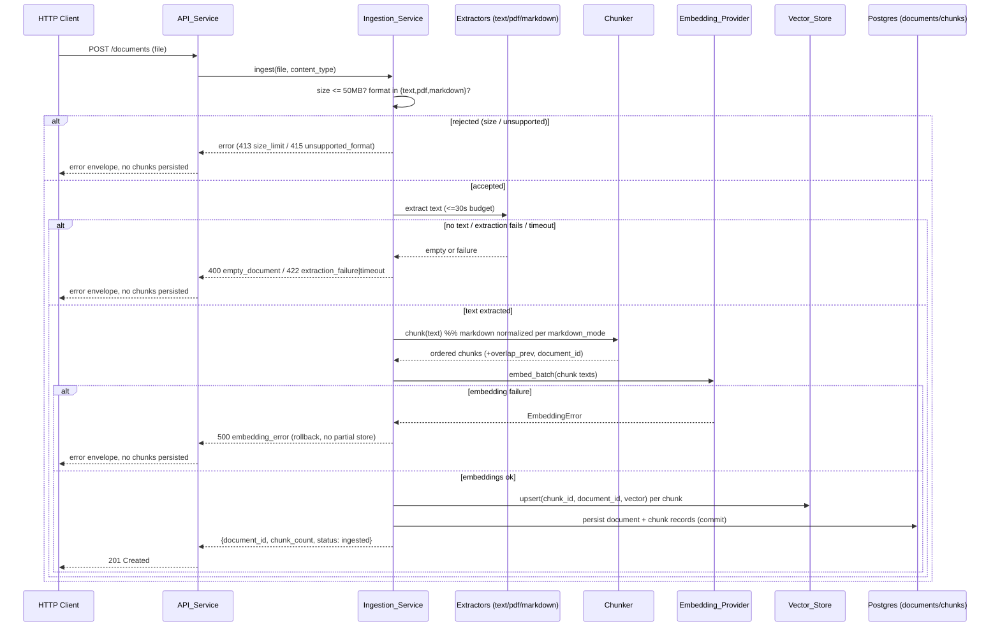
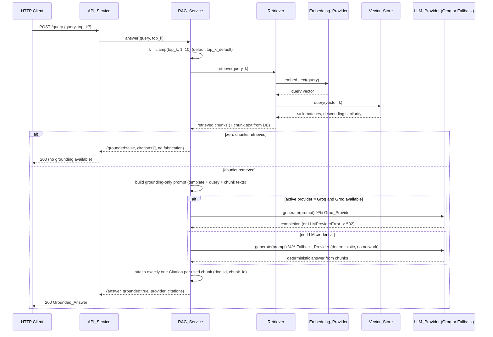

# Design Document

## Overview

This design covers **Phase 1 (Foundation)** and **Phase 2 (Core RAG)** of the
AgentForge platform. The outcome is a system that runs end to end on a laptop with
Docker, ingests plain-text/PDF/Markdown documents, and answers questions with
grounded, cited responses — all **without requiring any paid API key**.

Every later phase (agentic layer, multi-agent orchestration, enterprise auth/RBAC,
observability, frontend, integrations, deployment) is explicitly out of scope here,
but the architecture is deliberately shaped so those phases can be added later
without reworking the foundation.

### Design Goals

| Goal | How this design achieves it |
| --- | --- |
| **Modularity** | Each responsibility (API, config, ingestion, chunking, embedding, vector storage, retrieval, generation) lives in its own module with a narrow surface area. |
| **Pluggability** | The three seams most likely to change — `LLM_Provider`, `Embedding_Provider`, and `Vector_Store` — are abstract interfaces with interchangeable implementations selected at runtime. |
| **Graceful fallback** | The system boots and answers queries with **no credentials at all**. A deterministic `Fallback_Provider` and a local `Chroma_Store` are the zero-config defaults. |
| **Local runnability** | A single `docker compose up` starts the API, Postgres+pgvector, and Redis. Readiness is verifiable with one HTTP call. |
| **Cost-consciousness** | Default embeddings are computed locally (sentence-transformers), the default LLM path calls no external service, and the local vector store (Chroma) needs no managed infrastructure. |
| **Extensibility without rework** | Adding a new provider means implementing one interface and registering it in the `Configuration_Manager` — the `RAG_Service` never changes. |

### Key Design Decisions (summary)

- **Interfaces over implementations at the seams.** The RAG pipeline depends on
  abstract contracts, never on Groq, Chroma, or a specific embedding model.
- **Credentials are always optional.** Provider selection is driven by *presence of
  configuration*, not by required settings, so the platform is "secure and runnable
  by default."
- **Two profiles, one code path.** `local` uses Chroma + local embeddings + fallback
  LLM; `production` uses pgvector + (optionally) hosted providers. The calling code
  is identical.
- **Default embedding provider is local.** `sentence-transformers/all-MiniLM-L6-v2`
  (384-dimensional) runs on CPU, needs no key, and keeps the free-tier promise. The
  pgvector column is sized to the *configured* dimension so hosted embedders can be
  swapped in.

A dedicated **Design Decisions & Why** section at the end records the rationale for
learning purposes, including the Markdown strip-vs-preserve chunking choice.

## Architecture

### High-Level Architecture

```mermaid
graph TB
    Client([HTTP Client])

    subgraph API["API_Service (FastAPI, async)"]
        Routes[Routers: ingest / query / documents / health]
        ErrMw[Exception + Error Envelope Middleware]
    end

    Config[Configuration_Manager]

    subgraph RAGCore["RAG Core"]
        Ingest[Ingestion_Service]
        Chunk[Chunker]
        Retr[Retriever]
        RAG[RAG_Service]
    end

    subgraph Seams["Pluggable Seams (interfaces)"]
        Emb[[Embedding_Provider]]
        VS[[Vector_Store]]
        LLM[[LLM_Provider]]
    end

    subgraph EmbImpl["Embedding impls"]
        STEmb[SentenceTransformer_Embeddings default]
        HostEmb[Hosted_Embeddings optional]
    end
    subgraph VSImpl["Vector_Store impls"]
        Chroma[Chroma_Store local]
        PgV[Pgvector_Store production]
    end
    subgraph LLMImpl["LLM impls"]
        Groq[Groq_Provider]
        FB[Fallback_Provider default]
    end

    DB[(PostgreSQL + pgvector)]
    Redis[(Redis)]

    Client --> Routes
    Routes --> ErrMw
    Routes --> Ingest
    Routes --> RAG
    Routes --> DB
    Routes --> Redis

    Ingest --> Chunk
    Ingest --> Emb
    Ingest --> VS
    Ingest --> DB

    RAG --> Retr
    Retr --> Emb
    Retr --> VS
    RAG --> LLM

    Emb -.implements.-> STEmb
    Emb -.implements.-> HostEmb
    VS -.implements.-> Chroma
    VS -.implements.-> PgV
    LLM -.implements.-> Groq
    LLM -.implements.-> FB

    PgV --> DB
    Config --> API
    Config --> RAGCore
    Config --> Seams
```



### Layering and Dependency Rule

The codebase follows a strict inward dependency rule: **core logic depends on
interfaces, never on concrete implementations.**

1. **Transport layer** (`API_Service`) — FastAPI routers, request/response schemas,
   middleware. Knows nothing about which provider is active.
2. **Service layer** (`Ingestion_Service`, `Retriever`, `RAG_Service`, `Chunker`) —
   pure orchestration and business logic. Depends only on the interface contracts.
3. **Provider/adapter layer** — concrete implementations of `LLM_Provider`,
   `Embedding_Provider`, `Vector_Store`.
4. **Infrastructure** — Postgres+pgvector, Redis, Chroma, Docker Compose.

The `Configuration_Manager` sits to the side of every layer as a composition root: it
reads the environment, decides which concrete implementation satisfies each interface,
and wires them together at startup.

### Repository / Module Layout

```text
AgentForge/
├── docker-compose.yml            # api + postgres(pgvector) + redis
├── Dockerfile                    # API_Service image
├── pyproject.toml                # pinned dependencies (dependency manifest)
├── .env.example                  # every setting name, placeholder values, no secrets
├── README.md                     # install / configure / run locally
├── docs/
│   └── decisions.md              # architectural decision records (Req 14.3)
├── migrations/                   # SQL schema migrations (versioned)
│   ├── 0001_enable_pgvector.sql
│   └── 0002_create_core_tables.sql
├── scripts/
│   └── verify_e2e.py             # documented end-to-end check (Req 14.2)
├── src/
│   └── agentforge/
│       ├── main.py               # FastAPI app factory, router registration, lifespan
│       ├── config/
│       │   ├── settings.py       # Configuration_Manager (env loading + validation)
│       │   └── container.py      # composition root: builds providers from settings
│       ├── api/
│       │   ├── schemas.py        # typed request/response models (Pydantic)
│       │   ├── errors.py         # error envelope + exception handlers
│       │   └── routers/
│       │       ├── ingest.py
│       │       ├── query.py
│       │       ├── documents.py
│       │       └── health.py
│       ├── ingestion/
│       │   ├── service.py        # Ingestion_Service
│       │   └── extractors.py     # text / pdf / markdown extraction
│       ├── chunking/
│       │   └── chunker.py        # Chunker
│       ├── embeddings/
│       │   ├── base.py           # Embedding_Provider (ABC)
│       │   ├── sentence_transformer.py   # default local impl
│       │   └── hosted.py         # optional hosted impl
│       ├── vectorstore/
│       │   ├── base.py           # Vector_Store (ABC)
│       │   ├── chroma_store.py   # Chroma_Store (local)
│       │   └── pgvector_store.py # Pgvector_Store (production)
│       ├── llm/
│       │   ├── base.py           # LLM_Provider (ABC)
│       │   ├── groq_provider.py  # Groq_Provider
│       │   └── fallback_provider.py  # Fallback_Provider (deterministic, no network)
│       ├── retrieval/
│       │   └── retriever.py      # Retriever
│       ├── rag/
│       │   ├── service.py        # RAG_Service (grounding + citation assembly)
│       │   └── prompt.py         # grounding-only prompt construction
│       ├── db/
│       │   ├── engine.py         # async engine / session
│       │   └── repositories.py   # document + chunk persistence
│       └── models/
│           └── domain.py         # Document, Chunk, Embedding, Citation, Answer
└── tests/
    ├── unit/                     # example + edge-case tests
    └── property/                 # property-based tests (run with Fallback_Provider)
```

**Interfaces vs implementations:** every `base.py` holds an abstract base class (the
contract). Sibling files hold concrete implementations. The service layer imports only
from `base.py`; concrete classes are referenced solely by `config/container.py`.

## Components and Interfaces

### Configuration_Manager (`config/settings.py`)

Loads all settings from environment variables, validates required *non-secret*
settings at startup, treats every credential as optional, and never logs secret
values. It also exposes the derived active profile.

```python
class Settings(BaseSettings):
    # --- profile / non-secret required settings ---
    profile: Literal["local", "production"] = "local"
    api_port: int = 8000

    # --- chunking ---
    chunk_max_chars: int = 1000        # max chunk size
    chunk_overlap_chars: int = 150     # overlap between consecutive chunks
    markdown_mode: Literal["strip", "preserve"] = "strip"

    # --- embeddings ---
    embedding_provider: Literal["sentence_transformer", "hosted"] = "sentence_transformer"
    embedding_model: str = "sentence-transformers/all-MiniLM-L6-v2"
    embedding_dimension: int = 384

    # --- retrieval ---
    top_k_default: int = 4             # must resolve within [1, 10]
    top_k_min: int = 1
    top_k_max: int = 10

    # --- ingestion limits ---
    max_document_bytes: int = 50 * 1024 * 1024   # 50 MB
    extraction_timeout_seconds: int = 30

    # --- infrastructure (required non-secret) ---
    database_url: str                  # e.g. postgresql+asyncpg://...
    redis_url: str

    # --- credentials (ALL optional) ---
    groq_api_key: SecretStr | None = None
    hosted_embedding_api_key: SecretStr | None = None

    def active_llm(self) -> str:
        return "groq" if self.groq_api_key else "fallback"

    def active_vector_store(self) -> str:
        return "pgvector" if self.profile == "production" else "chroma"
```

- Missing *required non-secret* settings (e.g., `database_url`) abort startup with the
  offending setting name (Req 3.4, 4.5).
- `SecretStr` guarantees credential values are redacted from logs and error output
  (Req 3.6).

### Pluggable Seam 1 — `Embedding_Provider` (`embeddings/base.py`)

```python
class Embedding_Provider(ABC):
    @property
    @abstractmethod
    def dimension(self) -> int:
        """Fixed vector dimension; surfaced via Configuration_Manager (Req 9.2)."""

    @abstractmethod
    def embed_text(self, text: str) -> list[float]:
        """Return a vector of length == dimension. Raise EmbeddingError on failure."""

    @abstractmethod
    def embed_batch(self, texts: list[str]) -> list[list[float]]:
        """Embed many texts; each result has length == dimension."""
```

Implementations:

- **`SentenceTransformer_Embeddings` (default, local, no key).** Wraps
  `sentence-transformers/all-MiniLM-L6-v2`, `dimension == 384`. Runs on CPU, satisfies
  the free-tier promise (Req 14.4). Deterministic dimension across identical inputs
  (Req 9.3).
- **`Hosted_Embeddings` (optional).** For a hosted embedding API when
  `embedding_provider == "hosted"` and a key is present. Same contract; its own
  `dimension`.

Selection is by `embedding_provider`; the pgvector column is sized to
`embedding_dimension` at migration time so swapping models is a config + migration
change, not a code change.

### Pluggable Seam 2 — `Vector_Store` (`vectorstore/base.py`)

```python
@dataclass
class StoredMatch:
    chunk_id: str
    document_id: str
    score: float            # similarity, higher == more similar

class Vector_Store(ABC):
    @abstractmethod
    def upsert(self, chunk_id: str, document_id: str,
               embedding: list[float]) -> None:
        """Persist an embedding associated with its originating chunk (Req 10.4)."""

    @abstractmethod
    def query(self, embedding: list[float], k: int) -> list[StoredMatch]:
        """Return at most k matches, descending similarity (Req 10.5, 10.6)."""

    @abstractmethod
    def delete_document(self, document_id: str) -> None:
        """Remove all embeddings belonging to a document."""

    @abstractmethod
    def count(self) -> int: ...
```

Implementations:

- **`Chroma_Store` (local profile).** Backed by an embedded Chroma collection; zero
  external infrastructure.
- **`Pgvector_Store` (production profile).** Uses the pgvector `<=>`/`<->` operators on
  the `chunk_embeddings` table; ordering by ascending distance == descending similarity.

Both guarantee the `query` post-conditions: `len(result) <= k`, and if `count() < k`
then `len(result) == count()`.

### Pluggable Seam 3 — `LLM_Provider` (`llm/base.py`)

```python
@dataclass
class GenerationResult:
    text: str
    provider: str

class LLM_Provider(ABC):
    @property
    @abstractmethod
    def name(self) -> str: ...

    @abstractmethod
    def generate(self, prompt: str) -> GenerationResult:
        """Generate a completion. Raise LLMProviderError on failure (Req 11.5)."""
```

Implementations:

- **`Groq_Provider`.** Active only when `groq_api_key` is set (Req 11.2). On API
  failure raises `LLMProviderError` identifying the provider (Req 11.5).
- **`Fallback_Provider` (default).** Active when no LLM credential is configured
  (Req 11.3). Produces a **deterministic** answer assembled purely from the retrieved
  chunks, calling no external service (Req 11.4). Enables the whole test suite to run
  keyless (Req 13.3).

Adding a provider = implement `LLM_Provider` + register it in the container; the
`RAG_Service` is untouched (Req 11.6).

### Provider-Selection Logic (`config/container.py`)

The composition root turns settings into wired components:

```python
def build_llm_provider(s: Settings) -> LLM_Provider:
    if s.groq_api_key:
        return Groq_Provider(api_key=s.groq_api_key.get_secret_value())
    return Fallback_Provider()

def build_embedding_provider(s: Settings) -> Embedding_Provider:
    if s.embedding_provider == "hosted" and s.hosted_embedding_api_key:
        return Hosted_Embeddings(api_key=s.hosted_embedding_api_key.get_secret_value(), ...)
    return SentenceTransformer_Embeddings(model=s.embedding_model)  # default

def build_vector_store(s: Settings, emb: Embedding_Provider) -> Vector_Store:
    if s.profile == "production":
        return Pgvector_Store(dim=emb.dimension, dsn=s.database_url)
    return Chroma_Store(dim=emb.dimension)
```

Selection is credential- and profile-driven, never requiring a paid key to boot.

### Ingestion_Service (`ingestion/service.py`)

Orchestrates: validate → extract → chunk → embed → store vectors → persist document +
chunk records. Enforces size limit (50 MB), format allow-list (text/PDF/Markdown), and
the 30-second extraction budget. On any rejection it persists **no** chunks (atomic:
vector writes and DB writes are committed only after the full pipeline succeeds).

### Chunker (`chunking/chunker.py`)

Character-based sliding-window chunker with configurable `chunk_max_chars` and
`chunk_overlap_chars`.

- Text of length `<= chunk_max_chars` → exactly one chunk (Req 8.4).
- Consecutive chunks overlap by `chunk_overlap_chars` (Req 8.2).
- Every chunk retains its `document_id` and an ordered `index` (Req 8.3).
- **Round-trip:** concatenating chunk contents in order and removing the overlap
  between consecutive chunks reconstructs the original text exactly (Req 8.5). The
  chunker records the exact overlap length used per boundary so reconstruction is
  unambiguous even when the tail chunk is shorter than the overlap.
- **Markdown handling:** governed by `markdown_mode`. Default `strip` normalizes
  Markdown to plain text before chunking (better embedding quality); `preserve` keeps
  raw Markdown. The round-trip property is defined against the *chunker input text*
  (post-normalization), so it holds under both modes.

### Retriever (`retrieval/retriever.py`)

Embeds the query via the `Embedding_Provider`, calls `Vector_Store.query(vec, k)` with
`k` clamped to `[1, 10]`, and returns ordered `StoredMatch` list plus their chunk text
(loaded from the DB). It never returns more than `k` matches.

### RAG_Service (`rag/service.py`)

1. Resolve `k` (request value clamped to `[top_k_min, top_k_max]`, default
   `top_k_default`).
2. Retrieve top-K chunks.
3. If **zero** chunks → return a "no grounding information available" answer with an
   empty citation list and no fabricated content (Req 12.5).
4. Otherwise build a **grounding-only** prompt from the retrieved chunk texts (Req 12.4)
   via `rag/prompt.py`, call the active `LLM_Provider`, and assemble the answer.
5. Attach **exactly one Citation per retrieved chunk used** (Req 12.2, 12.3).

The service is provider-agnostic: identical logic runs against `Groq_Provider` or
`Fallback_Provider` (Req 12.6).

## Data Models

### Domain Models (`models/domain.py`)

```python
@dataclass
class Document:
    id: str
    filename: str
    content_type: str          # text/plain | application/pdf | text/markdown
    size_bytes: int
    status: str                # "ingested" | "rejected"
    created_at: datetime

@dataclass
class Chunk:
    id: str
    document_id: str
    index: int                 # ordinal position within the document
    content: str
    overlap_prev: int          # overlap chars shared with previous chunk

@dataclass
class Embedding:
    chunk_id: str
    document_id: str
    vector: list[float]        # length == configured embedding_dimension

@dataclass
class Citation:
    document_id: str
    chunk_id: str

@dataclass
class Grounded_Answer:
    text: str
    citations: list[Citation]
    provider: str
    grounded: bool             # False only in the no-context case
```

### PostgreSQL Schema (migrations)

```sql
-- 0001_enable_pgvector.sql
CREATE EXTENSION IF NOT EXISTS vector;

-- 0002_create_core_tables.sql
CREATE TABLE documents (
    id            UUID PRIMARY KEY,
    filename      TEXT NOT NULL,
    content_type  TEXT NOT NULL,
    size_bytes    BIGINT NOT NULL,
    status        TEXT NOT NULL,
    created_at    TIMESTAMPTZ NOT NULL DEFAULT now()
);

CREATE TABLE chunks (
    id            UUID PRIMARY KEY,
    document_id   UUID NOT NULL REFERENCES documents(id) ON DELETE CASCADE,
    idx           INTEGER NOT NULL,
    content       TEXT NOT NULL,
    overlap_prev  INTEGER NOT NULL DEFAULT 0,
    UNIQUE (document_id, idx)
);

-- vector column sized to the CONFIGURED embedding dimension (Req 4.3).
-- ${EMBEDDING_DIMENSION} is templated by the migration runner from
-- Configuration_Manager (default 384 for all-MiniLM-L6-v2).
CREATE TABLE chunk_embeddings (
    chunk_id      UUID PRIMARY KEY REFERENCES chunks(id) ON DELETE CASCADE,
    document_id   UUID NOT NULL REFERENCES documents(id) ON DELETE CASCADE,
    embedding     vector(${EMBEDDING_DIMENSION}) NOT NULL
);

CREATE INDEX chunk_embeddings_vec_idx
    ON chunk_embeddings USING hnsw (embedding vector_cosine_ops);
```

Migrations run at first Dev_Environment startup; a failing migration halts the process
and reports the failing migration identifier (Req 4.2, 4.4). In the `local` profile the
vectors live in Chroma instead, but the relational `documents`/`chunks` tables are still
created for document/chunk bookkeeping.

## Key Flows

The two primary runtime flows tie the components, data models, and pluggable seams
together. Both run identically regardless of which concrete provider the
`Configuration_Manager` selected — the difference is only which implementation sits
behind each interface.

### Flow 1 — Document Ingestion (`POST /documents`)

Validate → extract → chunk → embed → store vectors → persist records. The whole
pipeline is **atomic**: relational rows and vector writes are committed only after every
step succeeds, so any rejection (empty, unsupported, corrupt, oversized, or embedding
failure) persists **zero** Chunks (Req 7.3–7.7, 9.4).



### Flow 2 — Grounded Query (`POST /query`), including the keyless fallback path

Resolve K → embed query → retrieve top-K → ground → answer → cite. Retrieval always
precedes generation (Req 12.1). When no LLM credential is configured, the identical flow
runs through the deterministic `Fallback_Provider` (Req 12.6) — no calling code changes.



## API Endpoints

All endpoints use typed Pydantic request/response models (Req 2.3). Unknown routes →
404 (Req 2.2). Unhandled exceptions → 500 with a structured error envelope (Req 2.5).

### Error Envelope (all error responses)

```json
{ "error": { "code": "empty_document", "message": "…", "details": { } } }
```

### `POST /documents` — Ingest a document

- Request: `multipart/form-data` with a file part (`file`) plus optional `filename`.
  Accepted content types: `text/plain`, `application/pdf`, `text/markdown`.
- Success `201`:
  ```json
  { "document_id": "…", "filename": "…", "chunk_count": 12, "status": "ingested" }
  ```
- Errors: `400 empty_document`, `415 unsupported_format`, `422 extraction_failure`,
  `413 size_limit_exceeded` (see Error Handling).

### `POST /query` — Ask a grounded question

- Request:
  ```json
  { "query": "…", "top_k": 4 }
  ```
  `top_k` optional; clamped to `[1, 10]`, default `top_k_default`.
- Success `200`:
  ```json
  {
    "answer": "…",
    "grounded": true,
    "provider": "fallback",
    "citations": [ { "document_id": "…", "chunk_id": "…" } ]
  }
  ```
- No-context case: `200` with `"grounded": false`, empty `citations`, no fabricated
  source (Req 12.5).
- LLM failure (Groq path): `502 llm_provider_error` identifying the provider (Req 11.5).

### `GET /documents` — List documents

- Success `200`: array of `{ document_id, filename, content_type, size_bytes, status, chunk_count, created_at }`.

### `DELETE /documents/{document_id}` — Delete a document

- Removes the document, its chunks, and its embeddings (relational cascade + vector
  store `delete_document`). Success `204`; unknown id `404`.

### `GET /health/live` — Liveness

- Always `200` within 500 ms if the process is up (Req 6.1). No dependency checks.

### `GET /health/ready` — Readiness

- Verifies Database and Redis connectivity (Req 6.2).
- All up → `200 { "status": "ready", "dependencies": { "database": "up", "redis": "up" } }`
  (Req 6.4).
- Any down → `503` listing each unavailable dependency (Req 6.3):
  ```json
  { "status": "not_ready", "dependencies": { "database": "up", "redis": "down" } }
  ```

## Configuration & Secrets Design

- **Loading:** all settings come from environment variables via the
  `Configuration_Manager` (Req 3.1). A `.env.example` enumerates every setting name with
  placeholder values and **no real credentials** (Req 3.5).
- **Required vs optional:** required non-secret settings (`database_url`, `redis_url`,
  `profile`, ports, chunk/embedding/limit settings that have defaults) are validated at
  startup; missing ones abort boot and name the offending key (Req 3.3, 3.4). **Every
  credential is optional** (Req 3.2).
- **Secret hygiene:** credentials use `SecretStr` and are excluded from all logs and
  error bodies (Req 3.6).
- **Profile selection:**
  - `local` (default) → `Chroma_Store` + `SentenceTransformer_Embeddings` +
    `Fallback_Provider`. Fully keyless.
  - `production` → `Pgvector_Store`; LLM/embedding providers upgrade automatically
    *iff* their credentials are present, else they gracefully fall back.
- Database connection settings are exposed through the `Configuration_Manager`
  (Req 4.5).


## Correctness Properties

*A property is a characteristic or behavior that should hold true across all valid
executions of a system — essentially, a formal statement about what the system should
do. Properties serve as the bridge between human-readable specifications and
machine-verifiable correctness guarantees.*

The properties below were derived from the acceptance criteria via the prework
analysis. Structural, infrastructure, and one-shot criteria (project layout, Docker
orchestration, migrations, documentation) are validated with smoke/example/integration
tests instead of property-based tests and are listed in the Testing Strategy.

### Property 1: Chunk maximum-size invariant

*For any* document text and any valid chunker configuration
(`chunk_max_chars > chunk_overlap_chars >= 0`), every Chunk produced by the Chunker has
content length at most `chunk_max_chars`.

**Validates: Requirements 8.1, 8.4**

### Property 2: Chunk overlap invariant

*For any* document text that produces two or more Chunks, each pair of consecutive
Chunks shares exactly the configured overlap (the last `overlap_prev` characters of one
Chunk equal the first `overlap_prev` characters of the next).

**Validates: Requirements 8.2**

### Property 3: Chunk round-trip reconstruction

*For any* document text and any valid chunker configuration, concatenating the Chunks in
order while removing the recorded overlap between consecutive Chunks reconstructs the
original chunker-input text exactly.

**Validates: Requirements 8.5, 13.4**

### Property 4: Chunk–document reference invariant

*For any* ingested document, every Chunk produced by the Chunker and every persisted
Chunk record references that document's identifier, and the number of persisted Chunks
equals the number produced.

**Validates: Requirements 7.3, 8.3**

### Property 5: Ingestion rejects invalid inputs with no persisted Chunks

*For any* submission that has no recoverable text (empty or whitespace-only / zero
bytes) or whose content type is outside the supported set (plain text, PDF, Markdown),
the Ingestion_Service rejects the submission with the corresponding error and persists
zero Chunks for that document.

**Validates: Requirements 7.4, 7.5**

### Property 6: Embedding dimension is fixed and stable

*For any* input text, the Embedding_Provider returns a vector whose length equals the
configured embedding dimension, and repeated calls with identical text return vectors of
identical dimension.

**Validates: Requirements 9.1, 9.3**

### Property 7: Vector store bound and ordering

*For any* populated Vector_Store, any query embedding, and any requested count K, the
query returns exactly `min(K, stored_count)` matches ordered by non-increasing
similarity.

**Validates: Requirements 10.5, 10.6**

### Property 8: Stored embedding is associated with its originating Chunk

*For any* set of Chunks stored in the Vector_Store, every match returned by a query
carries the Chunk identifier (and document identifier) under which it was stored, and no
unknown identifier is ever returned.

**Validates: Requirements 10.4**

### Property 9: Top-K is clamped into the valid range

*For any* requested `top_k` value (including values below 1, above 10, or absent), the
effective retrieval count used by the RAG_Service lies within `[1, 10]`, and retrieval
is performed before any generation call.

**Validates: Requirements 12.1**

### Property 10: One valid Citation per used Chunk

*For any* non-empty set of retrieved Chunks, the Grounded_Answer contains exactly one
Citation per retrieved Chunk used, and each Citation identifies a document identifier
and Chunk identifier drawn from the retrieved set (no duplicates, no invented ids).

**Validates: Requirements 12.2, 12.3**

### Property 11: Grounding-only prompt construction

*For any* set of retrieved Chunks and any query, the generation prompt is composed only
of the fixed prompt template, the query, and the text of the retrieved Chunks — it
contains no content originating outside the retrieved Chunks.

**Validates: Requirements 12.4**

### Property 12: Empty retrieval yields no fabricated answer

*For any* query for which the Retriever returns zero Chunks, the RAG_Service responds
that no grounding information is available, includes no Citation, and produces no
fabricated source or content.

**Validates: Requirements 12.5**

### Property 13: Fallback generation is deterministic and grounded

*For any* set of retrieved Chunks and any query, the Fallback_Provider produces an
answer that is a deterministic function of its inputs (identical inputs yield identical
output) derived solely from the retrieved Chunks, without any external call, while still
obeying the grounding and Citation rules.

**Validates: Requirements 11.4, 12.6**

### Property 14: Secret values are never exposed

*For any* configured credential value, that value never appears in the serialized
settings representation, log output, or error bodies produced by the platform.

**Validates: Requirements 3.6**

## Error Handling

The platform uses a uniform error envelope
`{ "error": { "code, message, details } }` and a FastAPI exception-handler layer that
converts domain errors into the correct HTTP status.

| Condition | Requirement | HTTP status | Error code | Behavior |
| --- | --- | --- | --- | --- |
| Unknown route | 2.2 | 404 | `not_found` | Default FastAPI 404, wrapped in envelope. |
| Unhandled exception | 2.5 | 500 | `internal_error` | Caught by middleware; message included, stack trace never leaked. |
| Missing required non-secret setting | 3.4 | fail startup | `config_error` | Boot aborts, naming the missing setting; app never serves. |
| Migration failure | 4.4 | fail startup | `migration_error` | Migration runner stops and reports the failing migration id. |
| Empty / no-text document | 7.4 | 400 | `empty_document` | Reject; persist no Chunks. |
| Unsupported format | 7.5 | 415 | `unsupported_format` | Reject; persist no Chunks. |
| Extraction failure (corrupt file) | 7.6 | 422 | `extraction_failure` | Reject; persist no Chunks. |
| Oversized document (>50 MB) | 7.7 | 413 | `size_limit_exceeded` | Reject before extraction. |
| Extraction exceeds 30 s | 7.1 | 422 | `extraction_timeout` | Abort extraction; persist no Chunks. |
| Embedding generation failure | 9.4 | 500 | `embedding_error` | Report error; store no partial embedding; ingestion transaction rolled back. |
| Groq request failure | 11.5 | 502 | `llm_provider_error` | Error identifies the LLM_Provider that failed. |
| Readiness dependency down | 6.3 | 503 | `not_ready` | Body lists each unavailable dependency. |
| No grounding chunks | 12.5 | 200 | — | `grounded=false`, empty citations, no fabrication (not an error). |

**Atomicity:** ingestion commits relational records and vector writes only after the
full pipeline (extract → chunk → embed → store) succeeds. Any failure rolls back so the
"persist no Chunks" guarantees (7.4–7.6, 9.4) hold.

## Testing Strategy

Property-based testing **is appropriate** for the core logic of this feature (chunking,
retrieval bounds, citation assembly, grounding-prompt construction, fallback
determinism), because these are pure or near-pure functions with universal properties
over large input spaces. Infrastructure and wiring concerns are covered by
example/integration/smoke tests instead.

### Dual approach

- **Unit / example tests** — specific behaviors and error cases: 404 routing (2.2), 500
  envelope (2.5), config loading and validation (3.1–3.4, 4.5), health endpoints
  (6.1–6.4), provider selection (10.2–10.3, 11.2–11.3), embedding dimension exposure
  (9.2), and the error-case criteria (4.4, 6.3, 7.6, 7.7, 9.4, 11.5).
- **Property-based tests** — the 14 properties above.
- **Integration tests (1–3 examples)** — pgvector extension + migrations (4.1–4.3),
  Docker Compose startup and reachability (5.1–5.4), and the documented end-to-end
  ingest→answer verification with the Fallback_Provider (14.1, 14.2).
- **Smoke/structural checks** — module layout (1.1), interfaces are abstract (1.2, 10.1,
  11.1), dependency manifest pinned (1.3), README and decisions doc present (1.4, 14.3),
  `.env.example` completeness (3.5), extensibility without RAG changes (11.6).

### Property-based testing configuration

- Use an established PBT library for Python (e.g., **Hypothesis**) — do **not** hand-roll
  property testing.
- Each property test runs a **minimum of 100 iterations**.
- Each property test is tagged with a comment referencing its design property in the
  format: **Feature: agentforge-foundation-rag, Property {number}: {property_text}**.
- Each of the 14 correctness properties is implemented by a **single** property-based
  test.
- Generators cover edge cases explicitly: empty/whitespace text, text exactly at
  `chunk_max_chars`, text shorter than the overlap, Unicode/non-ASCII content, and
  requested `top_k` values below 1 and above 10.

### Keyless execution (critical)

The entire suite runs with **no external LLM credential**: the composition root selects
the `Fallback_Provider` and `SentenceTransformer_Embeddings`, and vector-store property
tests can use the in-memory `Chroma_Store`. This satisfies Requirements 13.1–13.4 and
14.4 and keeps property tests fast and cost-free. The Groq path is covered separately by
mocked unit tests (11.2, 11.5).

## Design Decisions & Why

This section records the rationale for the major choices, per Requirement 14.3. It is
mirrored into `docs/decisions.md` in the repository.

- **Interfaces at exactly three seams (LLM, Embedding, Vector store).** These are the
  parts most likely to change as the platform grows or as cost/quality trade-offs
  shift. Abstracting only these keeps the design simple while guaranteeing later phases
  can swap providers without touching the RAG pipeline (Req 1.2, 11.6).
- **Fallback_Provider as the default LLM.** The platform owner's guiding constraint is
  that the system must run and be verifiable locally *before* any agentic capability is
  added. A deterministic, network-free provider makes the whole system — and its test
  suite — runnable with zero credentials, and its determinism makes it ideal for
  property tests (Req 11.3, 11.4, 13.3, 14.4).
- **Local sentence-transformers embeddings by default (`all-MiniLM-L6-v2`, 384-dim).**
  Free, CPU-friendly, and good enough for retrieval quality in development. The pgvector
  column is sized to the *configured* dimension, so upgrading to a hosted embedder later
  is a config + migration change, not a code change (Req 4.3, 9.1, 14.4).
- **Two profiles (Chroma local / pgvector production), one code path.** Chroma removes
  infrastructure friction for local development, while pgvector consolidates relational
  and vector data in one production database. Because both sit behind the `Vector_Store`
  interface, calling code is identical across profiles (Req 10.1–10.3).
- **Credentials always optional; only non-secret settings are required.** This makes the
  system "secure and runnable by default": nothing sensitive is ever required to boot,
  and no secret is committed or logged (Req 3.2, 3.6).
- **Character-based chunker with recorded per-boundary overlap.** Storing the exact
  overlap used at each boundary makes the round-trip reconstruction property
  unambiguous, even when the final chunk is shorter than the configured overlap — a
  subtle case that a naive "subtract a constant overlap" approach gets wrong (Req 8.5).
- **Markdown: strip by default, preserve optionally.** *Decision:* normalize Markdown to
  plain text before chunking by default (`markdown_mode=strip`). *Why:* Markdown markup
  (`#`, `*`, link syntax, tables) adds tokens that dilute embedding quality and can
  fragment semantically related text, so stripping generally improves retrieval
  relevance. *Trade-off:* structure that carries meaning (headings as section labels,
  code fences) is lost, and the round-trip property is then defined against the
  normalized text rather than the raw bytes. For documents where structure matters,
  `markdown_mode=preserve` keeps the raw Markdown and the round-trip holds against the
  raw input. Making this a configurable switch lets the platform owner experiment and
  learn the trade-off directly rather than baking in one answer.
- **Grounding-only prompt construction.** Building the prompt exclusively from retrieved
  chunks (plus a fixed template and the query) is what makes answers trustworthy and
  citations verifiable, and it is enforced as a correctness property rather than left to
  convention (Req 12.4).
- **Atomic ingestion.** Committing only after the full extract→chunk→embed→store pipeline
  succeeds guarantees the "persist no Chunks on rejection" requirements and prevents
  orphaned embeddings (Req 7.4–7.6, 9.4).

---

*Scope note:* this design intentionally covers only Phase 1 (Foundation) and Phase 2
(Core RAG). The agentic layer, multi-agent orchestration, enterprise auth/RBAC,
observability, frontend, integrations, and cloud deployment are reserved for later
phases and are enabled — but not designed — by the modular seams established here.
