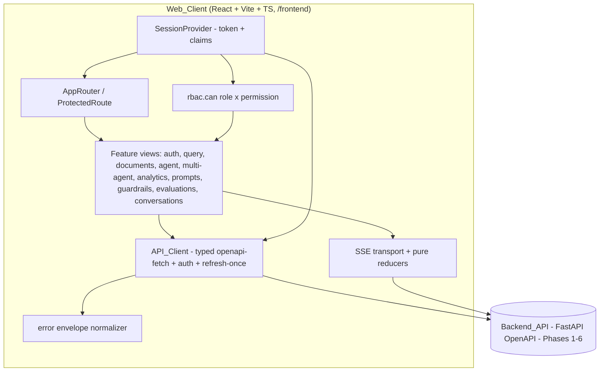

# Design Document — AgentForge Phase 7: React Web Frontend

## Overview

Phase 7 delivers the **Web_Client**: a React + Vite + TypeScript single-page application
that gives human Operators a browser console over the already-shipped AgentForge backend
(Phases 1–6). This phase is **UI-only** — it introduces no new backend capability and no
backend contract change. The Web_Client consumes the stable HTTP/SSE contracts served by
the async FastAPI application, mirrors its authentication/authorization/tenancy/error
semantics faithfully, and degrades gracefully when optional backend features are disabled.

The application lives in a `/frontend` subdirectory of the existing repository. All
backend calls flow through a single typed **API_Client** whose request/response types are
generated from the backend's FastAPI OpenAPI schema, so the client cannot drift from the
shipped contracts. No secret ever enters the client bundle; the only build/runtime
configuration is the Backend_API base URL and non-secret flags.

### Design Goals

1. **Contract fidelity** — types are derived from OpenAPI; the UI never re-implements or
   relaxes backend semantics (auth, RBAC, tenancy, error envelope, SSE terminal rules).
2. **RBAC-aware rendering** — controls are gated as a *pure function* of the Session Role
   and the backend's static role→permission map; unauthorized controls are omitted from
   the DOM entirely, not merely disabled.
3. **Uniform error surfacing** — every backend error is normalized from the
   `AppError` envelope into one client error shape and surfaced consistently, with a
   401 refresh-once-then-retry policy and cross-tenant 404 handled as "not found".
4. **Faithful streaming** — single-agent and multi-agent SSE streams are consumed with an
   exactly-one-terminal-event invariant; multi-agent events are attributed to their
   `role_id` and ordered by `sequence`; `approval_required` is treated as non-terminal.
5. **Deterministic, keyless testability** — the pure logic layer (claims decoding, RBAC,
   error mapping, SSE reducers, cost rendering) is unit- and property-tested with no
   network and no credentials, mirroring the backend's keyless promise.

### Backend Semantics the Web_Client Must Mirror (source of truth)

Grounded against `src/agentforge/api/*`, `src/agentforge/enterprise/*`, and
`docs/decisions.md`:

- **Access_Token**: JWT (HS256) with claims `sub`, `org_id`, `role`, `exp`. Issued by
  `POST /auth/login`, `POST /auth/register-self` (201), and `POST /auth/refresh`. Sent as
  `Authorization: Bearer <token>`.
- **RBAC** (`enterprise/rbac.py`): roles `owner ⊇ admin ⊇ member ⊇ viewer`; permissions
  `read`, `run_agents`, `ingest_documents`, `manage_api_keys`, `manage_members`. The map
  is: `viewer = {read}`; `member = viewer ∪ {run_agents, ingest_documents}`;
  `admin = member ∪ {manage_api_keys}`; `owner = admin ∪ {manage_members}`.
- **Tenancy**: cross-tenant access returns **404 `not_found`, never 403** — existence is
  never leaked (`orgs.py`, `deps.py`, decisions §28/§38).
- **AppError_Envelope** (`errors.py`): every error body is
  `{ "error": { "code": string, "message": string, "details": object } }` with an HTTP
  status. Well-known codes: `unauthorized` (401), `auth_failed` (401), `forbidden` (403),
  `not_found` (404), `validation_error` (422 with `details.errors`, or 400 with
  `details.field`), `rate_limited` (429), `internal_error` (500), `llm_provider_error`
  (502), `guardrail_blocked` (400 with `details.reason`), document errors
  (`size_limit_exceeded` 413, `unsupported_format` 415, `empty_document` 400,
  `extraction_failure`/`extraction_timeout` 422, `embedding_error` 500),
  `missing_variable` (400 with `details.missing`), `run-not-awaiting-approval` (409).
- **SSE frame shape** (`streaming/base.py`, `multiagent/streaming.py`):
  `event: <type>\ndata: <json>\n\n`; the JSON payload always embeds a monotonic
  `sequence`. Single-agent event types: `step`, `tool_call`, `delta`, `completion`
  (terminal), `error` (terminal). Multi-agent event types: `agent_started`, `plan`,
  `research`, `draft`, `critic_feedback`, `approval_required` (non-terminal),
  `completion` (terminal), `error` (terminal). Every agent event carries `role_id`.
- **Streaming transport**: both stream endpoints are **POST** returning
  `text/event-stream` (`POST /agent/stream`, `POST /multi-agent/runs/{id}/stream`). The
  browser `EventSource` API only issues GET, so the client streams via `fetch` +
  `ReadableStream` and parses SSE frames itself.

## Architecture

### High-Level Shape

The Web_Client is a client-rendered SPA. It holds two kinds of state:

- **Session state** (auth): the stored Access_Token and its decoded claims (Org_Context,
  Role, expiry). Kept in a React context backed by `localStorage`, and consumed by the
  API_Client to attach the bearer header and by the RBAC gate to decide control
  visibility.
- **Server state** (data): everything fetched from the Backend_API — documents, usage
  reports, prompts, runs, etc. Managed by a data-fetching library that provides caching,
  loading/empty/error states, and request retry, so feature components stay declarative.

Streaming (SSE) is handled outside the data-fetching cache by a dedicated transport that
feeds a **pure reducer**; the reducer's accumulated state is exposed to the run views.



### Technology Choices (concrete, minimal, well-established)

| Concern | Choice | Rationale |
|---|---|---|
| Build/dev | **Vite** + **TypeScript** | Required by the spec; fast HMR, first-class TS, `import.meta.env` for non-secret build/runtime config (base URL). |
| UI | **React 18** | Required by the spec. |
| Routing | **React Router v6** | De-facto standard SPA router; enables the unauthenticated→login redirect (Req 2.5) and per-view guards via a `ProtectedRoute`. |
| Server state | **TanStack Query (React Query) v5** | Declarative caching, retry, and built-in loading/empty/error surfacing map directly onto Reqs 5, 6, and the many list/detail views. Keyless-testable by mocking the transport. |
| API types | **openapi-typescript** (dev-time codegen) + **openapi-fetch** (tiny runtime) | Generates request/response types straight from the backend OpenAPI schema (Req 1.3), giving compile-time contract fidelity with a ~1 KB runtime and no secret in the bundle. |
| SSE | **fetch + ReadableStream** (custom `SSEClient`) + pure frame parser/reducers | The stream endpoints are POST; `EventSource` is GET-only, so a fetch-based reader is required. A pure parser + reducer make the terminal-event and ordering invariants property-testable. |
| Forms/validation | Lightweight controlled components + zod (optional) for client-side required-field checks | Empty-field blocking (Req 2.4, 12.6) is simple presence validation; server remains the source of truth for all other validation. |
| Testing | **Vitest** + **React Testing Library** + **fast-check** + **MSW** | Vitest/RTL are the Vite-native unit/component stack; fast-check supplies property-based testing for the pure logic layer; MSW mocks the Backend_API (including SSE) deterministically with no credentials. |

`openapi-typescript` + `openapi-fetch` are preferred over heavier generators (e.g. a full
client SDK) because they add negligible runtime weight, keep the bundle free of generated
imperative code, and still deliver end-to-end type safety keyed to the shipped schema.

### Module / Directory Layout

```
/frontend
├── index.html
├── package.json
├── vite.config.ts
├── tsconfig.json
├── openapi-ts.config.ts          # points at the backend OpenAPI schema
└── src/
    ├── main.tsx                  # React root, providers
    ├── App.tsx                   # layout shell + router mount
    ├── config.ts                 # base URL from import.meta.env (non-secret only)
    ├── api/
    │   ├── schema.d.ts           # GENERATED by openapi-typescript (do not edit)
    │   ├── client.ts             # openapi-fetch instance + middleware
    │   ├── auth-middleware.ts    # attach bearer; 401 refresh-once + retry
    │   ├── errors.ts             # AppError envelope → ClientError (total mapping)
    │   └── sse/
    │       ├── parse.ts          # pure: parseSseFrame(text) -> SseFrame
    │       ├── stream.ts         # fetch-based SSE transport + AbortController cancel
    │       ├── singleAgentReducer.ts  # pure reducer over single-agent events
    │       └── multiAgentReducer.ts   # pure reducer over multi-agent events
    ├── auth/
    │   ├── token.ts              # pure: decodeClaims, isExpired
    │   ├── rbac.ts               # pure: ROLE_PERMISSIONS mirror, can(role, perm)
    │   ├── SessionProvider.tsx   # context: token + claims + login/logout
    │   └── useSession.ts
    ├── routing/
    │   ├── AppRouter.tsx
    │   └── ProtectedRoute.tsx    # redirects to /login when no valid session
    ├── components/
    │   ├── Can.tsx               # RBAC gate: renders children iff permission held
    │   ├── OrgContextBadge.tsx   # persistent Org_Context + Role display
    │   ├── ErrorBanner.tsx       # renders normalized ClientError
    │   ├── EmptyState.tsx        # explicit empty-state rendering
    │   └── RetryNotice.tsx       # connectivity/retry affordance
    └── features/
        ├── auth/                 # LoginView, RegisterView
        ├── query/                # RagQueryView (citations, flags, grounded)
        ├── documents/            # DocumentListView, UploadControl
        ├── agent/                # SingleAgentRunView, TraceView
        ├── multiAgent/           # MultiAgentRunView, ApprovalPanel
        ├── analytics/            # UsageDashboardView
        ├── prompts/              # PromptRegistryView, RenderPromptForm
        ├── guardrails/           # GuardrailsView
        ├── evaluations/          # EvaluationsView
        └── conversations/        # ConversationView + conversation context hook
```

### Routing and Authenticated Layout

- **Public routes**: `/login`, `/register`. Reachable with no valid Session.
- **Protected routes**: everything else, wrapped by `ProtectedRoute`. When no valid
  Access_Token is stored (absent, expired, or malformed), `ProtectedRoute` redirects to
  `/login` (Req 2.5, 3.2).
- The authenticated layout renders a persistent `OrgContextBadge` (active Org_Context +
  Role, Req 4.1), an org switcher when the Operator holds tokens for multiple orgs
  (Req 4.6), a navigation menu whose entries are themselves RBAC-gated, and a logout
  control (Req 3.4).

Route → primary endpoint(s) → required permission:

| Route | Endpoint(s) | Permission (to show primary action) |
|---|---|---|
| `/query` | `POST /query` | `run_agents` |
| `/documents` | `GET/POST/DELETE /documents` | list: `read`; upload/delete: `ingest_documents` |
| `/agent` | `POST /agent/run`, `POST /agent/stream`, `GET /agent/runs/{id}/trace` | run: `run_agents`; trace: `read` |
| `/multi-agent` | `POST /multi-agent/runs`, `.../stream`, `.../approval`, `GET .../{id}` | run/approval: `run_agents`; view: `read` |
| `/analytics` | `GET /analytics/usage` | `read` |
| `/prompts` | `GET /prompts*`, `POST /prompts`, `POST /prompts/{name}/render` | browse/render: `read`; create version: `ingest_documents` |
| `/guardrails` | `GET /guardrails/config`, `POST /guardrails/evaluate` | view: `read`; evaluate: `run_agents` |
| `/evaluations` | `GET/POST /evaluations/datasets`, `POST /evaluations/runs`, `GET /evaluations/runs/{id}` | view: `read`; create dataset/run: `run_agents` |
| `/conversations/:id` | `POST /conversations`, `GET /conversations/{id}` | `read` |

> Note (Req 4.4/4.5): `manage_members` and `manage_api_keys` gate org member/team and
> API-key management controls. The backend exposes these under `/orgs/*`; the Web_Client
> gates such controls by permission and only surfaces them where a corresponding shipped
> contract exists. No management capability is added that lacks a backend contract (Req 1.6).

### State Management Strategy

- **Session**: a single `SessionProvider` holds `{ token, claims }`. On mount it hydrates
  from `localStorage`, decodes claims, and validates expiry. On login/register it stores
  the token; on logout or terminal 401 it clears token + derived state. The active token
  is the single source of Org_Context and Role — switching orgs means adopting a different
  stored token whose `org_id` matches the selection (Req 4.6).
- **Server data**: React Query keyed by `[resource, orgId, ...params]` so that switching
  Org_Context re-scopes every displayed list/detail by cache key (Req 4.6). Query
  functions call the API_Client and throw normalized `ClientError`s; components render
  `isLoading` / empty / `error` states uniformly.
- **Streaming**: a `useSseRun` hook owns an `AbortController` and feeds frames into the
  appropriate pure reducer, exposing `{ events, phase, terminal, cancel }`. Cancel aborts
  the fetch and marks the client subscription closed (Req 9.7).

### API_Client Layer

`api/client.ts` constructs one `openapi-fetch` client bound to `config.baseUrl`
(`import.meta.env.VITE_API_BASE_URL`). Two middlewares are attached:

1. **auth-middleware** (request): if a valid token is present, attach
   `Authorization: Bearer <token>` (Req 2.6). Public auth endpoints are exempt.
2. **auth-middleware** (response): on `401 unauthorized` for an authenticated request,
   attempt `POST /auth/refresh` **exactly once**; on success, replace the stored token and
   retry the original request one time; on refresh failure (or a second 401), clear the
   token and route to `/login` (Req 3.3, 3.5, 3.6). The refresh-once flag is per original
   request so retries can never loop.

All non-2xx responses are passed through `errors.ts` to produce a normalized
`ClientError` before reaching feature code. The SSE transport shares the same base URL and
bearer attachment but bypasses React Query (streams are not cacheable).

### SSE Handling

`api/sse/stream.ts` opens a POST `fetch` with `Accept: text/event-stream`, reads
`response.body` as a stream, decodes chunks, and splits on the blank-line frame delimiter.
Each complete frame is handed to the pure `parseSseFrame`, producing
`{ type, data }` where `data` includes the monotonic `sequence`. Parsed events are pushed
into a pure reducer:

- **singleAgentReducer**: accumulates ordered `step`/`tool_call`/`delta` events; on the
  first terminal event (`completion` or `error`) it records the terminal payload and marks
  the stream closed; any event arriving after a terminal is ignored (defensive — the
  backend emits exactly one).
- **multiAgentReducer**: buckets agent events by `role_id`, keeps a `sequence`-ordered
  event log, records an `approval_required` checkpoint as a **non-terminal** pause (so the
  UI shows approve/reject/edit and the run can be resumed by a fresh stream call), and
  closes on the single `completion`/`error` terminal.

Both reducers are pure `(state, event) -> state` functions, which makes the
exactly-one-terminal and ordering guarantees property-testable without a live stream.

## Components and Interfaces

### Pure logic modules (unit- and property-tested)

```ts
// auth/token.ts
export interface Claims {
  sub: string;
  org_id: string;
  role: Role;         // "owner" | "admin" | "member" | "viewer"
  exp: number;        // seconds since epoch
}
/** Decode a JWT payload. Returns null for ANY malformed/undecodable token
 *  or any payload missing/!typed on the required claims (never throws). */
export function decodeClaims(token: string): Claims | null;
/** True iff the token is expired at `nowSeconds` (exp <= now). */
export function isExpired(claims: Claims, nowSeconds: number): boolean;

// auth/rbac.ts
export type Permission =
  | "read" | "run_agents" | "ingest_documents"
  | "manage_api_keys" | "manage_members";
export const ROLE_PERMISSIONS: Record<Role, ReadonlySet<Permission>>; // mirrors backend
/** Pure authorization decision: does `role` grant `permission`? */
export function can(role: Role, permission: Permission): boolean;

// api/errors.ts
export interface ClientError {
  code: string;            // envelope error.code, or a synthetic code for network/parse
  message: string;         // always a non-empty, user-presentable message
  status: number | null;   // HTTP status, or null for a network-layer failure
  details: Record<string, unknown>;
  kind: ErrorKind;         // "auth" | "forbidden" | "not_found" | "validation"
                           // | "rate_limited" | "provider" | "server" | "network" | "unknown"
  fieldErrors?: Record<string, string>; // populated for 422 validation_error
}
/** Total function: for ANY status + ANY body (valid envelope, partial, or garbage)
 *  and for the network-failure case, returns a defined ClientError. Never throws. */
export function mapError(status: number | null, body: unknown): ClientError;

// api/sse/parse.ts
export interface SseFrame { type: string; data: Record<string, unknown>; }
/** Parse one `event: <type>\ndata: <json>\n\n` frame. */
export function parseSseFrame(raw: string): SseFrame | null;
```

### SSE reducer interfaces

```ts
// api/sse/singleAgentReducer.ts
export interface SingleAgentStreamState {
  events: SseFrame[];            // in received (sequence) order, non-terminal only
  terminal: SseFrame | null;     // the one terminal event, once seen
  closed: boolean;               // true after a terminal
  answer?: string;
  citations: Citation[];
  terminationReason?: "final-answer" | "iteration-limit-reached";
  errorMessage?: string;
}
export const initialSingleAgentState: SingleAgentStreamState;
export function singleAgentReduce(
  s: SingleAgentStreamState, e: SseFrame,
): SingleAgentStreamState;

// api/sse/multiAgentReducer.ts
export interface MultiAgentStreamState {
  events: SseFrame[];                 // ordered by sequence
  byRole: Record<string, SseFrame[]>; // agent events bucketed by role_id
  approval: { checkpoint: string; runId: string } | null; // non-terminal pause
  terminal: SseFrame | null;
  closed: boolean;
  finalAnswer?: string;
  citations: Citation[];
  terminationReason?: MultiAgentTerminationReason;
}
export const initialMultiAgentState: MultiAgentStreamState;
export function multiAgentReduce(
  s: MultiAgentStreamState, e: SseFrame,
): MultiAgentStreamState;
```

### React component contracts (representative)

```tsx
// components/Can.tsx — RBAC gate; omits children from the DOM when unauthorized (Req 4.2-4.5)
function Can(props: { permission: Permission; children: React.ReactNode }): JSX.Element | null;

// components/ErrorBanner.tsx — renders a normalized ClientError uniformly (Req 5.1, 5.2, 5.5)
function ErrorBanner(props: { error: ClientError; onRetry?: () => void }): JSX.Element;

// auth/useSession.ts
interface SessionApi {
  token: string | null;
  claims: Claims | null;         // null when unauthenticated/expired
  orgId: string | null;
  role: Role | null;
  isAuthenticated: boolean;      // token present AND not expired
  login(token: string): void;
  logout(): void;                // clears token + derived state (Req 3.4)
}
function useSession(): SessionApi;

// features/agent/useSseRun.ts
interface SseRun<S> {
  state: S;                      // reducer-accumulated stream state
  isStreaming: boolean;
  cancel(): void;                // aborts fetch + closes client subscription (Req 9.7)
}
```

### Endpoint-to-view interface map

Each feature view calls the API_Client method whose types come from `schema.d.ts`. The
mapping is exhaustive over the 15 requirements:

- **Auth** (Req 2, 3): `POST /auth/login`, `POST /auth/register-self`, `POST /auth/refresh`.
- **Org/RBAC** (Req 4): claims-derived Org_Context/Role; `Can` gating; org switch by token.
- **Query** (Req 7): `POST /query`.
- **Documents** (Req 8): `GET /documents`, `POST /documents` (multipart),
  `DELETE /documents/{id}`.
- **Single-agent** (Req 9): `POST /agent/run`, `POST /agent/stream`,
  `GET /agent/runs/{id}/trace`.
- **Multi-agent** (Req 10): `POST /multi-agent/runs`, `.../stream`, `.../approval`,
  `GET /multi-agent/runs/{id}`.
- **Analytics** (Req 11): `GET /analytics/usage?start&end`.
- **Prompts** (Req 12): `GET /prompts`, `GET /prompts/{name}/versions`,
  `GET /prompts/{name}?version=N`, `POST /prompts`, `POST /prompts/{name}/render`.
- **Guardrails** (Req 13): `GET /guardrails/config`, `POST /guardrails/evaluate`.
- **Evaluations** (Req 14): `POST/GET /evaluations/datasets`, `POST /evaluations/runs`,
  `GET /evaluations/runs/{id}`.
- **Conversations** (Req 15): `POST /conversations`, `GET /conversations/{id}`.

## Data Models

All server-facing types are **generated** from the backend OpenAPI schema into
`api/schema.d.ts` and consumed via `openapi-fetch`, so they always match the shipped
Pydantic models in `api/schemas.py`. The types below are the client-side domain types
(hand-written) plus the shapes the generated types resolve to, shown for clarity.

### Session / auth

```ts
type Role = "owner" | "admin" | "member" | "viewer";
interface Claims { sub: string; org_id: string; role: Role; exp: number; }
interface TokenResponse { access_token: string; token_type: "bearer"; }
```

### RAG / citations

```ts
interface Citation { document_id: string; chunk_id: string; }
interface QueryResponse {
  answer: string;
  grounded: boolean;
  provider: string;
  citations: Citation[];
  flags: string[];
}
```

### Documents

```ts
interface IngestResponse {
  document_id: string; filename: string; chunk_count: number; status: "ingested";
}
interface DocumentSummary {
  document_id: string; filename: string; content_type: string;
  size_bytes: number; status: string; chunk_count: number; created_at: string;
}
```

### Agent (single) + trace

```ts
interface AgentRunResponse {
  run_id: string; conversation_id: string; answer: string;
  termination_reason: "final-answer" | "iteration-limit-reached";
  citations: Citation[]; flags: string[];
}
interface TraceEntry {
  ordinal: number; step_type: string;
  role_id?: string | null; tool_name?: string | null; outcome?: string | null;
}
interface TraceResponse { run_id: string; entries: TraceEntry[]; }
```

### Multi-agent

```ts
type MultiAgentRunStatus = "running" | "awaiting_approval" | "terminated";
type MultiAgentTerminationReason =
  | "completed" | "max-rounds-reached" | "max-revisions-reached"
  | "rejected" | "aborted";
interface StartMultiAgentRunResponse {
  run_id: string; conversation_id: string; status: MultiAgentRunStatus; flags: string[];
}
type ApprovalDecisionKind = "approve" | "reject" | "edit";
interface ApprovalDecisionRequest {
  type: ApprovalDecisionKind; feedback?: string | null; edited_content?: string | null;
}
interface ApprovalDecisionResponse {
  run_id: string; status: MultiAgentRunStatus;
  termination_reason?: MultiAgentTerminationReason | null;
}
interface FinalOutput { content: string; citations: Citation[]; }
interface MultiAgentRunResult {
  run_id: string; status: MultiAgentRunStatus;
  termination_reason?: MultiAgentTerminationReason | null;
  final_output?: FinalOutput | null; trace: TraceEntry[];
}
```

### SSE event payloads (mirroring the backend frame `data`)

```ts
// single-agent completion data / error data
interface SingleCompletionData {
  sequence: number; run_id: string | null; conversation_id: string | null;
  answer: string; termination_reason: string | null; citations: Citation[];
}
interface StreamErrorData { sequence: number; message: string; error_type: string; }

// multi-agent event data (role_id present on agent events)
interface MultiAgentEventData {
  sequence: number; role_id?: string;
  steps?: string[]; findings?: unknown[]; content?: string;
  citations?: Citation[]; revision_required?: boolean; comments?: string;
  checkpoint?: string; run_id?: string;
  answer?: string; termination_reason?: string | null;
}
```

### Analytics / usage

```ts
interface UsageBreakdownEntry { key: string; total_tokens: number; total_cost: string; }
interface UsageReport {
  org_id: string; start: string; end: string;
  total_tokens: number;
  total_cost: string;   // EXACT string from backend; rendered verbatim (Req 11.4)
  by_provider: UsageBreakdownEntry[];
  by_model: UsageBreakdownEntry[];
  by_user: UsageBreakdownEntry[];
}
```

### Prompts / guardrails / evaluations / conversations

```ts
interface PromptVersion {
  id: string; name: string; version: number;
  body: string; variables: string[]; created_at: string;
}
interface RenderPromptResponse { name: string; version: number; rendered: string; }

interface GuardrailInfo { name: string; kind: string; }
interface GuardrailConfig { guardrails: GuardrailInfo[]; }
interface GuardrailEvaluateResponse {
  decision: "allow" | "flag" | "block"; flags: string[]; reason?: string | null;
}

interface DatasetSummary { dataset_id: string; name: string; created_at: string; }
interface EvaluationItemScore { item_id: string; evaluator: string; score: number; }
interface EvaluationRunResponse {
  run_id: string; dataset_id: string; aggregate_score: number;
  results: EvaluationItemScore[];
}

interface Message { role: string; content: string; position: number; }
interface ConversationHistory { conversation_id: string; messages: Message[]; }
```

### Error envelope (client-normalized)

```ts
interface AppErrorEnvelope { error: { code: string; message: string; details: Record<string, unknown>; }; }
// normalized to ClientError (see Components and Interfaces)
```


## Premium UX & Design System

This section is an **additive** enhancement. It does not alter any backend contract, any
existing architecture decision, the API_Client layer, the pure logic layer, the twelve
correctness properties, error handling, or the testing strategy defined above — all of that
remains authoritative. Its purpose is to raise the Web_Client from a functionally-correct
console to a **world-class, premium SaaS "AI Operating System"** whose craft is comparable
to ChatGPT, the Anthropic Console, Linear, the Vercel Dashboard, Arc, Perplexity, GitHub,
and Retool. The bar is explicit: the product **must not look like a generic admin dashboard
or a basic CRUD app**.

### Non-negotiable constraints (restated for this section)

- **UI-only.** Nothing here introduces or requires a backend contract change. Where a
  desirable UX affordance has **no shipped backend contract**, the affordance is **omitted**
  rather than met by a backend change (Req 1.6). Every data-backed surface below binds to an
  already-shipped endpoint listed in the Architecture endpoint map.
- **Faithful backend semantics preserved.** JWT claims (`sub`, `org_id`, `role`, `exp`), the
  RBAC role→permission map (`viewer ⊆ member ⊆ admin ⊆ owner`), cross-tenant **404 (never
  403)**, the uniform `AppError` envelope, SSE **exactly-one-terminal**, multi-agent
  `role_id` + `sequence` attribution, and `approval_required` as **non-terminal** are all
  unchanged. The visual layer decorates these semantics; it never relaxes or re-implements
  them.
- **Keyless + deterministic testing preserved.** The pure logic layer is untouched; UI is
  still tested with **Vitest + React Testing Library + MSW**, with **fast-check** for pure
  logic. All new heavy dependencies (Monaco, charts) are **lazy-loaded and mocked in tests**
  so tests stay keyless, fast, and deterministic.
- **Bundle-conscious & keyless-testable dependency choices.** Every added library below is
  well-established, tree-shakeable, and either code-split or small enough to keep the initial
  bundle lean.

### 1. Design language & theming

**Dark-mode-first, full light-mode.** The Web_Client ships a refined dark theme as the
default and a first-class light theme. The active theme is chosen by: (1) an explicit
Operator selection persisted in `localStorage` under a stable key, else (2) the system
preference via `prefers-color-scheme`. To eliminate a **flash-of-wrong-theme (FOWT)**, a
tiny **blocking inline script in `index.html`** resolves and applies the `data-theme`
attribute on `<html>` *before* first paint (before React hydrates), reading the same
persisted key and media query the runtime `ThemeProvider` uses. React then adopts that
already-applied theme, so there is never a light→dark repaint.

**Design token system.** All visual constants are expressed as **CSS custom properties**
(design tokens) declared on `:root` / `[data-theme="dark"]` / `[data-theme="light"]`, and
consumed by Tailwind through its theme extension so utilities resolve to tokens rather than
hard-coded values. Token families:

- **Color — semantic roles**, not raw hues: `bg`, `bg-subtle`, `surface`, `surface-raised`,
  `surface-overlay`, `border`, `border-strong`, `text`, `text-muted`, `text-inverted`,
  `primary`, `primary-fg`, `accent`, `success`, `warning`, `danger`, `info`, `focus-ring`,
  plus agent-role accents (`role-planner`, `role-researcher`, `role-writer`, `role-critic`)
  used consistently by the multi-agent visualizer, trace timeline, and streaming panes.
- **Elevation**: a shadow scale `elevation-0..4` (dark mode leans on layered surfaces +
  subtle borders rather than heavy shadows).
- **Radius**: `radius-sm|md|lg|xl|full`.
- **Blur**: `blur-sm|md|lg` for glass surfaces.
- **Spacing scale**: 4px base (`space-0.5 … space-24`) for consistent layout rhythm.
- **Typography scale**: `text-xs … text-4xl` with paired line-heights and weights, plus a
  clear hierarchy (display / heading / title / body / label / caption / code).
- **Motion tokens**: durations (`motion-fast 120ms`, `motion-base 200ms`, `motion-slow
  320ms`) and easings (`ease-standard`, `ease-emphasized`, `ease-exit`) so animation feels
  coherent across the app.

**Typography.** UI type uses **Inter** (or **Geist**) with tabular numerals for metrics;
code, traces, prompt bodies, and JSON payloads use a monospace face (**JetBrains Mono** or
Geist Mono). Fonts are self-hosted/`woff2`, `font-display: swap`, and subset to keep payload
small. A clear type hierarchy governs page titles, section headers, body copy, metadata, and
inline code.

**Glassmorphism, used tastefully.** Translucent, backdrop-blurred surfaces are reserved for
**overlay-class** UI — the command palette, modals/dialogs, popovers, the top app bar, and
toasts — never for dense data tables or long-form reading. Every glass surface declares a
**solid-color contrast fallback** (via `@supports not (backdrop-filter: blur())` and a
sufficiently opaque base) so text contrast still meets WCAG AA where `backdrop-filter` is
unsupported or reduced-transparency is requested.

**Layout rhythm.** Generous, consistent spacing; a constrained content max-width for reading
surfaces; aligned baseline grid; and clear visual hierarchy (primary action, supporting
metadata, and ambient chrome are visually distinct). No cramped, borderless "spreadsheet"
density.

### 2. Component & styling stack

Concrete, well-established, maintainable choices layered on top of the existing React 18 +
Vite + TS + React Router + TanStack Query + openapi-fetch foundation. All are additive to the
current `package.json`; none replaces an existing choice.

| Concern | Choice | Rationale (brief) | Bundle / test posture |
|---|---|---|---|
| Styling | **Tailwind CSS** (tokenized theme) | Utility-first velocity with a single tokenized source of truth; utilities resolve to the CSS custom-property tokens above, so theming stays centralized. | Purged/JIT — only used classes ship. No runtime cost. |
| Headless primitives | **Radix UI** (shadcn/ui composition pattern) | Accessible, unstyled primitives (Dialog, DropdownMenu, Popover, Tooltip, Tabs, Switch, Toast) give correct focus trapping, ARIA, and keyboard behavior for free; we own the styling via tokens. | Tree-shakeable per-primitive imports; renders real DOM/ARIA so RTL a11y assertions are straightforward. |
| Animation | **Framer Motion** | Declarative 60fps transform/opacity animations, layout animations, `AnimatePresence` for enter/exit, and built-in reduced-motion support. | Import only used components; wrap in `components/motion/` so tests can swap for a no-op. |
| Command palette | **cmdk** | Battle-tested, accessible command-menu primitive powering the ⌘K experience. | Small; palette route/panel is code-split. |
| Prompt editor | **Monaco Editor** (`@monaco-editor/react`) | Full-featured code/prompt editing with diffing (`DiffEditor`) for immutable version comparison and syntax awareness for variables. | **Lazy-loaded** via `React.lazy` + dynamic import; **mocked in tests** (never loaded under Vitest). |
| Markdown | **react-markdown** + **remark-gfm** + **rehype** (sanitize + **rehype-highlight**/Shiki) | Safe, extensible markdown with GFM, code-block syntax highlighting, and a custom renderer for **inline citations**. | Renderer isolated in `components/markdown/`; highlighter loaded on demand. |
| Charts | **visx** (or **Recharts**) | Accessible, composable analytics charts for usage/cost, breakdowns, and time-range views; visx keeps control over a11y and bundle. | **Lazy-loaded** on the analytics route; mocked in tests. |
| Icons | **lucide-react** | Consistent, lightweight, tree-shakeable icon set. | Per-icon imports only. |

**Testing implications (explicit).** The pure logic layer is unchanged and remains the PBT
target. UI continues under Vitest + RTL + MSW. Monaco and the charting lib are **dynamically
imported and mocked** (a lightweight stub component) in the test environment so suites remain
fast, deterministic, and keyless. Framer Motion is configured to honor a test-time reduced
/instant transition so assertions are not racing animations.

### 3. Signature experiences (mapped to shipped requirements)

Each experience binds only to endpoints already in the Architecture endpoint map; no new
contract is implied.

- **Global command palette (⌘K / Ctrl-K).** A cmdk-powered palette for navigation (jump to
  any RBAC-permitted route) and actions (new query, start run, new conversation, switch org,
  toggle theme, open shortcuts overlay). Command entries are themselves **RBAC-gated** by the
  same `can(role, permission)` used for nav (Req 4.2–4.5), so the palette never surfaces an
  action the Operator cannot perform. Fully keyboard-operable and screen-reader labeled via
  cmdk/Radix semantics.
- **Keyboard-shortcut system + discoverable overlay.** A central shortcut **registry** maps
  normalized key-chords (e.g. `mod+k`, `g then d`) to actions; a `?`-triggered **shortcuts
  overlay** (Radix Dialog) lists them grouped by area. The registry is validated for
  uniqueness (see Property 14) so no chord is ambiguously bound.
- **Rich loading / empty / success / error states everywhere.** Every list and dashboard has
  **skeleton loaders** (shimmer placeholders matching final layout) during `isLoading`;
  explicit **empty states** (illustration + primary CTA) for zero-result sets (Req 6.2, 11.5,
  13.5); success confirmations; and the uniform `ErrorBanner` for `ClientError` (Req 5.x).
  A **toast/notification system** (Radix Toast) surfaces transient outcomes (copied, saved,
  approved, rate-limited) without blocking, honoring input-preservation rules (Req 5.4, 6.5,
  7.5).
- **Live streaming chat / agent interface.** Token-by-token rendering of `delta` events with
  a blinking **streaming cursor**, incremental **markdown + code blocks**, and **inline
  citations** that render each `[n]` marker as a link to its source `{document_id, chunk_id}`
  (Req 7.2, 9.1–9.2). Backed by the existing `useSseRun` hook and the single-agent reducer;
  citation mapping is the pure function covered by Property 15.
- **Animated multi-agent workflow visualization.** A first-class **Planner → Researcher →
  Writer → Critic** visualization: role nodes with per-role accent tokens, animated **live
  role transitions** as `agent_started`/`plan`/`research`/`draft`/`critic_feedback` events
  arrive (attributed by `role_id`, ordered by `sequence`, Req 10.2), streaming per-role
  output panes, and the **`approval_required` checkpoint rendered as an interactive,
  first-class moment** — an elevated approval panel offering `approve` / `reject` / `edit`
  (Req 10.3) that is visually distinct as a **non-terminal pause** (the run is clearly
  "waiting on you", not finished). Uses Framer Motion for node/edge transitions; degrades to
  a static ordered layout under reduced motion.
- **Trace timeline visualization.** An ordered, zoomable timeline of trace steps — step type,
  tool calls, and durations — for single-agent (Req 9.5) and multi-agent runs (role-attributed,
  Req 10.6). When tracing is configured **NoOp** and no exported detail exists, the timeline
  renders the available streamed/persisted data and marks trace detail **unavailable**
  gracefully (Req 6.3) rather than showing an error.
- **Prompt Studio (Monaco).** Browse the **immutable versioned** registry (Req 12.1–12.3),
  **diff between versions** using Monaco `DiffEditor`, edit new versions with
  **variable-aware** highlighting, and a **render preview** panel (Req 12.5) with
  required-variable validation before submit (Req 12.6, Property 12). Version creation is
  gated on `ingest_documents` (Req 12.4).
- **Analytics / observability dashboards.** Beautiful, interactive usage/cost views with a
  **time-range picker** (Req 11.2), totals, and **by_provider / by_model / by_user**
  breakdowns (Req 11.3), each breakdown in its own error boundary (Req 11.6). Every cost
  string is rendered **verbatim** from the backend (Req 11.4, Property 11) — charts label and
  position values but never reformat the authoritative cost string shown to the Operator.
- **Guardrails & evaluations views.** Guardrail configuration presented as a polished, ordered
  list of `name`/`kind` with an interactive evaluate panel showing `allow`/`flag`/`block`
  decisions (Req 13); evaluations presented as insightful dataset/run views with
  aggregate + per-item scores visualized (Req 14).
- **Premium auth + app shell.** A refined login/registration experience (Req 2) and a
  commercial-grade **app shell**: a collapsible **sidebar** with RBAC-aware navigation, a
  persistent **Org_Context + Role badge** (Req 4.1), an **org switcher** for Operators
  holding tokens for multiple orgs (Req 4.6), theme toggle, and logout (Req 3.4). The shell
  feels like a product, not a scaffold.

### 4. Motion & performance

**60fps animation guidelines.**
- Animate **only `transform` and `opacity`** (GPU-compositable); avoid animating layout
  properties (`width`, `top`, `height`) on hot paths.
- Respect **`prefers-reduced-motion`**: a `useReducedMotion`-aware motion layer disables or
  reduces non-essential animation (route transitions become instant, the streaming cursor
  stops blinking, multi-agent transitions snap) — reduced motion never hides information.
- Standard patterns: **route/page transitions** (fade/slide via `AnimatePresence`),
  **list/stagger** entrance for cards and rows, a **streaming cursor** for live tokens, and
  spring-based micro-interactions for buttons/toggles.

**Performance.**
- **Code-splitting / lazy-loading**: Monaco, the charting lib, the multi-agent visualizer,
  and other heavy views are `React.lazy` + `Suspense` with skeleton fallbacks, kept out of
  the initial bundle.
- **Virtualization** (e.g. `@tanstack/react-virtual`) for long lists and long trace/event
  logs so streaming thousands of events stays smooth.
- **Memoization** (`memo`, `useMemo`, `useCallback`) around reducer-derived stream state and
  chart data to avoid re-render storms during high-frequency `delta` streaming.
- **Streaming smoothness**: batch token appends within an animation frame and keep the SSE
  reducer output referentially stable between frames.

### 5. Accessibility & responsiveness

**WCAG 2.1 AA.**
- **Color contrast** ≥ 4.5:1 for text (≥ 3:1 for large text/UI components), enforced on the
  token palette in both themes, including the solid fallbacks behind glass surfaces.
- **Focus management**: visible **focus rings** (`focus-ring` token) on all interactive
  elements; focus is trapped in dialogs/palette and restored on close (handled by Radix/cmdk);
  logical tab order.
- **Full keyboard operability**: every interactive element — including the command palette,
  dialogs, dropdown menus, tabs, and the approval panel — is reachable and operable by
  keyboard (Radix primitives provide roving focus and correct key handling).
- **ARIA semantics & screen-reader labels**: correct roles/names for nav, live regions for
  streaming output and toasts (`aria-live="polite"`), labeled form fields tied to validation
  messages (Req 5.3), and icon-only buttons carry accessible names.
- **Reduced motion** honored as above.

**Responsiveness.** Fully responsive from **mobile → ultrawide**. Breakpoints (Tailwind):
`sm 640 · md 768 · lg 1024 · xl 1280 · 2xl 1536`. App-shell adaptation:
- **< md**: sidebar collapses into a slide-over drawer (Radix Dialog), the Org badge moves
  into the top bar, tables reflow into stacked cards, and the command palette remains the
  fast path to any destination.
- **md–xl**: persistent collapsible sidebar + content area; two-pane run/trace layouts.
- **≥ 2xl**: content max-width is honored for reading surfaces while dashboards and the
  multi-agent visualizer use the extra width for side-by-side panes.

### 6. Frontend Directory Layout (UX additions)

These additions **extend** the existing `/frontend/src` layout defined in the Architecture
section; nothing there is removed. The `api/`, `auth/`, `routing/`, and existing pure logic
modules remain exactly as specified.

```
/frontend/src/
├── styles/
│   ├── tokens.css            # CSS custom-property design tokens (color/space/radius/blur/motion), per theme
│   ├── theme.ts              # token TypeScript types + resolveToken(theme, role) pure helper (Property 13)
│   └── tailwind.config.ts    # Tailwind theme extension bound to the CSS tokens
├── components/
│   ├── ui/                   # design-system primitives (Button, Input, Dialog, Tabs, Tooltip, Toast, Skeleton, Badge, Card) over Radix
│   ├── command/              # command palette (cmdk): CommandPalette, command registry, action items
│   ├── motion/               # animation primitives (MotionFade, Stagger, StreamingCursor) wrapping Framer Motion; test-swappable
│   └── markdown/             # Markdown renderer + citation mapping (extractCitations — Property 15) + code highlighting
├── hooks/
│   ├── useTheme.ts           # read/set/persist theme; system-preference aware; no-FOWT contract
│   ├── useKeyboardShortcuts.ts # shortcut registry + normalization + collision validation (Property 14)
│   └── useToast.ts           # imperative toast API over the ToastProvider
├── providers/
│   ├── ThemeProvider.tsx     # applies data-theme, persists selection, mirrors the index.html pre-paint script
│   ├── CommandPaletteProvider.tsx # global ⌘K state + registered commands (RBAC-gated)
│   └── ToastProvider.tsx     # Radix Toast viewport + queue
└── features/*/               # each feature gains visual components (e.g. multiAgent/WorkflowVisualizer,
                              #   agent/TraceTimeline, prompts/PromptStudio, analytics/UsageCharts,
                              #   query/StreamingAnswer) — all binding to the existing endpoint map
```

### UX correctness properties (new)

Three new pure, fast-check-testable properties are added to the **Correctness Properties**
section below as **Property 13, 14, and 15**, continuing from Property 12. They cover the
only genuinely pure/testable UX logic identified in prework — design-token resolution
totality, keyboard-shortcut registry uniqueness, and markdown citation mapping safety. All
other UX concerns (glass contrast, 60fps feel, responsive layout, focus appearance) are
verified by example-based a11y (axe-core), snapshot/visual, and component tests, not PBT, to
avoid inventing untestable UI properties.


## Correctness Properties

*A property is a characteristic or behavior that should hold true across all valid
executions of a system — essentially, a formal statement about what the system should do.
Properties serve as the bridge between human-readable specifications and
machine-verifiable correctness guarantees.*

Property-based testing applies to the Web_Client's **pure logic layer** — claims
decoding, RBAC authorization, the error-envelope normalizer, the SSE frame parser and
reducers, and verbatim cost rendering. These are pure functions with large input spaces
and universal invariants, so they are ideal PBT targets and are testable with no network
and no credentials. UI rendering interactions, specific endpoint calls, empty states, and
degradation scenarios are covered by example-based component tests (see Testing Strategy),
not property tests.

The following properties were derived from the prework analysis after redundancy
reflection (many mapping and rendering criteria consolidate into single comprehensive
properties).

### Property 1: Claims decoding is total and correct

*For any* string token, `decodeClaims` never throws: it returns a `Claims` object with
exactly the `sub`, `org_id`, `role`, and `exp` values encoded in a well-formed JWT payload
carrying all four correctly-typed claims, and returns `null` for any token that is
malformed, undecodable, or missing/mistyping any required claim.

**Validates: Requirements 3.1, 2.1, 2.3**

### Property 2: Session expiry is decided solely by exp vs. now

*For any* `Claims` and *any* `nowSeconds`, `isExpired(claims, nowSeconds)` is `true` if and
only if `claims.exp <= nowSeconds`; consequently a session derived from an expired token is
never treated as authenticated.

**Validates: Requirements 3.2**

### Property 3: Control visibility is a pure function of role and required permission

*For any* `Role` and *any* `Permission`, the RBAC gate (`Can` / `can(role, permission)`)
renders the gated control if and only if the backend role→permission map grants that
permission to that role — the query/run controls require `run_agents`, upload/prompt-create
require `ingest_documents`, member/team controls require `manage_members`, and API-key
controls require `manage_api_keys`. When the permission is not granted, the control is
absent from the rendered DOM (not merely disabled).

**Validates: Requirements 4.2, 4.3, 4.4, 4.5, 8.1, 12.4, 14.1**

### Property 4: The client RBAC map mirrors the backend nesting invariant

*For any* pair of roles ordered `viewer ≤ member ≤ admin ≤ owner`, the client
`ROLE_PERMISSIONS` sets satisfy `viewer ⊆ member ⊆ admin ⊆ owner`, and *for every* role the
set contains `read`. (This pins the client mirror to `enterprise/rbac.py` so the gate can
never grant more than the backend authorizes.)

**Validates: Requirements 4.2, 4.3, 4.4, 4.5**

### Property 5: Error-envelope normalization is total

*For any* HTTP status (including the network-failure case represented as `null`) and *any*
response body — a well-formed `AppError` envelope, a partial/garbage body, or no body —
`mapError` returns a defined `ClientError` with a non-empty, user-presentable `message` and
never throws. When the body is a valid envelope, `code`, `message`, and `details` are taken
verbatim from it; a `422 validation_error` additionally yields `fieldErrors` for each
reported field; a network failure yields `kind = "network"`; a `500` yields the generic
envelope message with no internal/stack text; and no message for a cross-tenant `404`
references any other organization.

**Validates: Requirements 5.1, 5.2, 5.3, 5.5, 5.6, 4.7, 6.5, 8.5, 9.6, 10.7, 12.7, 14.5, 15.4**

### Property 6: The 401 refresh path retries at most once

*For any* authenticated request whose first response is `401 unauthorized`, the API_Client
attempts `POST /auth/refresh` at most once and re-issues the original request at most once:
on refresh success it replaces the stored token and retries once; on refresh failure (or a
second `401`) it clears the stored token and routes to the login view. The total number of
original-request attempts never exceeds two, so the policy cannot loop.

**Validates: Requirements 3.3, 3.5, 3.6**

### Property 7: Every authenticated request carries the bearer token

*For any* stored valid Access_Token and *any* request to an authenticated endpoint, the
outgoing request includes the header `Authorization: Bearer <token>`; the public auth
endpoints (`/auth/login`, `/auth/register-self`) never receive it, and when no valid token
is stored no `Authorization` header is attached.

**Validates: Requirements 2.6**

### Property 8: The single-agent reducer preserves order and closes on exactly one terminal

*For any* finite sequence of parsed single-agent events, the `singleAgentReduce` fold keeps
non-terminal events (`step`/`tool_call`/`delta`) in received (`sequence`) order, transitions
to `closed = true` upon the first terminal event (`completion` or `error`) while capturing
its payload (answer + citations, or error detail), and ignores any event delivered after a
terminal — so the accumulated state records exactly one terminal outcome.

**Validates: Requirements 9.1, 9.2, 9.3**

### Property 9: The multi-agent reducer orders by sequence, attributes roles, and treats approval as non-terminal

*For any* finite sequence of parsed multi-agent events, the `multiAgentReduce` fold exposes
the events ordered by `sequence`, attributes every agent event (`agent_started`, `plan`,
`research`, `draft`, `critic_feedback`) to its `role_id` bucket, records an
`approval_required` event as a **non-terminal** pause (leaving `closed = false` and exposing
the checkpoint), and transitions to `closed = true` only upon the single terminal
`completion` (capturing final output + citations + termination reason) or `error`.

**Validates: Requirements 10.2, 10.3, 10.5**

### Property 10: SSE frame parsing round-trips the backend frame format

*For any* stream event in the backend vocabulary (a `type` plus a JSON `data` object
carrying a `sequence`), rendering it in the backend frame shape
`event: <type>\ndata: <json>\n\n` and then applying `parseSseFrame` yields a frame whose
`type` equals the original type and whose `data` equals the original payload.

**Validates: Requirements 9.1, 10.2**

### Property 11: Usage cost strings are rendered verbatim

*For any* `UsageReport`, every cost the Web_Client displays — the top-level `total_cost` and
each breakdown entry's `total_cost` — equals the exact string returned by the Backend_API,
with no numeric parsing, rounding, or reformatting applied.

**Validates: Requirements 11.4, 11.3**

### Property 12: Required-variable validation blocks render on exactly the missing set

*For any* set of declared variables of a selected `Prompt_Version` and *any* map of supplied
values, the prompt-render form blocks submission (issuing no `POST /prompts/{name}/render`)
if and only if at least one declared variable has no supplied value, and the set of names it
prompts for is exactly the declared variables that were not supplied.

**Validates: Requirements 12.6**

### Property 13: Design-token resolution is total over theme × semantic role

*For any* theme in `{ dark, light }` and *any* declared semantic role token, `resolveToken`
returns a defined, non-empty token value and never throws; and *for any* undeclared role
identifier it returns a single deterministic fallback value (identical across repeated calls
for the same input). This totality is what guarantees no undefined surface color and no
flash-of-wrong-theme: every theme × role pair the UI can request always resolves.

**Validates: Premium UX & Design System §1 (theming/token system); supports Requirements 4.1, 6.x rendering**

### Property 14: The keyboard-shortcut registry has no duplicate binding collisions

*For any* list of shortcut declarations, the registry builder normalizes each key-chord
(case- and modifier-order-insensitive, e.g. `Mod+K` ≡ `mod+k`) and produces a registry in
which every normalized chord maps to **exactly one** action; whenever two distinct actions
declare the same normalized chord, the builder surfaces a **collision** rather than silently
overwriting or dropping a binding. Consequently, resolving any registered chord yields a
unique, unambiguous action.

**Validates: Premium UX & Design System §3 (command palette / keyboard-shortcut system)**

### Property 15: Markdown citation extraction maps every marker to a valid citation or renders it inert

*For any* markdown string and *any* citation list of length `N`, `extractCitations` is total
(never throws) and produces a segment stream in which every inline `[n]` marker is emitted
either as a **citation link** referencing an index in `1..N` that points at the matching
`Citation` (`{ document_id, chunk_id }`), or — when `n` is outside `1..N` or not a real
citation reference — as **inert text** with no link and no dangling reference; no in-range
marker is dropped and no out-of-range marker becomes a link.

**Validates: Premium UX & Design System §3 (streaming chat inline citations); supports Requirements 7.2, 9.2**

## Error Handling

All error handling flows through the single normalizer `mapError` (Property 5), so every
feature surfaces failures the same way via `ErrorBanner`.

### Normalization

- **AppError envelope** (`{ error: { code, message, details } }`): `code`, `message`, and
  `details` are copied into `ClientError`; `kind` is derived from status/code. `message` is
  always presented to the Operator (Req 5.1); relevant `details` fields are surfaced beside
  it (Req 5.2).
- **Non-envelope / malformed body**: a synthetic `ClientError` is produced with a generic
  message and `kind = "unknown"` (or `"server"` for 5xx), never throwing.

### Status-specific behavior

| Condition | `kind` | UI behavior |
|---|---|---|
| `401 unauthorized` (authenticated req) | `auth` | Refresh-once → retry; on failure clear token + route to `/login` (Req 3.3, 3.5, 3.6). |
| `401 auth_failed` (login) | `auth` | Show envelope message; stay on login (Req 2.2). |
| `403 forbidden` | `forbidden` | Show message; the action's control is normally already RBAC-gated out (Req 4.2–4.5). |
| `404 not_found` | `not_found` | Present resource as "not found"; never reveal another org (Req 4.7, 9.6, 10.7, 14.5, 15.4). |
| `422 validation_error` | `validation` | Map `details.errors` to `fieldErrors` and show against form fields (Req 5.3). |
| `429 rate_limited` | `rate_limited` | Show rate-limit notice; preserve unsubmitted input (Req 5.4). |
| `500 internal_error` | `server` | Show generic envelope message; never a stack trace (Req 5.5). |
| `502 llm_provider_error` | `provider` | Show provider error message; preserve submitted input for retry (Req 6.5). |
| `400 guardrail_blocked` | `validation`/`unknown` | Show `details.reason`; withhold any answer (Req 7.5). |
| `400 missing_variable` | `validation` | Show `details.missing` variable names (Req 12.7). |
| Document errors (413/415/400/422/500) | per status | Show the corresponding envelope message (Req 8.5). |
| `409 run-not-awaiting-approval` | `unknown` | Show message; refresh the run status (Req 10.8). |
| Network failure (no HTTP response) | `network` | Show connectivity error + `RetryNotice` retry action (Req 5.6). |

### Input preservation

For `429`, `502`, and `400 guardrail_blocked`, the submitting form retains the Operator's
input so a retry needs no re-entry (Req 5.4, 6.5, 7.5). This is implemented by keeping form
state independent of the request lifecycle (the mutation does not clear inputs on error).

### Graceful degradation

- Empty result sets render explicit empty states per view (Req 6.2); guardrails config
  empty → no-active-guardrails state (Req 13.5); usage empty → empty usage state (Req 11.5).
- A run whose trace has no exported detail (NoOp tracing) renders streamed/persisted data
  and marks trace detail unavailable (Req 6.3).
- Responses omitting optional capabilities render only what is present (Req 6.4).
- Each analytics breakdown is wrapped in its own error boundary so one failing breakdown is
  hidden while totals and other breakdowns still render (Req 11.6).

## Testing Strategy

The Web_Client uses a **dual testing approach**: property-based tests for the pure logic
layer and example-based component/integration tests for UI interactions and specific
scenarios. PBT is scoped to pure functions with universal invariants; UI rendering, routing
navigation, specific endpoint wiring, empty states, and degradation are covered by
example-based tests. This division follows the PBT guidance: rendering and single-scenario
interactions are not universal-quantification targets, while the decode/authorize/map/parse/
reduce layer is.

### Tooling

- **Vitest** — test runner (Vite-native, fast, TS-first). Run once with `vitest --run`.
- **React Testing Library** — component/interaction tests against the rendered DOM,
  including assertions that RBAC-gated controls are *absent* from the DOM.
- **fast-check** — property-based testing for the pure logic modules. This is an
  established library; property tests must **not** be hand-rolled.
- **MSW (Mock Service Worker)** — deterministic, keyless mocking of the Backend_API for
  component/integration tests, including simulated `text/event-stream` responses for SSE and
  simulated network failures.
- **UX-layer testing posture (additive).** The new premium-UX dependencies keep suites fast,
  deterministic, and keyless: **Monaco Editor** and the **charting library** are dynamically
  imported and **mocked** with lightweight stub components under Vitest (never loaded in
  tests); **Framer Motion** runs with reduced/instant transitions in the test environment so
  assertions never race animations; and accessibility is asserted with **axe-core** (via
  `jest-axe`/`vitest-axe`) plus RTL keyboard-interaction and focus-order tests. Theme,
  command palette, skeleton/empty/error states, and responsive behavior are covered by
  example-based component tests and snapshot/visual checks — not PBT — consistent with the
  property/example division above.

### Property-based testing requirements

- Each correctness property (Properties 1–15) is implemented by a **single** property-based
  test using fast-check.
- Each property test runs a **minimum of 100 iterations**.
- Each property test is tagged with a comment referencing its design property, in the format:
  **Feature: agentforge-frontend, Property {number}: {property_text}**
- Generators: arbitrary JWT payloads (valid and malformed) for Property 1; arbitrary
  `exp`/`now` integers for Property 2; the four roles × five permissions for Properties 3–4;
  arbitrary status codes × arbitrary bodies (valid envelope, partial, garbage, null) for
  Property 5; arbitrary 401-then-{success|failure} response sequences for Property 6;
  arbitrary token/endpoint pairs for Property 7; arbitrary ordered event sequences ending in
  a terminal for Properties 8–9; arbitrary event `{type, data}` pairs for Property 10;
  arbitrary cost strings and reports for Property 11; arbitrary declared-variable sets ×
  supplied subsets for Property 12; theme ∈ `{dark, light}` × declared/undeclared role
  identifiers for Property 13; arbitrary shortcut-declaration lists (including
  normalized-equivalent and duplicate chords) for Property 14; arbitrary markdown strings
  containing in- and out-of-range `[n]` markers paired with citation lists of arbitrary
  length `N` for Property 15.
- Properties 13–15 exercise only the new **pure** UX helpers (`resolveToken`, the
  shortcut-registry builder, and `extractCitations`); they require no DOM, no network, and no
  credentials, preserving the keyless testing promise.

### Example-based tests (representative, non-exhaustive)

- **Auth flows**: login stores token (2.1); 401 auth_failed stays on login (2.2);
  register 201 stores token (2.3); empty-field blocking (2.4); logout clears + routes (3.4).
- **Org/RBAC**: badge shows Org_Context + Role (4.1); org switch adopts matching token and
  re-scopes queries (4.6).
- **Query**: submit calls `POST /query` and renders answer/provider (7.1, 7.6); ungrounded
  indicator (7.3); guardrail_blocked withholds answer (7.5); flags render (7.4).
- **Documents**: upload multipart + result fields (8.1, 8.2); list metadata rows (8.3);
  delete removes row on 204 (8.4).
- **Single-agent**: non-streaming run fields (9.4); trace ordered by ordinal (9.5); cancel
  aborts stream (9.7).
- **Multi-agent**: start fields (10.1); approval submit + response (10.4); run result +
  role-attributed trace (10.6); 409 message + status refresh (10.8).
- **Analytics**: totals (11.1); range query params (11.2); empty state (11.5); breakdown
  failure isolation (11.6).
- **Prompts**: list names (12.1); versions ascending (12.2); version detail (12.3); create
  version (12.4); render string (12.5).
- **Guardrails**: config order render (13.1); evaluate decision/flag/block (13.2–13.4);
  empty config state (13.5).
- **Evaluations**: create dataset (14.1); list (14.2); run scores (14.3); run detail (14.4).
- **Conversations**: create + retain id (15.1); run includes conversation_id (15.2); history
  ordered by position (15.3).
- **Degradation**: optional-feature-disabled views operate (6.1); empty states (6.2); NoOp
  trace unavailable (6.3); partial-capability rendering (6.4).

### Contract-fidelity checks

- `tsc` type-check over the generated `schema.d.ts` ensures the client cannot call an
  endpoint or read a field that the shipped OpenAPI schema does not define (Req 1.2, 1.3).
- A bundle scan asserts no secret material is present and that only the base URL / non-secret
  config is embedded (Req 1.5).
- The `openapi-typescript` codegen step is run against the backend schema in CI so drift
  between the client types and the shipped contracts is caught at build time.
