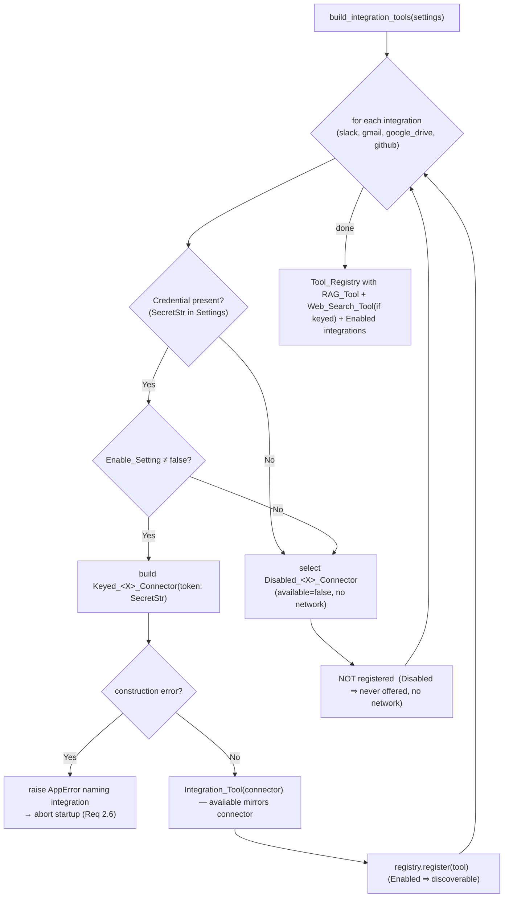

# Design Document — Phase 8: Third-Party Integrations

## Overview

Phase 8 adds **Slack, Gmail, Google Drive, and GitHub** to AgentForge as pluggable
`Tool_Interface` implementations discoverable by the Phase 3 agentic and Phase 4
multi-agent layers. It is a **backend** phase: no new frontend is delivered, only the
backend tools and a small org-scoped introspection API a later frontend phase will
consume.

The controlling design principle is **reuse, never reimplement**. Every existing seam is
consumed exactly as-is; none is forked, widened, or changed:

- Each integration is a concrete subclass of the existing `Tool_Interface`
  (`tools/base.py`) — the same `name` / `description` / `input_schema` / `available` /
  `invoke` contract the `RAG_Tool` and `Web_Search_Tool` implement. No new tool base
  class, registry, or result type is introduced (Req 1.1, 1.2).
- Each integration's real network work sits behind a per-integration **Connector**
  transport seam that mirrors the `Search_Provider` keyless/credentialed/mockable pattern
  exactly: an abstract contract, a `Disabled_<Integration>_Connector` keyless default that
  reports itself unavailable and performs no network call, and a
  `Keyed_<Integration>_Connector` constructed only when a Credential is present (Req 5.1–5.5).
- The **composition root** (`config/container.py`) remains the only module that names
  concrete Connectors and registers Integration_Tools, extending the existing
  `build_tool_registry` policy (register `RAG_Tool` always; `Web_Search_Tool` only when
  keyed) with "register each Integration_Tool only when Enabled" (Req 2.1–2.3).
- Credentials are optional `SecretStr` fields on the existing `Settings`
  (`config/settings.py`), redacted from logs / `repr` / `model_dump`, sourced only from the
  environment, defaulting to absent — so the platform boots and the whole suite runs with
  zero integration credentials (Req 3.x, 4.x).
- Failures map onto the existing `AppError` envelope (`api/errors.py`) on HTTP surfaces and
  onto a fixed integration error-code vocabulary carried in `Tool_Result` inside a run
  (Req 7.x); the agent `act` node already contains an invalid call or a raised `ToolError`
  as a bounded observation without crashing the run (Req 8.x).
- Multi-tenancy reuses the Phase 5 `Principal` / `require_permission` / `get_org_id`
  dependencies, the static `RBAC_Policy`, the request-scoped tenancy context
  (`enterprise/tenancy.py`), and the 404-never-403 data-access rule; observability reuses
  the Phase 3/6 `Trace_Recorder` written by the `act` node, with export failures never
  changing a run outcome (Req 9–11, 16).
- Any per-org persistence uses the existing additive migration runner
  (`CREATE ... IF NOT EXISTS`) and stores **non-secret** configuration only (Req 11.x).

The net result: with no integration credential configured, the `Tool_Registry` exposes
exactly the pre-Phase-8 set and agent / multi-agent behavior is unchanged (Req 17).

## Architecture

### Where the Integration_Layer sits

The Integration_Layer sits **entirely behind the existing Tool seam**. Agents never learn
about integrations directly; they only ever see the `Tool_Registry`. An Integration_Tool is
just another `Tool_Interface` the composition root chooses to register.

```
Agent_Orchestrator / Multi_Agent_Orchestrator   (UNCHANGED)
        │  resolves + validates + invokes tools only via
        ▼
   Tool_Registry            (UNCHANGED — list_specs() omits unavailable tools)
        │  holds
        ├── RAG_Tool                (Phase 2 — always registered)
        ├── Web_Search_Tool         (Phase 3 — registered only when search is keyed)
        └── Integration_Tool × 4    (Phase 8 — registered only when Enabled)
                │  each wraps a
                ▼
        <Integration>_Connector     (transport seam, mirrors Search_Provider)
                ├── Disabled_<Integration>_Connector  (keyless default, no network)
                ├── Keyed_<Integration>_Connector     (built only when Credential present)
                └── Mock_<Integration>_Connector      (tests only; no network, no credential)
```

The four Integration_Tools plus the introspection API and optional persistence form the
`Integration_Layer`. Only the shaded Phase 8 boxes are new; every box marked UNCHANGED is
consumed as-is.

### The Connector transport seam (mirrors Search_Provider)

Each integration defines one abstract Connector contract that exposes an `available` flag
plus exactly the operations that integration's Tool invokes (e.g. Slack:
`read_channel` / `post_message`). This is the direct analogue of `Search_Provider`
(`available` + `search`):

| Search (Phase 3)               | Integration (Phase 8, per integration)          |
|--------------------------------|-------------------------------------------------|
| `Search_Provider` (ABC)        | `<Integration>_Connector` (ABC)                 |
| `Disabled_Search_Provider`     | `Disabled_<Integration>_Connector` (no network) |
| `Keyed_Search_Provider`        | `Keyed_<Integration>_Connector` (built when keyed) |
| test double injected into tool | `Mock_<Integration>_Connector` injected into tool |

The Integration_Tool's `available` property **mirrors its connector** exactly as
`Web_Search_Tool.available` mirrors `Search_Provider.available` (Req 5.5), so a Disabled
integration is never offered to the agent by `Tool_Registry.list_specs()`.

### Composition-root registration policy

`config/container.py` is the single wiring seam and the only module that names concrete
Connectors (Req 2.1). The existing `build_tool_registry` is extended:

```
build_tool_registry(settings, app, ...):
    registry = Tool_Registry()
    registry.register(RAG_Tool(app.rag_service))          # always (unchanged)
    if search.available: registry.register(Web_Search_Tool(search))   # unchanged
    for tool in build_integration_tools(settings, ...):    # NEW
        registry.register(tool)                            # only Enabled tools are yielded
    return registry
```

`build_integration_tools` constructs, for each integration, a Connector via a
credential-driven builder that returns the `Disabled_<Integration>_Connector` unless the
integration is **Enabled**, in which case it returns the `Keyed_<Integration>_Connector`.
Only Enabled integrations are yielded for registration, so a Disabled integration is never
registered and never offered to the agent (Req 2.2, 2.3, 2.5). This mirrors the existing
`build_search_provider` → "register only when available" flow.

If constructing or registering an Enabled integration fails (e.g. a keyed connector cannot
be built), `build_integration_tools` raises an `AppError`-shaped error naming the offending
integration and startup aborts — the platform never starts in a partially registered state
(Req 2.6). This matches the existing `ConfigError`-aborts-startup discipline.

### How enablement is derived (Credential presence + Enable_Setting)

Enablement is a pure function of configuration, mirroring the existing
`Settings.active_search()` helper:

```
Enabled(integration) ⇔ Credential present  AND  Enable_Setting ≠ false
Disabled(integration) ⇔ Credential absent  OR   Enable_Setting = false
```

Credential presence and the Enable_Setting are **separate** conditions: a present
Credential alone does not force enablement when the operator sets the Enable_Setting to
`false` (Req 3.5, 3.6, 3.7). A new `Settings.integration_enabled(name)` helper (mirroring
`active_search()`) returns this boolean, and the Disabled connector is the keyless default
whenever it returns `False`, so no network-capable connector is ever constructed on the
keyless path (Req 3.1, 3.2, 3.4).



### Module / directory layout

New code lives under `src/agentforge/integrations/`, a sibling of the existing `tools/`
package. Rationale for a dedicated package (rather than dropping four tools into `tools/`):
the integrations are a cohesive subsystem with their own Connector transport seam, error
vocabulary, status service, and optional persistence — grouping them keeps the subsystem
discoverable and mirrors how `tools/search/` co-locates the pluggable-provider trio. Each
integration module co-locates its Connector ABC + `Disabled_` + `Keyed_` implementations
next to its Tool, exactly the way `web_search_tool.py` relates to `search/{base,disabled,keyed}.py`
but consolidated per integration (there are four parallel provider families, so one
self-contained module per integration reads better than four near-identical subpackages).

```
src/agentforge/integrations/
    __init__.py
    base.py            # Integration_Tool base (Tool_Interface); Integration_Connector ABC;
                       #   error-code vocabulary; connector failure classes; timeout + cap + redaction helpers
    slack.py           # Slack_Connector ABC; Disabled_/Keyed_/Mock_ ; Slack_Tool
    gmail.py           # Gmail_Connector ABC; Disabled_/Keyed_/Mock_ ; Gmail_Tool
    google_drive.py    # Google_Drive_Connector ABC; Disabled_/Keyed_/Mock_ ; Google_Drive_Tool
    github.py          # GitHub_Connector ABC; Disabled_/Keyed_/Mock_ ; GitHub_Tool
    status.py          # Integration_Status_Service + Integration_Status_Entry
    connection.py      # Integration_Connection model; Integration_Connection_Store ABC + InMemory_/Pg_
src/agentforge/api/routers/integrations.py   # GET /integrations/status (RBAC-gated, org-scoped)
migrations/0011_create_integration_connections.sql   # additive, org-scoped, non-secret only

Modified (additive only):
    config/settings.py     # optional SecretStr credentials, enable-toggles, timeout, result cap
    config/container.py    # build_integration_tools / connector builders / status + connection builders
    api/routers/__init__.py + main.py   # mount the integrations router (as existing routers are mounted)
```

No file under `tools/`, `agent/`, `multiagent/`, or `enterprise/` is modified; the
`Tool_Interface`, `Tool_Registry`, `Tool_Result`, and `AppError` contracts are untouched
(Req 17.3, 17.4).

## Components and Interfaces

### 1. Integration error-code vocabulary and connector failure classes (`integrations/base.py`)

A fixed, closed vocabulary of error codes carried in `Tool_Result.data["error_code"]`
inside a run and rendered through `AppError.code` on HTTP surfaces:

```python
class IntegrationErrorCode(str, Enum):
    DISABLED       = "integration_disabled"
    UNAUTHORIZED   = "integration_unauthorized"
    RATE_LIMITED   = "integration_rate_limited"
    UPSTREAM_ERROR = "integration_upstream_error"
    TIMEOUT        = "integration_timeout"
```

Connectors signal typed failures the base Tool maps onto the vocabulary (the Tool never
inspects provider-specific error text):

```python
class ConnectorError(RuntimeError):
    """Base transport failure raised by a Keyed connector."""

class Unauthorized_Error(ConnectorError):   ...  # → integration_unauthorized
class Rate_Limited_Error(ConnectorError):   ...  # → integration_rate_limited
class Upstream_Error(ConnectorError):       ...  # → integration_upstream_error
# Timeout is produced by the Tool's timeout wrapper, not raised by the connector.
```

`ConnectorError` messages are constructed to carry **no credential value and no internal
stack trace** (Req 7.6); the base Tool additionally sanitizes any surfaced message.

### 2. `Integration_Connector` ABC and per-integration Connector contracts

A tiny shared marker ABC captures the one thing every connector has in common — the
availability flag mirrored by the Tool:

```python
class Integration_Connector(ABC):
    @property
    @abstractmethod
    def available(self) -> bool:
        """Whether calls can be performed (a Credential is configured). Mirrors Search_Provider.available."""
```

Each integration then defines its own contract adding exactly its operations. Example
(Slack); Gmail / Google Drive / GitHub follow the identical shape with their own operations:

```python
class Slack_Connector(Integration_Connector):
    @abstractmethod
    def read_channel(self, channel: str, limit: int) -> list[dict]: ...
    @abstractmethod
    def post_message(self, channel: str, text: str) -> dict: ...

class Disabled_Slack_Connector(Slack_Connector):
    @property
    def available(self) -> bool: return False
    def read_channel(self, *a, **k): raise RuntimeError("slack integration is disabled")  # never reached; guarded by Tool
    def post_message(self, *a, **k): raise RuntimeError("slack integration is disabled")

class Keyed_Slack_Connector(Slack_Connector):
    def __init__(self, token: str) -> None:  # plaintext obtained from SecretStr in container only
        if not token: raise ValueError("Keyed_Slack_Connector requires a non-empty token")
        self._token = token
    @property
    def available(self) -> bool: return True
    # real HTTP calls with a transport-level timeout; deterministic stand-in in this phase

class Mock_Slack_Connector(Slack_Connector):
    """Test double: available, no network, returns injected canned data / raises injected errors."""
```

The `Disabled_` implementations mirror `Disabled_Search_Provider` precisely: `available` is
`False` and each operation raises defensively so an accidental call fails loudly rather than
hitting the network (the Tool guards on `available` first, so it is never reached in normal
operation — Req 5.2).

### 3. `Integration_Tool` base class (`integrations/base.py`)

A base implementing `Tool_Interface` that captures the cross-cutting behavior (availability
mirroring, disabled short-circuit, timeout enforcement, error mapping, result capping,
redaction) so each concrete tool only declares its identity, schema, and action dispatch:

```python
class Integration_Tool(Tool_Interface):
    def __init__(self, connector: Integration_Connector, *,
                 timeout_seconds: float, max_results: int) -> None: ...

    @property
    def available(self) -> bool:
        return self._connector.available          # mirror connector (Req 5.5)

    def invoke(self, arguments: dict) -> Tool_Result:
        if not self._connector.available:         # disabled short-circuit; NO connector call (Req 7.1)
            return self._error_result(IntegrationErrorCode.DISABLED, "integration is disabled")
        try:
            data = self._run_with_timeout(         # Timeout_Budget (Req 6.1, 6.2)
                lambda: self._dispatch(arguments, self._connector))
        except _TimeoutExceeded:
            return self._error_result(IntegrationErrorCode.TIMEOUT, "integration timed out")
        except Unauthorized_Error:
            return self._error_result(IntegrationErrorCode.UNAUTHORIZED, "provider rejected the credential")
        except Rate_Limited_Error:
            return self._error_result(IntegrationErrorCode.RATE_LIMITED, "provider applied a rate limit")
        except (Upstream_Error, ConnectorError):
            return self._error_result(IntegrationErrorCode.UPSTREAM_ERROR, "provider returned an error")
        return self._success_result(self._cap(data))   # bound result volume (Req 6.3)

    # Subclasses implement:
    #   name / description / input_schema  (Tool_Interface)
    #   _dispatch(arguments, connector) -> dict   (route validated action to a connector op)
```

Key behaviors:

- **Disabled short-circuit** returns `Tool_Result(ok=False)` carrying `integration_disabled`
  and performs no connector call (Req 3.2, 7.1).
- **Timeout** wraps the connector call in a bounded executor; exceeding the `Timeout_Budget`
  aborts and returns `integration_timeout` (Req 6.1, 6.2). The `Keyed_` connector also sets a
  transport-level timeout so the underlying socket is bounded; the wrapper is the correctness
  guarantee tests exercise with a deliberately slow mock connector.
- **Error mapping** is total over the connector failure classes → the fixed vocabulary
  (Req 7.2–7.4). No provider-specific error text is surfaced.
- **Result capping** truncates any returned collection to `max_results` (Req 6.3).
- **Redaction**: `_error_result` / `_success_result` build content and `data` from
  outcome fields only; the credential (held only inside the `Keyed_` connector as a plain
  string derived from `SecretStr` in the container) is never placed into a `Tool_Result`
  (Req 4.2, 4.4).
- **Write actions** (`post_message`, `send_message`, `create_issue`) dispatch to exactly one
  connector write call with the validated arguments and produce no additional side effect
  (Req 6.5).

A successful invocation returns `Tool_Result(ok=True, content=<summary>, data=<outcome>)`
(Req 1.4); every mapped failure returns `Tool_Result(ok=False, content=<safe message>,
data={"error_code": <code>})`. Note the base returns contained failures as
`Tool_Result(ok=False)` rather than raising `ToolError`; a genuinely unexpected internal
error still surfaces as `ToolError` and is contained by the `act` node (Req 8.3).

### 4. The four Integration_Tools

Each declares a unique, stable `name` (distinct from every other tool — Req 1.3), a
`description`, an `input_schema` (JSON-Schema object with `additionalProperties: false`, the
same shape the `act` node already validates — Req 8.1), and an action-dispatch method.

**Slack_Tool** (`name = "slack"`) — Req 12
- `input_schema`: `action` ∈ {`read_channel`, `post_message`}; `channel` (string); `text`
  (string, required for `post_message`); `limit` (integer, optional, for `read_channel`).
- `read_channel` → up to `limit` recent messages (also bounded by the global cap); returns
  them in `Tool_Result.data`. `post_message` → posts exactly one message with `text` to
  `channel` (single write). Provider credential rejection / rate limit → `integration_unauthorized`
  / `integration_rate_limited` (Req 12.6).

**Gmail_Tool** (`name = "gmail"`) — Req 13
- `input_schema`: `action` ∈ {`search_messages`, `read_message`, `send_message`}; `query`
  (required for search); `message_id` (required for read); `to`, `subject`, `body` (required
  for send).
- `search_messages` → up to the configured max result count of message references;
  `read_message` → the message identified by `message_id`; `send_message` → sends exactly
  one message to `to` (single write). The `send_message` write is gated behind the
  agent-run permission model (Req 13.6, 10.6).

**Google_Drive_Tool** (`name = "google_drive"`) — Req 14
- `input_schema`: `action` ∈ {`list_files`, `search_files`, `read_file`}; `query` (required
  for search); `file_id` (required for read).
- `list_files` / `search_files` → up to the max result count of file references;
  `read_file` → content or metadata of `file_id`. The connector exposes **read-only**
  operations only — there is no mutate/delete operation on the contract, so the tool cannot
  modify or delete a file (Req 14.5).

**GitHub_Tool** (`name = "github"`) — Req 15
- `input_schema`: `action` ∈ {`search_code`, `search_issues`, `read_repo`, `create_issue`};
  `query` (required for the search actions); `owner`, `repo` (required for `read_repo` and
  `create_issue`); `title` (required for `create_issue`), `body` (optional).
- search actions → up to the max result count of results; `read_repo` → repo metadata;
  `create_issue` → creates exactly one issue with `title` (single write), gated behind the
  agent-run permission model (Req 15.6, 10.6).

### 5. Integration_Status introspection API (`integrations/status.py` + `api/routers/integrations.py`)

A read-only, org-scoped, RBAC-gated view reporting each integration's name and whether it is
Enabled, with no credential value ever exposed (Req 9).

```python
@dataclass(frozen=True)
class Integration_Status_Entry:
    name: str        # "slack" | "gmail" | "google_drive" | "github"
    enabled: bool    # derived from Credential presence + Enable_Setting at request time

class Integration_Status_Service:
    def __init__(self, settings: Settings) -> None: ...
    def status(self) -> list[Integration_Status_Entry]:
        return [Integration_Status_Entry(name, self._settings.integration_enabled(name))
                for name in INTEGRATION_NAMES]
```

The router mirrors the existing analytics router pattern exactly — declaring only
`Depends(require_permission(Permission.READ))` and no bespoke authorization logic:

```python
@router.get("/integrations/status", response_model=IntegrationStatusResponse)
async def get_integration_status(
    service: Integration_Status_Service = Depends(get_integration_status_service),
    principal: Principal = Depends(require_permission(Permission.READ)),
) -> IntegrationStatusResponse: ...
```

- No valid Principal → `AppError("unauthorized", 401)` via `get_current_principal` (Req 9.4).
- Principal lacking `read` → `AppError("forbidden", 403)` via `require_permission` (Req 9.3).
- The response reflects enablement derived from the configured Credentials and
  Enable_Settings at request time and contains only `{name, enabled}` pairs — never a
  credential (Req 9.1, 9.2, 9.5).

### 6. Optional org-scoped Integration_Connection persistence (`integrations/connection.py`)

Optional, additive persistence of **non-secret** per-org integration configuration (e.g. a
default Slack channel or GitHub repository). It never stores credential material. Enablement
never depends on it — when unconfigured, enablement is derived solely from Credentials and
the platform remains fully functional (Req 11.5).

```python
@dataclass
class Integration_Connection:
    id: UUID
    org_id: UUID                 # required tenant key (Req 11.1)
    integration: str             # "slack" | "gmail" | "google_drive" | "github"
    config: dict                 # NON-SECRET only (e.g. {"default_channel": "#general"}) (Req 11.4)
    created_at: datetime

class Integration_Connection_Store(ABC):
    @abstractmethod
    def create(self, org_id: UUID, integration: str, config: dict) -> Integration_Connection: ...
    @abstractmethod
    def get(self, org_id: UUID, connection_id: UUID) -> Integration_Connection | None: ...
    @abstractmethod
    def list_for_org(self, org_id: UUID) -> list[Integration_Connection]: ...
```

Tenant isolation is enforced **at the data-access layer**, identical to Phase 5/6: every
method takes `org_id` as a required parameter and constrains its query with
`WHERE org_id = :org_id`, so a cross-tenant read/mutate matches zero rows → `None`/`[]` →
the router raises `AppError("not_found", 404)` — 404, never 403 (Req 11.2). The
`InMemory_Integration_Connection_Store` is the keyless default; `Pg_Integration_Connection_Store`
is selected in the production profile, mirroring `build_conversation_store` /
`build_usage_store`. The store never accepts or persists a `SecretStr` / credential field
(Req 11.4).

### 7. Composition-root additions (`config/container.py`)

New builders, all following the existing credential-driven / profile-driven selection
pattern; concrete Connectors are named **only here** (Req 2.1):

```python
def build_slack_connector(settings) -> Slack_Connector:
    if not settings.integration_enabled("slack"):
        return Disabled_Slack_Connector()                 # keyless default, no network
    return Keyed_Slack_Connector(settings.slack_bot_token.get_secret_value())
# … build_gmail_connector / build_google_drive_connector / build_github_connector identically

def build_integration_tools(settings, *, connectors=None) -> list[Tool_Interface]:
    tools = []
    for name, build_connector, tool_cls in _INTEGRATION_BUILDERS:
        try:
            connector = (connectors or {}).get(name) or build_connector(settings)
            if connector.available:                        # Enabled ⇒ register (Req 2.2)
                tools.append(tool_cls(connector,
                    timeout_seconds=settings.integration_timeout_seconds,
                    max_results=settings.integration_max_results))
        except Exception as exc:                           # abort naming the integration (Req 2.6)
            raise AppError("integration_config_error",
                           f"failed to construct integration {name!r}", 500,
                           {"integration": name}) from None
    return tools
```

`build_tool_registry` calls `build_integration_tools` and registers each returned tool; a
duplicate name would surface the existing `DuplicateToolNameError` unchanged (Req 2.4). A
`build_integration_status_service(settings)` and `build_integration_connection_store(settings)`
are added and surfaced through `api/deps.py` accessors mirroring the existing `get_*`
dependencies. The introspection router is mounted in `main.py` alongside the existing
routers.

## Data Models

### Settings additions (`config/settings.py`) — all optional, keyless-safe

```python
# --- integrations (Phase 8; all optional / defaulted to preserve keyless boot) ---
# Credentials: optional SecretStr, env-only, absent by default (Req 3.3, 4.1).
slack_bot_token:      SecretStr | None = None
gmail_token:          SecretStr | None = None
google_drive_token:   SecretStr | None = None
github_token:         SecretStr | None = None

# Enable_Settings: non-secret master toggles, default True (mirror tracing_export_enabled).
# A present Credential + toggle False ⇒ Disabled (Req 3.5, 3.6, 3.7).
slack_enabled:        bool = True
gmail_enabled:        bool = True
google_drive_enabled: bool = True
github_enabled:       bool = True

# Bounded, keyless-safe execution limits (Req 6.4).
integration_timeout_seconds: int = 10   # resolved within a bounded range
integration_max_results:     int = 20   # single-invocation result-count cap (Req 6.3)

def integration_enabled(self, name: str) -> bool:
    """Enabled ⇔ Credential present AND Enable_Setting ≠ false (Req 3.6, 3.7).

    Mirrors active_search(): a pure function of configuration, used both by the
    composition root's connector selection and by the Integration_Status service.
    """
    cred = getattr(self, f"{name}_token" if name != "slack" else "slack_bot_token")
    toggle = getattr(self, f"{name}_enabled")
    return cred is not None and toggle is not False
```

Every credential is `SecretStr | None`, so pydantic redacts it from `repr` / `str` /
`model_dump` / logs by default (Req 4.2), and absence is the keyless default so boot
succeeds with zero integration credentials (Req 3.8, 17.5). `.env.example` gains every
new variable with keyless-safe defaults, matching prior phases.

### Integration_Status shape

```
IntegrationStatusResponse = { "integrations": [ { "name": str, "enabled": bool }, ... ] }
```

No credential, token, or secret-derived field appears anywhere in the response (Req 9.2).

### Integration_Connection row + additive migration

`migrations/0011_create_integration_connections.sql` — strictly additive, org-scoped,
non-secret only, mirroring `0008`/`0010`:

```sql
-- 0011_create_integration_connections.sql
-- Optional per-org, NON-SECRET integration configuration (Req 11.1, 11.3, 11.4).
-- Strictly additive; idempotent (CREATE ... IF NOT EXISTS); no prior column altered/dropped.
CREATE TABLE IF NOT EXISTS integration_connections (
    id           UUID PRIMARY KEY,
    org_id       UUID NOT NULL REFERENCES organizations(id) ON DELETE CASCADE,  -- tenant key (Req 11.1)
    integration  TEXT NOT NULL,          -- slack | gmail | google_drive | github
    config       JSONB NOT NULL DEFAULT '{}'::jsonb,   -- NON-SECRET only (Req 11.4)
    created_at   TIMESTAMPTZ NOT NULL DEFAULT now()
);
CREATE INDEX IF NOT EXISTS integration_connections_org_idx
    ON integration_connections (org_id, integration);
```

There is **no** column for a token or secret; the schema structurally cannot hold credential
material (Req 4.3, 11.4). Deleting an organization sweeps its connection rows via
`ON DELETE CASCADE`.

### Error-code vocabulary (closed set)

| Code (`Tool_Result.data["error_code"]` / `AppError.code`) | Raised when                                          | Requirement |
|-----------------------------------------------------------|------------------------------------------------------|-------------|
| `integration_disabled`                                    | Tool invoked while Disabled (no connector call)      | 7.1         |
| `integration_unauthorized`                                | Connector reports the provider rejected the credential | 7.2       |
| `integration_rate_limited`                                | Connector reports the provider applied a rate limit  | 7.3         |
| `integration_upstream_error`                              | Connector reports an upstream provider error         | 7.4         |
| `integration_timeout`                                     | Invocation exceeded the Timeout_Budget               | 6.2         |

On HTTP surfaces (the Integration_Status API and any future integration endpoint) these
render through the existing envelope `{ "error": { code, message, details } }` (Req 7.5).


## Correctness Properties

*A property is a characteristic or behavior that should hold true across all valid
executions of a system — essentially, a formal statement about what the system should do.
Properties serve as the bridge between human-readable specifications and machine-verifiable
correctness guarantees.*

The following properties were derived from the acceptance-criteria prework and consolidated
to remove redundancy (e.g. the many per-integration enablement clauses collapse into one
total enablement-equivalence property; all per-integration result limits collapse into one
result-cap property). Each is executable with **Hypothesis** (≥100 examples) against
**mock connectors**, requiring no real credential and no network. Every property is
tagged in code as `Feature: agentforge-integrations, Property N: <text>` and validates the
listed requirements.

### Property 1: Enablement equivalence (total over the configuration space)

*For any* integration and *any* combination of (Credential present or absent) × (Enable_Setting
`true` / `false` / unset), the integration is treated as Enabled **iff** the Credential is
present AND the Enable_Setting is not `false`, and Disabled otherwise — the enablement
decision is a total function of configuration alone (independent of any Integration_Connection
persistence).

**Validates: Requirements 3.1, 3.4, 3.6, 3.7, 5.3, 11.5, 12.2, 13.2, 14.2, 15.2**

### Property 2: Disabled integrations are never registered, never listed, and hold no network path

*For any* configuration, the Tool_Registry built by the composition root contains exactly the
baseline tools (`rag_search`, and `web_search` when its own search credential is present)
unioned with exactly the Enabled integrations; every Disabled integration is absent from both
the registry and `list_specs()`, its selected Connector reports `available == false`, and each
Integration_Tool's `available` equals its connector's `available` (the mirror).

**Validates: Requirements 2.2, 2.3, 2.5, 3.2, 5.2, 5.5, 10.5, 12.3, 13.2, 14.2, 15.2**

### Property 3: A Disabled tool invoked directly returns `integration_disabled` with no connector call

*For any* Integration_Tool whose connector is unavailable and *any* argument dictionary,
`invoke(arguments)` returns a `Tool_Result` with `ok == false` carrying the
`integration_disabled` error code, and the connector's operations are never called (zero
network path).

**Validates: Requirements 7.1, 3.2, 5.5, 10.5**

### Property 4: Connector failure mapping is total over the failure vocabulary

*For any* integration action and *any* connector failure class
(`Unauthorized_Error` → `integration_unauthorized`, `Rate_Limited_Error` →
`integration_rate_limited`, `Upstream_Error`/other `ConnectorError` → `integration_upstream_error`),
`invoke` returns a `Tool_Result` with `ok == false` carrying exactly the corresponding fixed
error code — every failure class maps to a defined code and never crashes the tool.

**Validates: Requirements 7.2, 7.3, 7.4, 12.6**

### Property 5: Exceeding the Timeout_Budget always yields `integration_timeout`

*For any* integration action and *any* connector whose operation takes longer than the
configured Timeout_Budget, `invoke` aborts the invocation and returns a `Tool_Result` with
`ok == false` carrying the `integration_timeout` error code.

**Validates: Requirements 6.1, 6.2**

### Property 6: A single invocation never returns more than the configured result cap

*For any* configured maximum result count `C` and *any* connector returning `N` items,
the `Tool_Result` produced by a read/search/list action contains `min(N, C)` items, so the
returned volume never exceeds `C`.

**Validates: Requirements 6.3, 12.4, 13.3, 14.3, 15.3**

### Property 7: A write action performs exactly one connector write and no other side effect

*For any* write action (`slack.post_message`, `gmail.send_message`, `github.create_issue`) with
validated arguments, `invoke` makes exactly one call to the corresponding connector write
operation with those arguments and makes no other connector call; and *for any* Google Drive
action, `invoke` makes zero write/mutate/delete calls (the Drive connector exposes only read
operations).

**Validates: Requirements 6.5, 12.5, 13.5, 15.5, 14.5**

### Property 8: Credential values are never surfaced anywhere

*For any* generated Credential value, that value never appears in a `Tool_Result` (`content`
or `data`), in the Integration_Status response, in any surfaced error message (which also
contains no internal stack trace), in recorded or exported trace/observability data, or in any
persisted Integration_Connection record.

**Validates: Requirements 4.2, 4.3, 4.4, 7.6, 9.2, 11.4, 16.2**

### Property 9: Cross-tenant Integration_Connection access resolves to not_found (404)

*For any* two distinct organizations and *any* Integration_Connection owned by the first, a
read or mutate of that connection performed with the second organization's `org_id` returns no
row at the data-access layer and resolves to `AppError("not_found", 404)` — never the other
org's data and never a 403.

**Validates: Requirements 11.1, 11.2**

### Property 10: Backward compatibility with zero integration credentials

*For any* Settings configuration with no integration Credential configured, the Tool_Registry's
tool-name set equals the pre-Phase-8 baseline set (`rag_search`, plus `web_search` iff its own
search credential is present), and an agent / multi-agent run over identical inputs on the
deterministic keyless path produces the same result it produced before Phase 8.

**Validates: Requirements 17.1, 17.2, 3.8, 3.1**

## Error Handling

All error handling reuses the existing envelope and containment seams; no new error
machinery is introduced.

### Inside an agent run — contained failures via the `act` node

Integration failures never crash a run. The mapping is two-layered:

1. **Integration_Tool → `Tool_Result(ok=false)`**: the base `Integration_Tool.invoke`
   converts every anticipated failure (disabled, unauthorized, rate-limited, upstream,
   timeout) into a `Tool_Result` with `ok=false` and `data["error_code"]` set to the fixed
   vocabulary value. This is a normal (non-raising) return, so the `act` node records a
   `tool_result` observation and the loop continues (Req 8.4).
2. **Unexpected internal error → `ToolError`**: if a tool hits a genuinely unexpected internal
   condition it raises `ToolError`; the existing `act` node catches it as a
   `tool_execution_error` observation and continues the run (Req 8.3). Invalid arguments are
   caught earlier by the act node's `validate_arguments` against the tool's `input_schema`,
   producing a `validation_error` observation without invoking the tool (Req 8.1, 8.2).

The Disabled short-circuit performs **no** connector call before returning
`integration_disabled` (Req 7.1), and the timeout wrapper aborts a slow call and returns
`integration_timeout` (Req 6.2).

### Error-code mapping (connector failure → code → surface)

| Connector signal / condition          | `Tool_Result.data["error_code"]` | HTTP `AppError.code` (status) |
|----------------------------------------|----------------------------------|-------------------------------|
| Tool invoked while Disabled            | `integration_disabled`           | `integration_disabled` (400)  |
| `Unauthorized_Error`                   | `integration_unauthorized`       | `integration_unauthorized` (400) |
| `Rate_Limited_Error`                   | `integration_rate_limited`       | `integration_rate_limited` (429) |
| `Upstream_Error` / other `ConnectorError` | `integration_upstream_error`  | `integration_upstream_error` (502) |
| Timeout_Budget exceeded                | `integration_timeout`            | `integration_timeout` (504)   |

### On HTTP surfaces — the uniform `AppError` envelope

The Integration_Status API (and any future integration HTTP endpoint) renders every failure
through the existing `{ "error": { code, message, details } }` envelope (Req 7.5):

- No valid Principal → `AppError("unauthorized", 401)` (reused `get_current_principal`).
- Missing `read` permission → `AppError("forbidden", 403)` (reused `require_permission`).
- Cross-tenant Integration_Connection access → `AppError("not_found", 404)` (data-access
  layer returns no row; 404, never 403 — Req 11.2).
- Enabled-integration construction failure at startup → `AppError`-shaped abort naming the
  integration (Req 2.6).

### No secrets, no stack traces

Every surfaced message (in a `Tool_Result`, an `AppError`, a log line, or exported trace)
is constructed from outcome fields and fixed strings only. A Credential value never appears
(guaranteed structurally by `SecretStr` + the redaction property), and internal stack traces
are never surfaced — the unhandled-exception handler already emits a generic
`internal_error` message (Req 7.6, 4.2). Observability recording or export failing never
changes an invocation outcome, reusing the Phase 6 suppression guarantee (Req 16.3).

## Testing Strategy

The suite is **keyless and deterministic**: it runs to completion with zero integration
credentials and no network access, using injected mock connectors throughout (Req 5.4,
17.5). This mirrors the keyless promise upheld by every prior backend phase.

### Dual approach

- **Unit / example tests** cover specific behaviors and schema shapes: each tool's
  `input_schema` per-action required fields (Req 12.1, 13.1, 14.1, 15.1), retrieval-by-id
  actions (`gmail.read_message`, `google_drive.read_file`, `github.read_repo` — Req 13.4,
  14.4, 15.4), the duplicate-name rejection (Req 2.4), the startup-abort on a failing Enabled
  integration (Req 2.6), and the reused enterprise/guardrail/tracing integration points
  (RBAC 401/403 on status, `run_agents` gating and audit event on denial, guardrail-block
  short-circuit, rate-limit application, write-action permission gating, trace entry recorded
  per invocation, and export-failure suppression — Req 8.1–8.4, 9.3, 9.4, 10.1–10.4, 10.6,
  13.6, 15.6, 16.1, 16.3).
- **Integration tests** (1–3 examples) cover the composition-root wiring and the
  Integration_Status HTTP surface — that an Enabled integration is discoverable through an
  **unmodified** orchestrator via the `Tool_Registry`, and that the status router renders the
  `AppError` envelope. These are wired with mock/disabled connectors; no external service is
  contacted.
- **Property tests (Hypothesis, ≥100 examples each)** implement the ten Correctness
  Properties above, one property-based test per property.

### Property-based testing details

- **Library**: Hypothesis (the established Python PBT library, consistent with prior backend
  phases). Property-based testing is **not** implemented from scratch.
- **Configuration**: each property test runs a minimum of 100 examples
  (`@settings(max_examples=100)` or higher).
- **Tagging**: each property test carries a comment referencing its design property in the
  form `Feature: agentforge-integrations, Property N: <property text>`.
- **One test per property**: each of Properties 1–10 is implemented by a single
  property-based test.
- **Mock connectors as the generative surface**: generators produce configuration tuples
  (credential present/absent × enable-toggle), connector outcomes (canned result lists of
  varying length, injected failure classes, injected latency), secret values (for the
  redaction property), and distinct `org_id`s (for the cross-tenant property). Mock connectors
  spy on their calls so "no network call while Disabled" and "exactly one write call" are
  directly assertable.

### Why property-based testing fits here

The Phase 8 logic under test is pure and input-sensitive: enablement derivation is a total
function over a finite-but-combinatorial config space; error mapping must be total over the
failure vocabulary; result capping must hold for all `(N, C)`; redaction must hold for all
secret values; the registry contents must equal a computed baseline ∪ enabled set for all
configs. These are exactly the "for all inputs, property holds" statements PBT is built for,
and mock connectors make 100+ iterations cost-free. Infrastructure concerns that do **not**
vary meaningfully with input — RBAC/guardrail/rate-limit wiring, trace recording, real
provider HTTP behavior — are covered by example/integration tests instead, not by
property-based tests.

### Extension note

Adding a fifth integration is an adapter + composition edit only, mirroring the Phase 3
"add a Tool" and Phase 6 "add a provider" how-tos: implement the integration's Connector ABC
+ `Disabled_`/`Keyed_`/`Mock_` and its `Integration_Tool` subclass under `integrations/`, add
its `SecretStr` credential + enable-toggle to `Settings`, and register a connector builder in
`build_integration_tools`. No edit to the orchestrator, the `Tool_Registry`, or the
`Tool_Interface` is required — the property suite (parameterized over the integration set)
picks up the new integration automatically.
