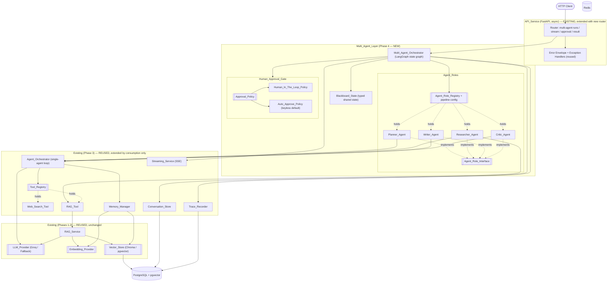
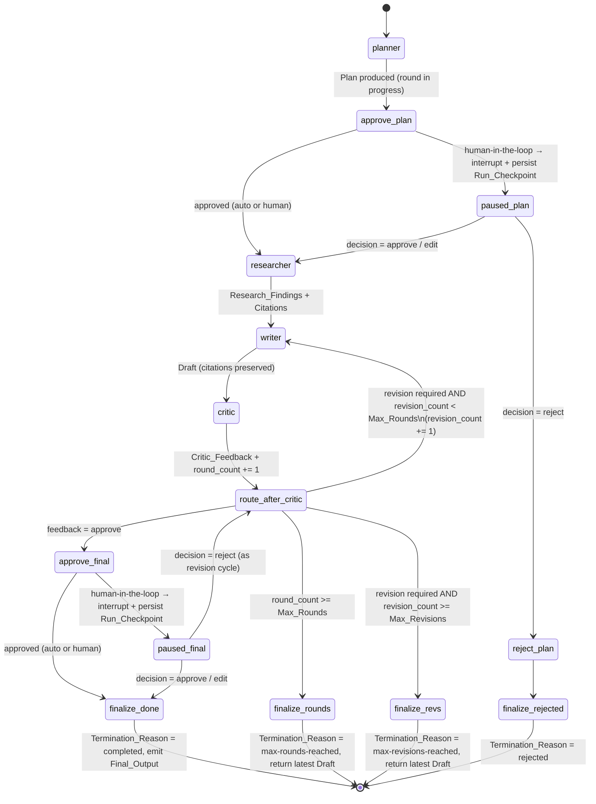

# Design Document

## Overview

This design covers **Phase 4 (Multi-Agent Collaboration & Human Approval)** of the
AgentForge platform. Phases 1 (Foundation), 2 (Core RAG), and 3 (Agentic Layer) are
already built and provide the reusable, pluggable seams this phase builds on. Phase 4
adds a **Multi_Agent_Layer** in which four specialized agents — a Planner, a Researcher,
a Writer, and a Critic — collaborate on a single task through a **bounded, terminating**
LangGraph orchestration graph, sharing a typed **Blackboard_State**, driving a **bounded
revision loop**, and pausing at defined checkpoints for a **human approval workflow**
that can resume the run after a decision.

The whole layer **reuses — never reimplements** — the Phase 1-3 seams. Each Agent_Role
runs the **existing Phase 3 `Agent_Orchestrator`** (the single-agent reason-act-observe
loop) rather than introducing a new text-generation or reasoning implementation; the
Researcher grounds through the existing `RAG_Tool`/`RAG_Service`; every role uses the
existing `LLM_Provider`, `Tool_Registry`, and `Memory_Manager`; progress streams over the
existing `Streaming_Service`; every step is attributed through the existing
`Trace_Recorder`; runs persist through the existing `Conversation_Store` and Postgres;
and all endpoints are added to the existing `API_Service` with the existing uniform error
envelope.

Everything remains **fully runnable and testable with no external credentials**: the
default `Fallback_Provider` drives deterministic role behavior, the `Web_Search_Tool` is
disabled without a key, and the default `Auto_Approve_Policy` approves every checkpoint
deterministically so a Multi_Agent_Run completes end-to-end with zero credentials and no
real human.

Explicitly **out of scope** (reserved for later phases and enabled — but not designed —
by the seams here): enterprise auth/RBAC/multi-tenancy; cost/token analytics, prompt
versioning, and evaluation frameworks; the React frontend; third-party integrations
(Slack, Gmail, Drive, GitHub, web crawling, scheduled agents); and cloud deployment. The
architecture stays modular so a new Agent_Role — or a later phase — is added without
rewriting the multi-agent core.

### Design Goals

| Goal | How this design achieves it |
| --- | --- |
| **Bounded, terminating collaboration** | The `Multi_Agent_Orchestrator` runs a LangGraph state graph whose conditional edges enforce `Max_Rounds` as a hard upper bound; `round_count` is incremented once per completed round and checked immediately, so it can never exceed `Max_Rounds` and every run ends with exactly one `Termination_Reason` (Req 2.2, 2.4, 2.7). |
| **Bounded revision loop** | The Critic-driven revision cycle increments `revision_count` only when routing back to the Writer and only while `revision_count < Max_Revisions`, so a revision is permitted exactly when `revision_count == Max_Revisions - 1` and `revision_count` never exceeds `Max_Revisions` (Req 3.1, 3.3, 3.4). |
| **Human-in-the-loop behind a clean interface** | Pause/resume is expressed as an `Approval_Policy` seam (`Human_In_The_Loop_Policy` vs `Auto_Approve_Policy`) implemented over LangGraph's interrupt + checkpointer, so the gate is testable with injected decisions and swappable without touching the graph (Req 5, 13.3). |
| **Keyless auto-approve default** | `Auto_Approve_Policy` is the default when the `Configuration_Manager` provides no policy; it approves every checkpoint deterministically so runs complete end-to-end keyless (Req 5.6, 5.7, 12.1). |
| **Add a role without core edits** | Every role implements the abstract `Agent_Role_Interface` and is registered in an `Agent_Role_Registry`; the pipeline is a declarative sequence the orchestrator reads, so a new role is "implement + register + list" with **no** edit to the routing core (Req 1.4, 13.2). |
| **Reuse of Phase 1-3 seams** | Roles run the existing `Agent_Orchestrator`; grounding uses the existing `RAG_Tool`; streaming/tracing/persistence/API reuse the existing `Streaming_Service`, `Trace_Recorder`, `Conversation_Store`, and `API_Service` (Req 8.4, 11, 6.4). |
| **Deterministic observability** | Under the `Fallback_Provider` + `Auto_Approve_Policy`, role behavior, event order, and trace order are pure functions of the input, so streamed event sequences and traces are reproducible (Req 7.9, 3.7). |

### Key Design Decisions (summary)

- **A supervisor/graph over role-nodes.** The collaboration is a small state machine
  (plan → research → write → review → maybe-revise → approve). Modeling it as an explicit
  LangGraph `StateGraph` over a typed `Blackboard_State` — rather than agents that call
  each other directly — makes the routing, the two bounds, the five termination reasons,
  and the approval checkpoints first-class and independently testable.
- **Bound both rounds and revisions.** Two independent counters guard two independent
  runaway risks: the revision loop (Critic ↔ Writer) is bounded by `Max_Revisions`, and
  the whole collaboration is bounded by `Max_Rounds` as a global backstop. Enforcing both
  structurally makes "every run terminates, and we always know why" a checkable invariant.
- **Roles behind an interface + registry.** Mirrors the Phase 1-3 "interfaces at the
  seams" rule and the Phase 3 `Tool_Registry`. The orchestrator depends only on
  `Agent_Role_Interface` and a declarative pipeline, so new roles never touch the core.
- **Each role reuses the Phase 3 single-agent orchestrator.** A role's `act` builds a
  role-scoped request from the blackboard and runs the existing `Agent_Orchestrator`,
  then maps the result into its blackboard field. No new reasoning loop, no new
  text-generation path — the keyless promise and behavior stay consistent (Req 11.1).
- **Human-in-the-loop as an `Approval_Policy` over LangGraph interrupt/checkpoint.**
  Pause = interrupt + persisted `Run_Checkpoint`; resume = re-invoke with the decision.
  Keeping it behind the policy interface lets the `Auto_Approve_Policy` run keyless and
  lets tests inject decisions with no real human.

A dedicated **Design Decisions & Why** section at the end records the full rationale for
learning purposes (Req 13).

## Architecture

### High-Level Architecture

The new Phase 4 components form the `Multi_Agent_Layer`; everything in the `Existing
(Phases 1-3)` groups is reused unchanged.



**How the new pieces connect to the existing platform:**

- The `Multi_Agent_Orchestrator` routes between `Agent_Role` nodes; each role runs the
  **existing** Phase 3 `Agent_Orchestrator` for its reasoning (Req 11.1) — introducing
  **no** new reasoning or text-generation implementation.
- The `Researcher_Agent` grounds through the **existing** `RAG_Tool`/`RAG_Service`, so
  citations are produced by the existing pipeline (Req 8.1, 8.4).
- Progress streams through the **existing** `Streaming_Service` (extended with new event
  types), every step is attributed through the **existing** `Trace_Recorder` (role id in
  the entry), and runs persist through the **existing** `Conversation_Store` + Postgres
  (Req 6, 7, 10, 11.5).
- The `Human_Approval_Gate` sits between graph phases and consults the `Approval_Policy`;
  the keyless `Auto_Approve_Policy` requires no external input (Req 5.6, 5.7).
- All endpoints are added to the **existing** `API_Service` and use the **existing**
  error envelope (Req 9.7).

### Layering and Dependency Rule

Phase 4 follows the same inward dependency rule as Phases 1-3: **core logic depends on
interfaces, never on concrete implementations.**

1. **Transport layer** (`API_Service`) — one new router + request/response schemas. Knows
   nothing about LangGraph internals, which roles exist, or which approval policy is active.
2. **Multi-agent core** (`Multi_Agent_Orchestrator`, graph, `Blackboard_State`) — pure
   orchestration over the abstract `Agent_Role_Interface`, `Approval_Policy`,
   `Streaming_Service`, `Trace_Recorder`, and `Conversation_Store` seams.
3. **Role/adapter layer** — concrete `Planner`/`Researcher`/`Writer`/`Critic` agents (each
   wrapping the Phase 3 `Agent_Orchestrator`), concrete `Human_In_The_Loop_Policy` /
   `Auto_Approve_Policy`, and the Postgres-backed run/checkpoint stores.
4. **Infrastructure** — the reused Phase 1-3 providers, Postgres + pgvector, and Redis.

The **existing** `config/container.py` composition root is extended with
`build_multi_agent_context`, wiring the multi-agent graph exactly as it wires the agent
graph today — the multi-agent core never constructs its own providers or roles.

### Repository / Module Layout

New Phase 4 modules follow the established convention: every `base.py` holds an abstract
contract; sibling files hold concrete implementations; only `config/container.py`
references concrete classes.

```text
src/agentforge/
├── main.py                       # EXTENDED: register the multi-agent router
├── config/
│   ├── settings.py               # EXTENDED: max_rounds, max_revisions, approval_policy
│   └── container.py              # EXTENDED: build_multi_agent_context() wires the graph
├── multiagent/                   # NEW — the multi-agent core
│   ├── state.py                  # Blackboard_State, Termination_Reason, bound resolution
│   ├── models.py                 # Plan, Research_Findings, Draft, Critic_Feedback,
│   │                             #   Approval_Decision, Final_Output, Multi_Agent_Run
│   ├── orchestrator.py           # Multi_Agent_Orchestrator: builds & runs the LangGraph graph
│   ├── graph.py                  # role-node wrappers + conditional routing + bound enforcement
│   ├── approval.py               # Approval_Policy (ABC), Human_In_The_Loop_Policy,
│   │                             #   Auto_Approve_Policy, Human_Approval_Gate
│   ├── streaming.py              # Multi_Agent_Streaming_Service + MultiAgentStreamEventType
│   ├── store.py                  # Multi_Agent_Run_Store (ABC) + Pg / InMemory implementations
│   └── roles/                    # NEW — the Agent_Role implementations
│       ├── base.py               # Agent_Role_Interface (ABC), Agent_Role_Registry
│       ├── planner.py            # Planner_Agent
│       ├── researcher.py         # Researcher_Agent (uses RAG_Tool via Agent_Orchestrator)
│       ├── writer.py             # Writer_Agent (preserves citations)
│       └── critic.py             # Critic_Agent (structured feedback + revision flag)
├── api/
│   ├── schemas.py                # EXTENDED: multi-agent request/response models
│   ├── deps.py                   # EXTENDED: get_multi_agent_context accessors
│   └── routers/
│       └── multi_agent.py        # NEW — start / stream / approval / result endpoints
└── (agent/, tools/, memory/, conversation/, streaming/, tracing/ — REUSED unchanged)

migrations/                       # EXTENDED (same runner, same templating)
└── 0005_create_multi_agent_runs.sql  # multi_agent_runs + approval_decisions + run_checkpoints
```

**Interfaces vs implementations:** the multi-agent core imports only from `base.py` /
`state.py` / `models.py`. Concrete roles, approval policies, and stores are referenced
solely by `config/container.py`, so a new role or policy is added by implementing an
interface and registering it — never by editing `orchestrator.py` (Req 1.4, 13.2).

## Components and Interfaces

### Multi_Agent_Orchestrator and the LangGraph State Graph (`multiagent/`)

The `Multi_Agent_Orchestrator` builds and runs a LangGraph `StateGraph` over the typed
`Blackboard_State`. It begins every Multi_Agent_Run at the `Planner_Agent` and routes
work Planner → Researcher → Writer → Critic, with a Critic-driven revision loop back to
the Writer and two approval checkpoints (Req 2.1). It depends only on the abstract
`Agent_Role_Registry` (which roles + in what order), the `Approval_Policy`, and the
reused `Streaming_Service` / `Trace_Recorder` / `Conversation_Store` seams, so it is fully
testable keyless with injected roles and an auto-approve policy.

#### The multi-agent graph

The graph mirrors the Phase 3 pattern: role work happens in nodes; **all bound
enforcement lives in the conditional edges**, so the counters are checked the instant they
change and can never be pushed past their limits.



**Round counting (Req 2.2).** `round_count` starts at 0 and is incremented by **exactly
1** inside the Critic node after each completed collaboration round (a Planner→…→Critic
pass, or a Writer→Critic revision pass). The bound is enforced structurally in
`route_after_critic`: the instant `round_count >= Max_Rounds`, routing goes to the
`finalize_rounds` terminal, so a new round can never push the count past `Max_Rounds`
(Req 2.4, so `round_count` never exceeds `Max_Rounds`).

**Revision counting (Req 3.1, 3.3, 3.4).** `revision_count` starts at 0. When the Critic
requires a revision and `revision_count < Max_Revisions`, `route_after_critic` increments
`revision_count` by exactly 1 and routes to the Writer — so a revision is still permitted
when `revision_count == Max_Revisions - 1` (the boundary). When the Critic requires a
revision but `revision_count >= Max_Revisions`, routing goes to the `finalize_revs`
terminal, so `revision_count` never exceeds `Max_Revisions`.

**Exactly one termination reason (Req 2.7).** Every terminal node sets exactly one
`Termination_Reason` from `{completed, max-rounds-reached, max-revisions-reached,
rejected, aborted}`; a defensive guard in `run()` sets `aborted` only if the graph ever
exits with an unset reason (it never should), so a run always ends with exactly one.

#### Bound resolution (`multiagent/state.py`) (Req 2.5, 2.6, 3.5, 3.6)

`Max_Rounds` and `Max_Revisions` are obtained from the `Configuration_Manager` and
normalized with the same pattern as Phase 3's `resolve_iteration_limit`:

```python
DEFAULT_MAX_ROUNDS, MIN_MAX_ROUNDS, MAX_MAX_ROUNDS = 6, 1, 50
DEFAULT_MAX_REVISIONS, MIN_MAX_REVISIONS, MAX_MAX_REVISIONS = 3, 1, 20

def _resolve_bound(configured, default, low, high) -> tuple[int, bool]:
    """Return (value, invalid_flag). Absent -> default (not invalid);
    non-int / bool / out-of-range -> default + invalid_flag=True."""
    if configured is None:
        return default, False
    if isinstance(configured, int) and not isinstance(configured, bool) and low <= configured <= high:
        return configured, False
    return default, True   # rejected: default applied + flagged (Req 2.6, 3.6)

def resolve_max_rounds(configured):    return _resolve_bound(configured, DEFAULT_MAX_ROUNDS, 1, 50)
def resolve_max_revisions(configured): return _resolve_bound(configured, DEFAULT_MAX_REVISIONS, 1, 20)
```

A valid value in range passes through; an absent value resolves to the default with no
flag; a non-integer, boolean, or out-of-range value is rejected, the default is applied,
and an invalid-limit indication (`invalid_rounds_flagged` / `invalid_revisions_flagged`)
is recorded on the blackboard and surfaced in the trace (Req 2.6, 3.6).

### Agent_Role_Interface and the role nodes (`multiagent/roles/base.py`)

Every specialized agent implements a single abstract contract, independently of any
concrete role (Req 1.1):

```python
class Agent_Role_Interface(ABC):
    @property
    @abstractmethod
    def role_id(self) -> str:
        """Stable identifier used for routing, tracing, streaming, and persistence."""
    @property
    @abstractmethod
    def instructions(self) -> str:
        """Role-specific instructions injected into the reused Agent_Orchestrator prompt."""
    @abstractmethod
    def act(self, state: Blackboard_State) -> Blackboard_State:
        """Read the Blackboard_State, do this role's work, return an updated copy (Req 1.1)."""
```

**How every role reuses the Phase 3 seams (Req 1.2, 11.1-11.4).** A role does **not**
implement reasoning or text generation. Its `act` builds a role-scoped request string
from `self.instructions` plus the relevant blackboard fields, runs the **injected
existing** `Agent_Orchestrator` (`orchestrator.run(request, ...)`), and maps the returned
`AgentState.final_answer` (and, for grounding, `extract_citations(state)`) into its
blackboard field. Because the orchestrator already consumes the existing `LLM_Provider`,
`Tool_Registry`, and `Memory_Manager`, every role inherits those seams for free and adds
no separate implementation (Req 1.2, 11.1, 11.2, 11.3, 11.4).

**Role registration and the declarative pipeline (Req 1.4, 13.2).** Roles are held in an
`Agent_Role_Registry` keyed by `role_id`, and the collaboration order is a **declarative
pipeline** the orchestrator reads when building the graph:

```python
class Agent_Role_Registry:
    def register(self, role: Agent_Role_Interface) -> None: ...   # reject duplicate role_id
    def resolve(self, role_id: str) -> Agent_Role_Interface | None: ...
    def roles(self) -> list[Agent_Role_Interface]: ...

# Declarative pipeline (data, not code): the linear phase order the graph builds from.
DEFAULT_PIPELINE = ["planner", "researcher", "writer", "critic"]
```

The `Multi_Agent_Orchestrator` builds the graph by iterating the pipeline and resolving
each `role_id` from the registry, wiring linear edges between consecutive phases and the
Critic revision/approval edges around the last phase. A **new role** is therefore added
by (1) implementing `Agent_Role_Interface`, (2) registering it, and (3) listing its
`role_id` in the pipeline config — with **no** edit to the orchestrator routing core
(Req 1.4). Adding a role between existing phases only changes the pipeline list.

#### The four built-in roles (`multiagent/roles/`)

Each role reuses the single-agent `Agent_Orchestrator` and behaves **deterministically
under the `Fallback_Provider`** (identical input Blackboard_State ⇒ identical output
Blackboard_State, Req 1.5), because the Fallback_Provider's output is a pure function of
the prompt the role builds.

- **Planner_Agent** (`planner.py`) — instructions: decompose the task into an ordered
  set of steps. Runs the orchestrator over the task (no tools needed) and parses the
  final answer into a `Plan` (Req 1.3, 4.3). Fallback: a deterministic step list derived
  from the task text.
- **Researcher_Agent** (`researcher.py`) — instructions: gather grounded information for
  the plan. Runs the orchestrator with the **RAG_Tool** available; the Phase 3 fallback
  selection strategy already prefers `rag_search` first, so grounding happens keylessly.
  It builds `Research_Findings` whose entries carry the `Citation`s from
  `extract_citations(state)` (Req 8.1, 8.4). If the `Web_Search_Tool` is configured
  (keyed) it is also available; when unavailable it is simply never offered (Req 11.3).
- **Writer_Agent** (`writer.py`) — instructions: produce or revise the Draft from the
  Plan and Research_Findings, and — on a revision — incorporate the Critic_Feedback.
  It **preserves the Citations** associated with the content it uses: the produced
  `Draft.citations` is the union of the citations of the findings it drew on, carried
  forward unchanged across revisions (Req 3.2, 8.2).
- **Critic_Agent** (`critic.py`) — instructions: review the Draft and emit **structured**
  `Critic_Feedback` with an explicit `revision_required` flag plus comments (Req 1.3,
  4.6). Under the Fallback_Provider the decision is deterministic, so a run with identical
  input terminates after an identical number of revision cycles (Req 3.7). The default
  fallback Critic approves the draft (deterministic, terminating); tests inject an
  always-revise Critic (itself an `Agent_Role_Interface` implementation, demonstrating the
  add-a-role seam) to exercise the revision/round bounds.

### Human_Approval_Gate and Approval_Policy (`multiagent/approval.py`)

Approval is expressed as a policy seam so the pause/resume mechanism stays behind a clean
interface, testable without a real human (Req 5, 13.3).

```python
class ApprovalOutcome(str, Enum):
    CONTINUE = "continue"   # proceed past the checkpoint
    PAUSE = "pause"         # interrupt + persist Run_Checkpoint, await a decision

class Approval_Policy(ABC):
    @abstractmethod
    def evaluate(self, checkpoint: str, state: Blackboard_State) -> ApprovalOutcome:
        """Decide whether to continue or pause at an Approval_Checkpoint."""

class Auto_Approve_Policy(Approval_Policy):
    """Keyless default: approve every checkpoint deterministically (Req 5.6, 5.7)."""
    def evaluate(self, checkpoint, state) -> ApprovalOutcome:
        return ApprovalOutcome.CONTINUE

class Human_In_The_Loop_Policy(Approval_Policy):
    """Pause at every checkpoint to await an external Approval_Decision (Req 5.1)."""
    def evaluate(self, checkpoint, state) -> ApprovalOutcome:
        return ApprovalOutcome.PAUSE
```

The `Human_Approval_Gate` wraps the policy and owns pause/resume:

```python
class Human_Approval_Gate:
    def __init__(self, policy: Approval_Policy, checkpointer, run_store, trace, streaming): ...

    def at_checkpoint(self, checkpoint: str, state: Blackboard_State) -> Blackboard_State:
        """Apply the policy at a checkpoint (Req 5.1, 5.6). On PAUSE: set awaiting_approval,
        persist a Run_Checkpoint, record a trace pause entry, emit approval_required."""

    def submit(self, run_id: str, decision: Approval_Decision) -> Multi_Agent_Run:
        """Apply an Approval_Decision to a paused run and resume (Req 5.2-5.5)."""
```

**Checkpoints.** Two `Approval_Checkpoint`s are defined: `after_plan` (after the Planner)
and `before_finalize` (after the Critic approves, before emitting the Final_Output)
(Req 5.1). At each, the gate consults the policy.

**Pause/persist/await (Req 5.1).** Under `Human_In_The_Loop_Policy`, reaching a checkpoint
raises a LangGraph **interrupt** (the graph is compiled with `interrupt_before` on the
approval nodes and a **checkpointer** keyed by the run id as `thread_id`). The gate marks
`awaiting_approval = True` and `pending_checkpoint`, persists a `Run_Checkpoint` (the
blackboard snapshot needed to resume, Req 10.4), records a trace pause entry (Req 6.2),
and the stream emits an `approval_required` event (Req 7.5). The run then holds until a
decision arrives.

**Resume semantics (Req 5.2-5.4).** `submit(run_id, decision)` resumes the paused run by
re-invoking the compiled graph on the persisted checkpoint with the decision applied:
- **approve** — resume from the `Run_Checkpoint` and continue the graph unchanged
  (Req 5.2).
- **reject(+feedback)** — record the feedback as `Critic_Feedback` (`revision_required =
  True`) and resume as a **revision cycle bounded by `Max_Revisions`**; if the revision
  bound is already reached, terminate with `Termination_Reason = rejected` (Req 5.3).
- **edit(+content)** — replace the corresponding `Blackboard_State` field (the Plan at
  `after_plan`, the Draft at `before_finalize`) with the edited content, then resume from
  the checkpoint (Req 5.4).

**Decision to a non-paused run (Req 5.5).** If `submit` targets a run that is not
currently `awaiting_approval` at a checkpoint (unknown, running, or already terminated),
the gate rejects the decision, reports a **run-not-awaiting-approval** error, and records
the rejected attempt in the trace — **without changing the core run execution state**.

**Default policy (Req 5.7).** When the `Configuration_Manager` provides no
`approval_policy`, the gate uses `Auto_Approve_Policy`, so runs complete end-to-end with
no external input.

**Persistence of the checkpoint.** For the keyless/auto-approve path the graph never
interrupts, so an in-memory checkpointer suffices. Under human-in-the-loop, the LangGraph
checkpointer persists graph state keyed by `thread_id = run_id`, and the gate additionally
writes a `Run_Checkpoint` row (blackboard JSON + checkpoint name) to Postgres so a paused
run survives process restarts and can be resumed (Req 10.4).

### Streaming (`multiagent/streaming.py`)

The multi-agent stream reuses the Phase 3 SSE mechanics — monotonic sequence, production
order, and the **exactly-one-terminal-event guarantee** — and extends only the event
**vocabulary**:

```python
class MultiAgentStreamEventType(str, Enum):
    AGENT_STARTED = "agent_started"     # a role began acting (carries role_id)
    PLAN = "plan"                       # Planner contribution
    RESEARCH = "research"               # Researcher contribution (with citations)
    DRAFT = "draft"                     # Writer contribution
    CRITIC_FEEDBACK = "critic_feedback" # Critic contribution (revision flag)
    APPROVAL_REQUIRED = "approval_required"  # human-in-the-loop pause (non-terminal)
    COMPLETION = "completion"           # terminal (success), carries Final_Output
    ERROR = "error"                     # terminal (failure)

MA_TERMINAL_EVENT_TYPES = frozenset({MultiAgentStreamEventType.COMPLETION,
                                     MultiAgentStreamEventType.ERROR})
```

`Multi_Agent_Streaming_Service` mirrors `SSE_Streaming_Service`: it assigns each event a
monotonic `sequence`, emits the first event within 5 s of accepting the request (an
initial `agent_started` for the Planner, before any slow work) (Req 7.1), forwards each
role contribution as a separate event as it is produced without waiting for completion
(Req 7.2), labels every event with exactly one type and **identifies the acting
`role_id`** on every agent-produced event (Req 7.3), preserves production order end-to-end
via `sequence` (Req 7.4), and guarantees **exactly one** terminal event — `completion`
carrying the `Final_Output` on success (Req 7.6) xor a single `error` on failure
(Req 7.7) — then closes the stream (Req 7.8). Any exception in the underlying run is
translated into that one `error` event and no `completion` is emitted (Req 7.7). It reuses
the existing `format_sse_frame` serialization shape (`event: <type>\ndata: <json>\n\n`).

Under human-in-the-loop, when the run pauses at a checkpoint the service emits an
`approval_required` event identifying the paused run (Req 7.5); this is **not** a terminal
event, so the stream for that request ends after emitting it (the run resumes on a
separate request and can be re-streamed). Under the `Fallback_Provider` + auto-approve,
role behavior and node order are deterministic, so two runs with identical input produce
**identical ordered event sequences** (Req 7.9).

### Per-agent Tracing (`reuses tracing/`)

Phase 4 **reuses, and does not replace,** the existing `Trace_Recorder` (Req 6.4). Each
role step is attributed by recording an entry with the role identifier and the run id at
the next ordinal:

```python
trace.record(
    run_id,
    step_type=f"role:{role_id}",     # role-scoped step type (e.g. "role:planner")
    detail={"role_id": role_id, "checkpoint": None},
)
```

Because `Trace_Recorder.record` already assigns a contiguous ascending `ordinal` per run
and `get_trace` returns entries ordered by ordinal, the multi-agent trace is
role-attributed and ordered with no change to the recorder (Req 6.1, 6.3). The
`Human_Approval_Gate` records approval activity through the same recorder: a pause entry
(`step_type="approval_pause"`, detail carries the checkpoint), a resume entry
(`step_type="approval_resume"`), and a decision entry (`step_type="approval_decision"`,
detail carries the decision type and any feedback/edited content) when a decision is
available (Req 6.2). The rejected non-paused-run attempt is also recorded (Req 5.5).

Persistence reuses `Pg_Trace_Recorder`, whose `record` auto-creates the `agent_runs` row;
the multi-agent run id doubles as the `agent_runs.id`, so trace entries attach to the run
through the **existing** `trace_entries` table with no schema change (Req 6.4, 10.6).

### Multi_Agent_Run_Store (`multiagent/store.py`)

A thin store persists the run lifecycle, reusing the existing conversation/message tables
and adding multi-agent-specific tables (see Data Models):

```python
class Multi_Agent_Run_Store(ABC):
    @abstractmethod
    def create(self, conversation_id: str, task: str) -> Multi_Agent_Run: ...      # Req 10.1
    @abstractmethod
    def append_message(self, run_id, role_id, content) -> int: ...                  # Req 10.2 (ordinal)
    @abstractmethod
    def record_decision(self, run_id, decision: Approval_Decision) -> None: ...      # Req 10.3
    @abstractmethod
    def save_checkpoint(self, run_id, checkpoint: str, blackboard: dict) -> None: ...# Req 10.4
    @abstractmethod
    def load_checkpoint(self, run_id) -> dict | None: ...
    @abstractmethod
    def terminate(self, run_id, final_output, reason) -> None: ...                   # Req 10.5
    @abstractmethod
    def get(self, run_id) -> Multi_Agent_Run | None: ...
```

`InMemory_Multi_Agent_Run_Store` is the keyless default/test double; `Pg_Multi_Agent_Run_Store`
persists to Postgres (synchronous SQLAlchemy, mirroring `PgConversation_Store`). Agent
messages reuse the existing `messages` table (role = `role_id`, `position` = ordinal),
associated to the run's conversation (Req 10.2).

### Composition Root Extension (`config/container.py`)

A new `build_multi_agent_context` mirrors `build_agent_context`: it reuses the existing
`AgentContext` (which already holds the wired `Agent_Orchestrator`, `Tool_Registry`,
`Memory_Manager`, `Conversation_Store`, `Trace_Recorder`, and `Streaming_Service`) and
wires the multi-agent object graph. All collaborators are injectable so tests pass keyless
in-memory doubles and an auto-approve policy.

```python
@dataclass
class MultiAgentContext:
    agent: AgentContext                      # the existing wired agent graph (reused)
    role_registry: Agent_Role_Registry
    approval_policy: Approval_Policy
    run_store: Multi_Agent_Run_Store
    streaming_service: Multi_Agent_Streaming_Service
    orchestrator: Multi_Agent_Orchestrator

def build_multi_agent_context(settings, agent=None, **overrides) -> MultiAgentContext:
    agent = agent or build_agent_context(settings)
    registry = Agent_Role_Registry()
    # Each role reuses the SAME existing single-agent orchestrator (Req 11.1).
    registry.register(Planner_Agent(agent.orchestrator))
    registry.register(Researcher_Agent(agent.orchestrator))   # RAG_Tool already registered
    registry.register(Writer_Agent(agent.orchestrator))
    registry.register(Critic_Agent(agent.orchestrator))
    policy = overrides.get("approval_policy") or build_approval_policy(settings)  # Auto by default
    run_store = overrides.get("run_store") or build_multi_agent_run_store(settings)
    gate = Human_Approval_Gate(policy, checkpointer, run_store, agent.trace_recorder, ...)
    orch = Multi_Agent_Orchestrator(
        registry=registry, pipeline=DEFAULT_PIPELINE, gate=gate,
        trace=agent.trace_recorder, conversation_store=agent.conversation_store,
        run_store=run_store,
        max_rounds=settings.max_rounds, max_revisions=settings.max_revisions,
    )
    streaming = Multi_Agent_Streaming_Service(orch, run_store)
    return MultiAgentContext(agent=agent, role_registry=registry, approval_policy=policy,
                             run_store=run_store, streaming_service=streaming, orchestrator=orch)
```

`main.py` is extended to build the `MultiAgentContext` at startup (respecting a
pre-injected context for tests) and register the new router — exactly the pattern used for
the agent context today.

### New Settings (`config/settings.py`)

Added to the existing `Settings` (all optional / defaulted, preserving keyless boot):

```python
max_rounds: int | None = None        # resolved to [1, 50], default 6 (Req 2.5, 2.6)
max_revisions: int | None = None      # resolved to [1, 20], default 3 (Req 3.5, 3.6)
approval_policy: Literal["auto", "human"] = "auto"   # keyless default (Req 5.7)
```

## Data Models

### Multi-agent domain models (`multiagent/models.py`, `multiagent/state.py`)

Plain, framework-agnostic dataclasses consistent with `models/domain.py` — depending on
neither FastAPI nor LangGraph. The existing `Citation` type is **reused** unchanged
(Req 8, and the glossary's Citation ↔ Chunk reference).

```python
from agentforge.models.domain import Citation   # REUSED, not redefined

@dataclass
class Plan:
    steps: list[str]                              # ordered decomposition (Req 4.3)

@dataclass
class Research_Finding:
    content: str
    citations: list[Citation] = field(default_factory=list)   # Req 4.4, 8.1

@dataclass
class Research_Findings:
    findings: list[Research_Finding] = field(default_factory=list)
    def all_citations(self) -> list[Citation]:
        return [c for f in self.findings for c in f.citations]

@dataclass
class Draft:
    content: str
    citations: list[Citation] = field(default_factory=list)   # preserved (Req 8.2)

@dataclass
class Critic_Feedback:
    revision_required: bool                        # explicit flag (Req 4.6)
    comments: str = ""

class ApprovalDecisionType(str, Enum):
    APPROVE = "approve"
    REJECT = "reject"
    EDIT = "edit"

@dataclass
class Approval_Decision:
    type: ApprovalDecisionType
    feedback: str | None = None                    # for reject (Req 5.3)
    edited_content: str | None = None              # for edit (Req 5.4)

@dataclass
class Final_Output:
    content: str
    citations: list[Citation] = field(default_factory=list)   # carried from Draft (Req 8.3)

class Termination_Reason(str, Enum):               # exactly one per run (Req 2.7)
    COMPLETED = "completed"
    MAX_ROUNDS_REACHED = "max-rounds-reached"
    MAX_REVISIONS_REACHED = "max-revisions-reached"
    REJECTED = "rejected"
    ABORTED = "aborted"

@dataclass
class Multi_Agent_Run:
    id: str
    conversation_id: str
    task: str
    status: str = "running"                        # running | awaiting_approval | terminated
    termination_reason: Termination_Reason | None = None
    final_output: Final_Output | None = None
```

`Blackboard_State` is the typed shared state carried between role nodes (Req 4.1). It is a
dataclass usable as the LangGraph state schema (the Phase 3 `AgentState` uses the same
pattern):

```python
@dataclass
class Blackboard_State:
    run_id: str
    conversation_id: str
    task: str                                      # the task (Req 4.1)
    plan: Plan | None = None                       # Planner contribution (Req 4.3)
    research_findings: Research_Findings | None = None   # Researcher contribution (Req 4.4)
    draft: Draft | None = None                     # Writer contribution (Req 4.5)
    critic_feedback: Critic_Feedback | None = None # Critic contribution (Req 4.6)
    round_count: int = 0                           # +1 per completed round (Req 2.2, 4.7)
    revision_count: int = 0                        # +1 per revision cycle (Req 3.1, 4.7)
    max_rounds: int = 6                            # resolved bound (Req 2.5)
    max_revisions: int = 3                         # resolved bound (Req 3.5)
    invalid_rounds_flagged: bool = False           # Req 2.6
    invalid_revisions_flagged: bool = False        # Req 3.6
    termination_reason: Termination_Reason | None = None   # Req 2.7
    final_output: Final_Output | None = None       # Req 2.3, 8.3
    # --- approval fields ---
    approval_policy: str = "auto"                  # "auto" | "human"
    awaiting_approval: bool = False                # set on pause (Req 5.1)
    pending_checkpoint: str | None = None          # "after_plan" | "before_finalize"
    last_decision: Approval_Decision | None = None
```

`round_count` and `revision_count` are initialized to zero at the start of a run
(Req 4.7). Each role's contribution field is populated by its node and present in the
blackboard passed to the next node (Req 4.2-4.6).

### PostgreSQL Schema (new migration)

The new migration uses the **existing** runner (`db/migrations.py`) — discovered by
filename order, tracked in `schema_migrations`, applied on startup, halting on failure
with the failing id, and templated with `${EMBEDDING_DIMENSION}` (unused here). It
**reuses** the existing `conversations`, `messages`, `agent_runs`, and `trace_entries`
tables (Req 10.6): agent messages go into `messages` (role = `role_id`), and per-agent
trace entries go into `trace_entries` via the run id doubling as `agent_runs.id`. It adds
three multi-agent-specific tables:

```sql
-- 0005_create_multi_agent_runs.sql
-- Multi-agent runs, human approval decisions, and resumable run checkpoints (Req 10).

CREATE TABLE IF NOT EXISTS multi_agent_runs (
    id                 UUID PRIMARY KEY,
    conversation_id    UUID REFERENCES conversations(id) ON DELETE CASCADE,
    task               TEXT NOT NULL,
    status             TEXT NOT NULL DEFAULT 'running',   -- running | awaiting_approval | terminated
    termination_reason TEXT,                              -- completed | max-rounds-reached | ...
    final_output       TEXT,                              -- Final_Output content on completion (Req 10.5)
    final_citations    JSONB NOT NULL DEFAULT '[]'::jsonb,-- preserved citations (Req 8.3, 10.5)
    created_at         TIMESTAMPTZ NOT NULL DEFAULT now(),
    updated_at         TIMESTAMPTZ NOT NULL DEFAULT now()
);

CREATE TABLE IF NOT EXISTS approval_decisions (
    id            UUID PRIMARY KEY,
    run_id        UUID NOT NULL REFERENCES multi_agent_runs(id) ON DELETE CASCADE,
    checkpoint    TEXT NOT NULL,                          -- after_plan | before_finalize
    decision_type TEXT NOT NULL,                          -- approve | reject | edit (Req 10.3)
    feedback      TEXT,                                    -- reject feedback (Req 5.3)
    edited_content TEXT,                                   -- edit content (Req 5.4)
    position      INTEGER NOT NULL,                        -- ordinal of the decision within the run
    created_at    TIMESTAMPTZ NOT NULL DEFAULT now(),
    UNIQUE (run_id, position)
);

CREATE TABLE IF NOT EXISTS run_checkpoints (
    id          UUID PRIMARY KEY,
    run_id      UUID NOT NULL REFERENCES multi_agent_runs(id) ON DELETE CASCADE,
    checkpoint  TEXT NOT NULL,                             -- after_plan | before_finalize
    blackboard  JSONB NOT NULL,                            -- snapshot to resume from (Req 10.4)
    created_at  TIMESTAMPTZ NOT NULL DEFAULT now()
);

CREATE INDEX IF NOT EXISTS multi_agent_runs_conversation_idx
    ON multi_agent_runs (conversation_id);
CREATE INDEX IF NOT EXISTS run_checkpoints_run_idx
    ON run_checkpoints (run_id, created_at);
```

### API request/response schemas (`api/schemas.py`, extended)

New typed Pydantic models (consistent with the existing `AgentRunRequest`/`AgentRunResponse`
style) back the new endpoints — see **API Endpoints** below. They reuse the existing
`CitationModel`.


## API Endpoints

All new endpoints are added to the **existing** `API_Service`, use typed Pydantic
request/response models, and render errors through the **existing** uniform error envelope
`{ "error": { "code", "message", "details" } }` (Req 9.7). A new router lives in
`api/routers/multi_agent.py` and is registered in `main.py`. Synchronous orchestrator and
store calls run in a worker thread (`run_in_threadpool`), mirroring the Phase 3 agent
router.

### `POST /multi-agent/runs` — Start a Multi_Agent_Run

- Request:
  ```json
  { "task": "…", "conversation_id": "…" }
  ```
  `conversation_id` optional; when absent a new conversation is created via the existing
  `Conversation_Store`.
- Behavior: creates a `Multi_Agent_Run`, persists it (Req 10.1), and returns its unique
  identifier. Execution then proceeds (streamed via the stream endpoint).
- Success `201`:
  ```json
  { "run_id": "…", "conversation_id": "…", "status": "running" }
  ```
  (Req 9.1). Failure renders the uniform error envelope.

### `POST /multi-agent/runs/{id}/stream` — Stream a run (SSE)

- Response: `text/event-stream`. Emits the first event within 5 s (Req 7.1); each event is
  one of `{agent_started, plan, research, draft, critic_feedback, approval_required,
  completion, error}` (Req 7.3) in production order (Req 7.4) with the acting `role_id` on
  agent events; exactly one terminal event (`completion` xor `error`) then the stream
  closes (Req 7.6-7.8). Under the `Fallback_Provider` + auto-approve the event sequence is
  deterministic (Req 7.9). Unknown `id` → `404 not_found` via the envelope (Req 9.6).
- SSE frame example:
  ```text
  event: agent_started
  data: {"sequence": 0, "role_id": "planner"}

  event: plan
  data: {"sequence": 1, "role_id": "planner", "steps": ["…"]}

  event: completion
  data: {"sequence": 7, "termination_reason": "completed", "answer": "…", "citations": []}
  ```

### `POST /multi-agent/runs/{id}/approval` — Submit an Approval_Decision

- Request:
  ```json
  { "type": "approve" | "reject" | "edit", "feedback": "…", "edited_content": "…" }
  ```
- Behavior: forwards the `Approval_Decision` to the `Human_Approval_Gate` (Req 9.3). On a
  paused run this resumes it (approve/edit) or converts it to a bounded revision / rejected
  termination (reject) (Req 5.2-5.4). On a run **not** awaiting approval, returns a
  `run-not-awaiting-approval` error via the envelope and records the rejected attempt in
  the trace, with no state change (Req 5.5). Unknown `id` → `404` (Req 9.6).
- Success `200`: the resulting run state
  ```json
  { "run_id": "…", "status": "running" | "awaiting_approval" | "terminated",
    "termination_reason": "completed" | null }
  ```

### `GET /multi-agent/runs/{id}` — Retrieve trace + result

- Success `200`:
  ```json
  {
    "run_id": "…",
    "status": "terminated",
    "termination_reason": "completed",
    "final_output": { "content": "…", "citations": [ { "document_id": "…", "chunk_id": "…" } ] },
    "trace": [ { "ordinal": 0, "step_type": "role:planner", "role_id": "planner" } ]
  }
  ```
  Returns the ordered `Trace` and, when the run has terminated, the `Final_Output` and
  `Termination_Reason` (Req 9.4).
- If the run terminated but its `Trace`, `Final_Output`, or `Termination_Reason` cannot be
  retrieved, returns an error via the envelope indicating the data is unavailable
  (Req 9.5).
- Unknown `id` → `404 not_found` via the envelope (Req 9.6).


## Correctness Properties

*A property is a characteristic or behavior that should hold true across all valid
executions of a system — essentially, a formal statement about what the system should
do. Properties serve as the bridge between human-readable specifications and
machine-verifiable correctness guarantees.*

The properties below were derived from the acceptance criteria via the prework analysis,
then consolidated to remove redundancy (e.g. the round bound of Req 2.4/12.4 folds in the
increment-by-one of Req 2.2; the revision criteria of Req 3.1/3.3/3.4/12.4 are one
property; the streaming criteria of Req 7.3/7.4/7.6/7.7/7.8 are one property; the
determinism criteria of Req 1.5/3.7/5.6/7.9/12.1 are one property; the blackboard
accumulation criteria of Req 4.2-4.6 fold in the role-activation order of Req 2.1).
Structural, reuse, configuration, documentation, timing, and API-shape criteria
(interface declarations, seam-reuse claims, SSE first-event timing, keyless boot,
test-suite presence, decision docs, and the CRUD-style endpoint shapes) are validated by
example/integration/smoke tests instead and are listed in the Testing Strategy. Every
property is testable **keyless** through the `Fallback_Provider`, a disabled
`Web_Search_Tool`, and the `Auto_Approve_Policy`, with an injected deterministic Critic
(approve or always-revise) to exercise the outcome branches, and injected
`Approval_Decision`s to exercise the human-in-the-loop paths (no real human).

### Property 1: Round count is bounded by Max_Rounds and increments by exactly one

*For any* task, any `Max_Rounds` in `[1, 50]`, and any Critic behavior (including one that
always requires a revision), `round_count` starts at 0, increases by exactly 1 after each
completed collaboration round, never exceeds `Max_Rounds`, and when it reaches `Max_Rounds`
the run terminates with `Termination_Reason = max-rounds-reached` and returns the most
recent available Draft.

**Validates: Requirements 2.2, 2.4, 12.4**

### Property 2: Revision count is bounded by Max_Revisions with the exact boundary

*For any* task, any `Max_Revisions` in `[1, 20]` (with `Max_Rounds` large enough not to
intervene), and an always-revise Critic, `revision_count` starts at 0, increases by
exactly 1 each time a revision is routed to the Writer, a revision is still permitted when
`revision_count == Max_Revisions - 1`, `revision_count` never exceeds `Max_Revisions`, and
when it reaches `Max_Revisions` the run terminates with `Termination_Reason =
max-revisions-reached` and returns the most recent available Draft.

**Validates: Requirements 3.1, 3.3, 3.4, 12.4**

### Property 3: Every run terminates with exactly one Termination_Reason

*For any* Multi_Agent_Run — across approving and always-revise Critics, valid and invalid
bounds, auto-approve and human-in-the-loop policies, and approve/reject/edit decisions —
the run terminates with `termination_reason` set to exactly one value from `{completed,
max-rounds-reached, max-revisions-reached, rejected, aborted}`, never unset and never more
than one.

**Validates: Requirements 2.7**

### Property 4: Critic approval completes the run and emits the Draft as Final_Output

*For any* run in which the Critic approves the Draft, the run terminates with
`Termination_Reason = completed` and the `Final_Output` content equals the approved Draft
content.

**Validates: Requirements 2.3**

### Property 5: Max_Rounds resolution

*For any* configured `Max_Rounds` value, the resolved bound equals that value when it is an
integer in `[1, 50]`; resolves to the default 6 with no invalid flag when the value is
absent; and resolves to the default 6 with the invalid indication recorded when the value
is a non-integer, a boolean, or an integer outside `[1, 50]`.

**Validates: Requirements 2.5, 2.6**

### Property 6: Max_Revisions resolution

*For any* configured `Max_Revisions` value, the resolved bound equals that value when it is
an integer in `[1, 20]`; resolves to the default 3 with no invalid flag when absent; and
resolves to the default 3 with the invalid indication recorded when the value is a
non-integer, a boolean, or an integer outside `[1, 20]`.

**Validates: Requirements 3.5, 3.6**

### Property 7: Blackboard accumulation and role activation order

*For any* task, the roles activate in the pipeline order beginning at the Planner
(Planner → Researcher → Writer → Critic), and after each role's node completes the
Blackboard_State passed onward contains that role's contribution: the Plan after the
Planner, the Research_Findings (with their Citations) after the Researcher, the Draft after
the Writer, and the Critic_Feedback after the Critic — with each prior contribution still
present.

**Validates: Requirements 2.1, 4.2, 4.3, 4.4, 4.5, 4.6**

### Property 8: Citation preservation from research through draft to final output

*For any* run, every Citation associated with the Research_Findings content used by the
Writer is retained in the Draft (including across revision cycles), and the `Final_Output`
includes exactly the Citations retained in the Draft — no citation is invented and none
carried from used findings is dropped.

**Validates: Requirements 3.2, 8.1, 8.2, 8.3**

### Property 9: Add-a-role interface round-trip

*For any* additional role that implements the `Agent_Role_Interface` with a distinct
`role_id` and a deterministic `act`, registering it and inserting its `role_id` into the
pipeline yields an orchestration graph that activates the new role in its pipeline position
and carries its contribution on the Blackboard_State — with no modification to the
orchestrator routing core.

**Validates: Requirements 1.4**

### Property 10: Human-approval pause → decision → resume for approve and edit

*For any* run under the human-in-the-loop policy reaching an Approval_Checkpoint, the run
pauses (`awaiting_approval` set) and a Run_Checkpoint sufficient to resume is persisted;
submitting an `approve` decision resumes the run from the Run_Checkpoint and continues the
graph unchanged, and submitting an `edit` decision replaces the corresponding
Blackboard_State field with the edited content and then resumes from the Run_Checkpoint.

**Validates: Requirements 5.1, 5.2, 5.4, 10.4, 12.5**

### Property 11: Reject decision is bounded to revision-or-terminate

*For any* paused run receiving a `reject` decision with feedback, the feedback is recorded
as Critic_Feedback and the run either resumes as a revision cycle bounded by
`Max_Revisions` (when the revision bound has not been reached) or terminates with
`Termination_Reason = rejected` (when the revision bound has been reached) — never
exceeding `Max_Revisions`.

**Validates: Requirements 5.3**

### Property 12: A decision to a non-paused run is rejected without state change

*For any* Multi_Agent_Run that is not currently awaiting approval at a checkpoint (running,
terminated, or unknown), submitting an Approval_Decision is rejected with a
run-not-awaiting-approval error and the rejected attempt is recorded in the Trace, while
the run's core execution state (status, counts, termination reason, final output) is
unchanged.

**Validates: Requirements 5.5**

### Property 13: Auto-approve determinism of final output and event sequence

*For any* two Multi_Agent_Runs with identical input executed under the Fallback_Provider
with no LLM or search credential and the Auto_Approve_Policy, the runs complete end-to-end
and produce an identical Final_Output, an identical `termination_reason`, an identical
number of revision cycles, and an identical ordered sequence of streamed events.

**Validates: Requirements 1.5, 3.7, 5.6, 7.9, 12.1**

### Property 14: Streaming emits exactly one terminal event, ordered and role-attributed

*For any* Multi_Agent_Run (successful or failing), every streamed event carries exactly one
type from `{agent_started, plan, research, draft, critic_feedback, approval_required,
completion, error}`, each agent-produced event identifies its acting `role_id`, events are
delivered in strictly increasing production order, and the stream ends with exactly one
terminal event — `completion` carrying the Final_Output on success xor `error` on failure,
never both — after which the stream closes.

**Validates: Requirements 7.3, 7.4, 7.6, 7.7, 7.8**

### Property 15: Trace is complete, ordered by ordinal, and role-attributed

*For any* Multi_Agent_Run, the recorded Trace contains one entry per executed role step
attributed to the producing `role_id` and associated with the run id, with contiguous
ascending ordinals matching execution order, and `get_trace` returns the entries ordered by
ordinal.

**Validates: Requirements 6.1, 6.3**

### Property 16: Agent-message persistence round-trip with ordinal and role

*For any* sequence of agent messages appended during a Multi_Agent_Run, reading the run's
messages back returns exactly those messages in append order, with contiguous ascending
ordinal positions and their `role_id`s and contents preserved.

**Validates: Requirements 10.2**

## Error Handling

Phase 4 reuses the existing uniform error envelope `{ "error": { code, message, details } }`
and the existing FastAPI exception-handler layer (`api/errors.py`, `AppError`). In-graph
bound conditions terminate the run cleanly with a `Termination_Reason` (never a crash);
approval misuse is contained; and transport errors render through the envelope.

| Condition | Requirement | Behavior | Surface |
| --- | --- | --- | --- |
| `round_count` reaches `Max_Rounds` | 2.4, 12.4 | Terminate run; return most recent Draft; `termination_reason = max-rounds-reached` | `completion` event / run result |
| `revision_count` reaches `Max_Revisions` | 3.4, 12.4 | Stop routing revisions; terminate; return most recent Draft; `termination_reason = max-revisions-reached` | `completion` event / run result |
| Invalid configured `Max_Rounds` | 2.6 | Reject value; apply default 6; set `invalid_rounds_flagged` (visible in trace detail) | run proceeds; trace note |
| Invalid configured `Max_Revisions` | 3.6 | Reject value; apply default 3; set `invalid_revisions_flagged` | run proceeds; trace note |
| Critic approves | 2.3 | Terminate; `termination_reason = completed`; emit Draft as Final_Output | `completion` event |
| `reject` decision, revision bound reached | 5.3 | Terminate; `termination_reason = rejected` | run result / `completion` on resume stream |
| Approval decision to a non-paused / unknown run | 5.5, 9.6 | Reject decision; `run-not-awaiting-approval` (or `not_found`) error; record attempt in trace; no state change | `AppError` via envelope |
| Human-in-the-loop pause | 5.1, 7.5 | Set `awaiting_approval`; persist Run_Checkpoint; record trace pause entry | `approval_required` event (non-terminal) |
| Error during a streaming run | 7.7 | Emit exactly one `error` terminal event, then close; never emit `completion` | `error` SSE event |
| Start run failure | 9.1 | Render the uniform error envelope | envelope |
| Terminated-run data unavailable | 9.5 | Return error via envelope indicating the data is unavailable | envelope (`unavailable`/`internal_error`) |
| Unknown run id on stream/approval/result | 9.6 | `404 not_found` via the existing envelope | `404` |
| Unknown route / unhandled exception | 9.7 | Existing `not_found` (404) / `internal_error` (500) handlers, no stack-trace leak | envelope |

**Containment principle.** The two structural bounds guarantee termination: because
`round_count` and `revision_count` are incremented then checked immediately in the
conditional edges, no branch can push a count past its limit, and every terminal node sets
exactly one `Termination_Reason`. Approval misuse (a decision to a non-paused run) is
contained as an error + trace entry with no state change, mirroring the Phase 3
"contain, don't crash" discipline.

## Testing Strategy

Property-based testing **is appropriate** for the multi-agent core's logic: the bounded
round/revision loops, bound resolution, blackboard accumulation, citation preservation,
approval pause/resume, streaming well-formedness, trace ordering, message persistence, and
fallback determinism are all pure or deterministically-driven behaviors with universal
properties over large input spaces. Infrastructure, timing, structural, reuse,
documentation, and CRUD-shape concerns use example/integration/smoke tests instead.

### Dual approach

- **Property-based tests** — the 16 properties above, each implemented by a **single**
  property test.
- **Unit / example tests** — interface declarations and distinct instructions (Req 1.1,
  1.3, 4.1, 4.7); role delegation to the reused `Agent_Orchestrator` / `RAG_Tool` /
  `Memory_Manager` (Req 1.2, 8.4, 11.1-11.5); default `Auto_Approve_Policy` selection
  (Req 5.7); approval pause/resume/decision trace-entry shapes (Req 6.2); `Trace_Recorder`
  reuse with role attribution (Req 6.4); incremental emission and `approval_required`
  emission (Req 7.2, 7.5); endpoint shapes and error envelope for start/stream/approval/
  result including 404 and unavailable-data (Req 9.1, 9.3-9.7); and run/decision/final-output
  persistence round-trips on the in-memory store (Req 10.1, 10.3, 10.5).
- **Integration tests (1-3 examples)** — SSE first-event-within-5s under the Fallback +
  auto-approve path (Req 7.1); keyless end-to-end `POST /multi-agent/runs` → stream →
  `completion` (Req 9.2, 12.1); and the new migration applying against Postgres, reusing
  the existing conversation/trace tables (Req 10.6).
- **Smoke / structural checks** — Fallback_Provider reaches every role keyless (Req 1.6);
  module layout and interface abstractness; the named automated tests exist and the suite
  runs keyless reporting pass/fail (Req 12.2, 12.3); and the decisions doc is present and
  documents adding a role and the approval-policy interface (Req 13.1-13.3).

### Property-based testing configuration

- Use an established PBT library for Python — **Hypothesis** — do **not** hand-roll
  property testing.
- Each property test runs a **minimum of 100 iterations**.
- Each property test is tagged with a comment referencing its design property in the
  format: **Feature: agentforge-multi-agent, Property {number}: {property_text}**.
- Each of the 16 correctness properties is implemented by a **single** property-based
  test.
- Generators cover edge cases explicitly: `Max_Rounds` at the 1/50 boundaries and outside
  the range; `Max_Revisions` at the 1/20 boundaries and outside; non-integer/boolean bound
  values; the exact revision boundary (`revision_count == Max_Revisions - 1`); tasks that
  are empty/whitespace/long; research findings with zero, one, and many citations; roles
  inserted at the head/middle/tail of the pipeline (add-a-role); and approve/reject/edit
  decisions against paused, running, terminated, and unknown runs.

### Keyless execution (critical)

The entire suite runs with **no external LLM credential and no search credential**: the
composition root selects the `Fallback_Provider`, the local embeddings + in-memory vector
store, the `Disabled_Search_Provider`, and the `Auto_Approve_Policy`, with the in-memory
`Conversation_Store`, `Trace_Recorder`, and `Multi_Agent_Run_Store`. Because each role runs
the deterministic `Fallback_Provider` through the reused `Agent_Orchestrator`, the whole
multi-agent graph is deterministic and testable end-to-end — the round/revision bounds are
exercised directly under the Fallback_Provider (Req 12.4), and the human-in-the-loop
pause/resume is tested with **injected `Approval_Decision`s** (no real human): a test drives
the run to a checkpoint under the `Human_In_The_Loop_Policy`, submits a decision, and
asserts the run resumes from its Run_Checkpoint (Req 12.5). The Groq path and any real
search provider are covered separately by mocked unit tests.

## Design Decisions & Why

This section records the rationale for the major choices, per Requirement 13. It is
mirrored into `docs/decisions.md` in the repository, alongside a short guide on how to add
a new Agent_Role without modifying the routing core (Req 13.2) and how the approval gate
stays behind a clean, human-free-testable interface (Req 13.3).

- **Why a supervisor/graph over agents-as-callers.** Modeling the collaboration as an
  explicit LangGraph `StateGraph` over a typed `Blackboard_State` — rather than agents that
  directly call one another — makes routing, the two bounds, the five termination reasons,
  and the approval checkpoints first-class and independently testable. It also reuses the
  exact substrate Phase 3 established (a typed state + conditional edges), so the mental
  model and the testing approach carry straight over. Agents-as-callers would bury control
  flow inside each role and make "every run terminates, and we know why" unverifiable.
- **Why bound both rounds and revisions.** They guard two different runaway risks. The
  revision loop (Critic ↔ Writer) can oscillate on subjective "not good enough" feedback,
  so it is bounded by `Max_Revisions`. But a future role or a mis-behaving policy could
  cycle the graph in other ways, so `Max_Rounds` is a **global backstop** on total
  collaboration rounds — the multi-agent analogue of Phase 3's `Iteration_Limit`. Both are
  enforced structurally (increment-then-check in the conditional edge), so neither counter
  can ever exceed its limit and every run provably terminates.
- **Why Agent_Role behind an interface + registry + declarative pipeline.** This mirrors
  the Phase 1-2 "interfaces at the seams" rule and the Phase 3 `Tool_Registry`. The
  orchestrator depends only on `Agent_Role_Interface` and a pipeline list (data), so a new
  role is "implement `act` + register + list in the pipeline" with zero core edits
  (Req 1.4, 13.2). Distinct `role_id`s keep tracing, streaming, and persistence attribution
  unambiguous.
- **Why reuse the Phase 3 single-agent orchestrator inside each role.** Each role's real
  work — reasoning, tool use, memory — is exactly what the Phase 3 `Agent_Orchestrator`
  already does. Running that orchestrator inside `act` (rather than writing a second
  reasoning loop) keeps behavior consistent, avoids duplicated logic, and — crucially —
  preserves the keyless promise, because the orchestrator already defaults to the
  deterministic `Fallback_Provider` and the disabled web search (Req 11.1). The Researcher
  gets grounding for free through the already-registered `RAG_Tool`.
- **How human-in-the-loop maps to LangGraph interrupt/checkpoint, and why behind an
  `Approval_Policy`.** A pause is a LangGraph **interrupt** at an approval node with the
  graph state saved by a **checkpointer** (keyed by the run id), plus a persisted
  `Run_Checkpoint` row for durability; a resume re-invokes the graph on that checkpoint with
  the decision applied. Wrapping this in an `Approval_Policy` seam (`Human_In_The_Loop_Policy`
  vs `Auto_Approve_Policy`) means the orchestrator never hard-codes "wait for a human": the
  keyless default approves deterministically so runs complete end-to-end, and tests inject
  decisions to exercise pause/resume with no real human (Req 5.6, 5.7, 12.5, 13.3).
- **Why a blackboard over message-passing.** A typed shared `Blackboard_State` lets each
  role read all prior work (task, plan, findings+citations, draft, feedback) and contribute
  its part without ad-hoc coupling or a bespoke message protocol between every pair of
  roles. It is also the natural LangGraph state object, makes citation flow explicit
  (research → draft → final), and makes "each role's contribution is present after its node"
  a checkable property (Req 4). Message-passing would scatter that state and obscure the
  provenance of citations.
- **How this sets up later phases.** The `Blackboard_State` + role-node/edge model, the
  `Agent_Role_Registry` + declarative pipeline, the `Approval_Policy` seam, and the reused
  `Trace_Recorder`/`Streaming_Service` are all extension points. Later phases add roles,
  tools, richer approval policies, analytics consumers of the trace, or a frontend over the
  same SSE stream — by extending the registry/pipeline and consuming the existing seams,
  not by rewriting the Phase 4 multi-agent core.

---

*Scope note:* this design intentionally covers only Phase 4 (multi-agent collaboration and
human approval). Enterprise auth/RBAC/multi-tenancy, cost/token analytics and evaluation,
the frontend, third-party integrations, and cloud deployment are reserved for later phases
and are enabled — but not designed — by the modular seams established here.
