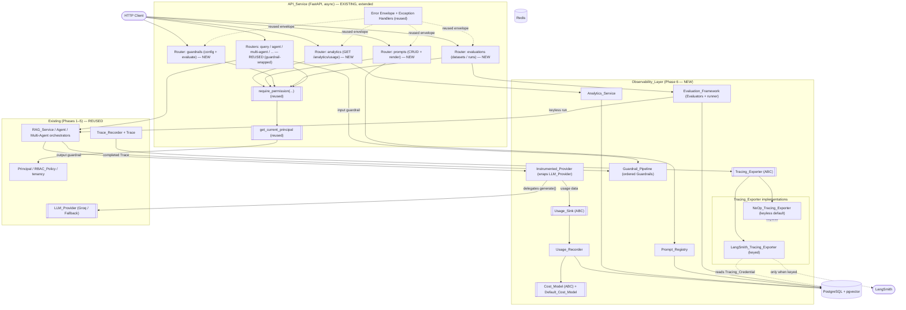

# Design Document

## Overview

This design covers **Phase 6 (Production Observability)** of the AgentForge platform.
Phases 1 (Foundation), 2 (Core RAG), 3 (Agentic Layer), 4 (Multi-Agent Collaboration),
and 5 (Enterprise Controls) are already built and provide the reusable, pluggable seams
this phase builds on **and MUST NOT reimplement**:

- the async FastAPI `API_Service` with its uniform error envelope
  `{ "error": { code, message, details } }` (`api/errors.py`, `AppError`) and typed
  request/response schemas (`api/schemas.py`);
- the `Configuration_Manager` (`Settings` + `load_settings`) that reads settings
  exclusively from environment variables, treats every credential as an optional
  `SecretStr`, and keeps the platform bootable with **no** external credentials;
- the composition root (`config/container.py` with `build_app_context` /
  `build_agent_context` / `build_multi_agent_context` / `build_enterprise_context`) as
  the **only** place concrete implementations are named;
- Postgres + pgvector plus the versioned SQL migration runner (`db/migrations.py`) that
  applies additive migrations `0001`–`0007` from `migrations/` and halts on the first
  failure naming the offending migration;
- Redis;
- the pluggable `LLM_Provider` seam exposing `generate(prompt) -> GenerationResult`
  (`llm/base.py`) with a Groq primary and a deterministic, network-free keyless
  `Fallback_Provider` (`llm/fallback_provider.py`);
- the `Trace_Recorder` seam recording an ordered per-run `Trace` of `Trace_Entry` steps
  (`tracing/base.py`, `InMemory_Trace_Recorder` + `Pg_Trace_Recorder`) consumed by the
  agent and multi-agent orchestrators;
- and the Phase 5 enterprise layer: `Principal` (`org_id`, `user_id`/`key_id`, `role`,
  `permissions`), the `get_current_principal` and `require_permission(...)` FastAPI
  dependencies (`api/deps.py`), strict multi-tenancy enforced at the data-access layer
  (cross-tenant → 404), the static `RBAC_Policy` (`enterprise/rbac.py`), org-scoped API
  keys, and the request-scoped tenant context (`enterprise/tenancy.py`).

Phase 6 adds an **Observability_Layer** that makes the platform measurable, controllable,
and verifiable in production **while remaining keyless and deterministic by default**. It
introduces:

- a pluggable **Tracing_Exporter** seam that forwards the existing `Trace` to an external
  tracer (LangSmith) only when a credential is configured, defaulting to a keyless
  `NoOp_Tracing_Exporter` that makes no external call and never changes a run's outcome;
- **token analytics and cost tracking** through an `Instrumented_Provider` that wraps any
  `LLM_Provider`, emits a `Usage_Record` (org/user/provider/model/tokens/cost/timestamp)
  per `generate` call via a `Usage_Sink`/`Usage_Recorder`, and computes cost from a
  pluggable `Cost_Model` — all without changing the `LLM_Provider` contract;
- an org-scoped **Analytics_Service** + cost/analytics API returning an aggregated
  `Usage_Report` (totals + provider/model/user breakdowns) with strict tenant isolation;
- a **Prompt_Registry** storing named `Prompt_Template`s as immutable, monotonically
  versioned `Prompt_Version`s that the RAG/agent/multi-agent flows can resolve and render;
- a pluggable **Guardrail** seam + **Guardrail_Pipeline** applying ordered input and
  output validation where a blocking guardrail short-circuits with a standard error and a
  flagging guardrail annotates without blocking;
- and an **Evaluation_Framework** that runs `Evaluator`s over an `Evaluation_Dataset`
  against the RAG/agent pipeline using the keyless `Fallback_Provider`, producing a
  persisted `Evaluation_Run` with per-item scores and an aggregate.

All new capabilities are wired through the existing composition root, exposed through the
existing `API_Service` with `get_current_principal` + `require_permission` applied, and
every new observability record is `org_id`-scoped and enforced at the data-access layer
consistent with Phase 5. Additive migrations `0008+` extend the schema without touching
prior-phase columns.

Explicitly **out of scope** (reserved for later phases, enabled by these seams): the React
frontend (this phase ships the analytics, prompt-registry, guardrail-config, and
evaluation **APIs** a frontend will later consume, not the UI); third-party integrations
(Slack, Gmail, Drive, GitHub); and cloud deployment.

### Design Goals

| Goal | How this design achieves it |
| --- | --- |
| **Keyless boot & deterministic tests preserved** | No `Tracing_Credential` → `build_tracing_exporter` selects `NoOp_Tracing_Exporter` (no external call). The `Instrumented_Provider` wraps the keyless `Fallback_Provider`, whose token count is a pure function of the request; the default `Cost_Model`, default guardrails, and evaluators are all deterministic. The whole Phase 6 suite runs with zero credentials (Req 1.2, 1.3, 2.4, 10.2, 11.1). |
| **`LLM_Provider` contract untouched** | `Instrumented_Provider` *implements* `LLM_Provider` (`name`, `generate(prompt) -> GenerationResult`) and wraps another provider; callers (RAG_Service, orchestrators) see no signature change. Usage capture and its failures never alter the returned `GenerationResult` (Req 2.1, 7.1, 7.2, 7.7, 9.2). |
| **Trace recording reused, not reimplemented** | The `Tracing_Exporter` *consumes* the existing `Trace` produced by `Trace_Recorder`; it never records steps itself. A new exporter is registered in the composition root without touching either orchestrator or the recorder (Req 1.1, 1.6, 9.1). |
| **Every seam pluggable through the composition root** | `Tracing_Exporter`, `Cost_Model`, `Usage_Sink`, `Guardrail`, and `Evaluator` are all abstract; `config/container.py` (extended with a `build_observability_context`) is the only place concretes are named. Adding a new one is a registry/builder edit — no core-flow change (Req 1.6, 2.6, 5.8, 6.7, 7.3, 9.7). |
| **Strict tenant isolation at the data-access layer** | Every Phase 6 store method takes `org_id` as a required parameter and constrains its SQL with `WHERE org_id = :org_id`; a cross-tenant read/mutate matches zero rows → `None`/`[]` → `AppError("not_found", 404)`. The handler cannot forget, because the store cannot return cross-org rows (Req 3.3, 4.8, 6.8, 10.3, 10.4, 10.5). |
| **Secrets optional & redacted** | The `Tracing_Credential` and any `Cost_Model` rate overrides flow through `Settings` as optional `SecretStr` / bounded fields, so no secret appears in logs, `repr`, or `model_dump` (Req 9.5, 10.1). |
| **Additive-only migrations** | `0008`–`0010` create the usage, prompt, and evaluation tables with `IF NOT EXISTS`; every table carries `org_id UUID NOT NULL REFERENCES organizations(id) ON DELETE CASCADE`; child FKs and the `(template, version)` uniqueness constraint are declared. No prior-phase column is dropped or altered (Req 8). |

### Key Design Decisions (summary)

- **Decorator (wrapper) over the `LLM_Provider` seam for usage capture.** The
  `Instrumented_Provider` is a decorator that adds a cross-cutting concern (usage/cost
  emission) without subclassing any concrete provider or editing the contract. It is
  wired in the composition root so *every* provider — Groq or Fallback — is instrumented
  identically, and its emission path is wrapped so a `Usage_Sink` failure never changes
  the wrapped provider's result.
- **`Tracing_Exporter` as a consumer of the existing `Trace`.** Export is a read-side
  concern layered on top of the already-recorded `Trace`; it is invoked after a run and
  its failures are suppressed from the request path, so tracing never changes a run's
  outcome. NoOp is the keyless default; the LangSmith-backed exporter is selected only
  when a credential is present.
- **Immutable, monotonically-versioned prompt registry.** A `Prompt_Version` is
  append-only: creating a version computes `max(version)+1` per `(org_id, name)`, a
  `UNIQUE (org_id, template_name, version)` constraint makes duplicate versions
  structurally impossible, and no update path exists. Rendering is a pure function that
  fails closed on any missing declared variable.
- **Ordered guardrail pipeline with allow/flag/block and block short-circuit.** The
  pipeline runs guardrails in a stable configured order, accumulates flags, and stops at
  the first block. Blocking an input prevents the downstream `LLM_Provider`/agent/
  multi-agent invocation entirely. Default guardrails are deterministic pure functions of
  the content, preserving keyless determinism.
- **Deterministic evaluation on the keyless path.** The `Evaluation_Framework` runs the
  pipeline with the `Fallback_Provider`, whose output is a pure function of its prompt;
  evaluators are pure functions of `(input, expected, actual)`; the aggregate is a pure
  function of the item scores — so repeated runs over the same dataset/evaluators are
  bit-for-bit identical.

A dedicated **Design Decisions & Why** section at the end records the full rationale for
learning purposes and is mirrored into `docs/decisions.md` during implementation (Req 12).

## Architecture

### High-Level Architecture

The new Phase 6 components form the `Observability_Layer`; everything in the
`Existing (Phases 1–5)` group is reused unchanged except that the LLM call path is now
routed through the `Instrumented_Provider` decorator (wired in the composition root, so
no caller changes). New analytics / prompt-registry / guardrail-config / evaluation
routers attach to the **existing** `API_Service` and reuse `get_current_principal` +
`require_permission` + the `AppError` envelope.



**How the new pieces connect to the existing platform:**

- The **`Instrumented_Provider`** is wired *in place of* the bare `LLM_Provider` inside
  `build_app_context` (and therefore inside every downstream `AgentContext` /
  `MultiAgentContext`), so RAG_Service, the agent orchestrator, and every multi-agent role
  transparently emit usage without any code change. It preserves `generate(prompt) ->
  GenerationResult` exactly (Req 2.1, 7.1, 7.2).
- The **`Tracing_Exporter`** consumes the `Trace` that `Trace_Recorder` already produced.
  It is invoked at run completion (from the orchestrator entry points / API layer, off the
  critical path) and tags the exported trace with the acting `Principal`'s `org_id` and
  `user_id`. Any export failure is caught and suppressed (Req 1.5, 1.7).
- The new routers sit on the **existing** `API_Service`, declare
  `Depends(require_permission(...))`, thread `principal.org_id` into org-scoped stores,
  and render every error through the existing `AppError` envelope (Req 3.5, 3.6, 7.4,
  7.5, 7.6, 9.4).
- **Guardrails** wrap the query / agent / multi-agent entry points: an input pipeline runs
  before the downstream invocation (a block short-circuits with an `AppError` and the
  downstream `LLM_Provider`/agent is never called), and an output pipeline runs on the
  result before it is returned (Req 5.4, 5.6).
- All Phase 6 secrets/tunables flow through the existing `Settings`; all state persists
  through the existing migration runner + Postgres; nothing introduces a separate config
  or persistence mechanism (Req 9.5, 9.6).

### Layering and Dependency Rule

Phase 6 follows the same inward dependency rule as Phases 1–5: **core logic depends on
interfaces, never on concrete implementations.**

1. **Transport layer** (`API_Service`) — four new routers (`analytics`, `prompts`,
   `guardrails`, `evaluations`) plus guardrail wrapping on the existing query/agent/
   multi-agent handlers. Knows nothing about how usage is stored, how cost is computed,
   which tracer is active, or how prompts/evaluations are persisted.
2. **Observability core** (`Tracing_Exporter` invocation, `Instrumented_Provider`,
   `Usage_Recorder`, `Cost_Model`, `Analytics_Service`, `Prompt_Registry`,
   `Guardrail_Pipeline`, `Evaluation_Framework`) — pure logic over abstract seams
   (`Usage_Sink`, `Cost_Model`, `Tracing_Exporter`, `Guardrail`, `Evaluator`, and the
   Phase 6 stores).
3. **Adapter layer** — concrete `Pg_*` stores + `LangSmith_Tracing_Exporter`, plus the
   `InMemory_*` / `NoOp` doubles for the keyless/test path.
4. **Infrastructure** — the reused Phase 1–5 providers, `Trace_Recorder`, Postgres +
   pgvector, Redis, and the enterprise `Principal`/RBAC/tenancy.

`config/container.py` is the **only** module that references concrete implementations; it
is extended with `build_tracing_exporter`, `build_cost_model`, `build_usage_recorder`,
`build_prompt_registry`, `build_guardrail_pipeline`, `build_evaluation_framework`, and a
`build_observability_context` that composes them and re-wraps the LLM provider with the
`Instrumented_Provider`. The observability core never constructs its own store, tracer, or
cost model (Req 7.3, 9.7).

### Repository / Module Layout

New Phase 6 modules follow the established convention: every `base.py` holds abstract
contracts, sibling files hold concrete implementations, and `config/container.py` is the
only module that names concretes.

```text
src/agentforge/
├── main.py                              # EXTENDED: register 4 new routers, wire observability context
├── config/
│   ├── settings.py                      # EXTENDED: langsmith_*, tracing_*, cost_*, guardrail_* (all optional)
│   └── container.py                     # EXTENDED: build_observability_context() + per-seam builders
├── observability/                       # NEW — the observability core
│   ├── __init__.py
│   ├── tracing_exporter.py              # Tracing_Exporter (ABC), NoOp_Tracing_Exporter, LangSmith_Tracing_Exporter
│   ├── models.py                        # Usage_Record, Token_Count, Usage_Report, breakdown dataclasses,
│   │                                    #   Prompt_Template, Prompt_Version, Guardrail_Result,
│   │                                    #   Evaluation_Dataset/Item/Run/Result dataclasses
│   ├── usage/
│   │   ├── base.py                      # Usage_Sink (ABC), Usage_Store (ABC)
│   │   ├── instrumented_provider.py     # Instrumented_Provider (implements LLM_Provider, wraps one)
│   │   ├── recorder.py                  # Usage_Recorder (builds + persists Usage_Records via Cost_Model)
│   │   ├── sink.py                      # Recording_Usage_Sink, NoOp_Usage_Sink (in-memory / keyless doubles)
│   │   └── store.py                     # InMemory_Usage_Store + Pg_Usage_Store
│   ├── cost.py                          # Cost_Model (ABC) + Default_Cost_Model (config-driven rate table)
│   ├── analytics.py                     # Analytics_Service (org-scoped aggregation -> Usage_Report)
│   ├── prompt_registry/
│   │   ├── base.py                      # Prompt_Store (ABC)
│   │   ├── registry.py                  # Prompt_Registry (versioning + render + missing-variable error)
│   │   └── store.py                     # InMemory_Prompt_Store + Pg_Prompt_Store
│   ├── guardrails/
│   │   ├── base.py                      # Guardrail (ABC), Guardrail_Decision enum, Guardrail_Pipeline
│   │   └── defaults.py                  # deterministic default guardrails (length / blocklist / non-empty)
│   └── evaluation/
│       ├── base.py                      # Evaluator (ABC), Evaluation_Store (ABC)
│       ├── framework.py                 # Evaluation_Framework (runner + aggregate)
│       ├── evaluators.py                # Exact_Match / Contains / Heuristic evaluators (deterministic)
│       └── store.py                     # InMemory_Evaluation_Store + Pg_Evaluation_Store
├── api/
│   ├── schemas.py                       # EXTENDED: UsageReportResponse, PromptVersionResponse, RenderRequest,
│   │                                    #   GuardrailConfigResponse, EvaluationRunResponse, ...
│   ├── deps.py                          # EXTENDED: get_observability_context + per-seam accessors
│   └── routers/
│       ├── analytics.py                 # NEW — GET /analytics/usage
│       ├── prompts.py                   # NEW — POST/GET /prompts, versions, POST /prompts/{name}/render
│       ├── guardrails.py                # NEW — GET /guardrails/config, POST /guardrails/evaluate
│       └── evaluations.py               # NEW — POST/GET /evaluations/datasets, POST/GET /evaluations/runs
└── (rag/, agent/, tools/, multiagent/, tracing/, enterprise/ — REUSED unchanged;
    the LLM provider they receive is the Instrumented_Provider, wired in the container)

migrations/                              # EXTENDED (same runner, same additive convention)
├── 0008_create_usage_records.sql        # usage_records (+ org_id FK, indexes)
├── 0009_create_prompt_registry.sql      # prompt_templates, prompt_versions (UNIQUE (template_id, version))
└── 0010_create_evaluations.sql          # evaluation_datasets, evaluation_items, evaluation_runs, evaluation_results
```

**Interfaces vs implementations.** The observability core imports only from the various
`base.py` modules and `observability/models.py`. Concrete stores / the LangSmith exporter
are referenced solely by `config/container.py`; routers reference only the FastAPI
dependencies. A new `Tracing_Exporter`, `Cost_Model`, `Guardrail`, or `Evaluator` is added
by implementing the interface and registering it in the composition root — never by
editing a router or an orchestrator (Req 1.6, 2.6, 5.8, 6.7, 9.7, 12.2).

## Components and Interfaces

### Tracing_Exporter (`observability/tracing_exporter.py`)

The `Tracing_Exporter` **consumes** the existing `Trace` (produced by the reused
`Trace_Recorder`) and forwards it to an external destination only when configured. It
never records steps itself (Req 1.1, 9.1).

```python
class Tracing_Exporter(ABC):
    """Forwards a completed Trace to an external destination when configured."""

    @property
    @abstractmethod
    def name(self) -> str: ...

    @abstractmethod
    def export(self, trace: Trace, *, org_id: UUID, user_id: UUID | None) -> None:
        """Forward `trace`, tagged with the owning org_id and initiating user_id.

        MUST NOT propagate an external failure to the caller: any error is caught and
        suppressed so trace export never changes a run's outcome (Req 1.5, 1.7).
        """


class NoOp_Tracing_Exporter(Tracing_Exporter):
    """Keyless default: makes no external call and produces no external side effect."""
    @property
    def name(self) -> str: return "noop"
    def export(self, trace, *, org_id, user_id) -> None:
        return  # intentionally does nothing (Req 1.3)


class LangSmith_Tracing_Exporter(Tracing_Exporter):
    """LangSmith-backed exporter, selected only when a Tracing_Credential is present."""
    def __init__(self, api_key: str, *, project: str, client=None) -> None: ...
    @property
    def name(self) -> str: return "langsmith"
    def export(self, trace, *, org_id, user_id) -> None:
        try:
            # Map Trace -> LangSmith run tree; tag with org_id / user_id metadata.
            self._client.create_run(..., extra={"org_id": str(org_id),
                                                 "user_id": str(user_id) if user_id else None})
        except Exception:      # noqa: BLE001 - suppression is the contract (Req 1.7)
            # Swallowed deliberately: export must never alter the request outcome.
            return
```

**Selection.** `build_tracing_exporter(settings)` returns `NoOp_Tracing_Exporter` when no
`Tracing_Credential` is configured, and `LangSmith_Tracing_Exporter` when it is (Req 1.2,
1.4). A new exporter is added by implementing the interface and registering a builder — no
orchestrator/recorder edit (Req 1.6).

**Invocation point.** The exporter is invoked at run completion by the API layer /
orchestrator entry point (which already holds the acting `Principal`), passing
`trace_recorder.get_trace(org_id, run_id)`, `principal.org_id`, and `principal.user_id`.
Because it runs after the run's result is produced and its failures are suppressed, export
is strictly off the critical path (Req 1.5, 1.7).

### Instrumented_Provider (`observability/usage/instrumented_provider.py`)

The `Instrumented_Provider` is a **decorator** that implements `LLM_Provider` and wraps
another `LLM_Provider`, emitting usage data per `generate` call while delegating generation
unchanged (Req 2.1, 7.1, 7.2, 9.2).

```python
class Instrumented_Provider(LLM_Provider):
    def __init__(
        self,
        wrapped: LLM_Provider,
        sink: Usage_Sink,
        *,
        token_counter: Callable[[str, GenerationResult], Token_Count] | None = None,
    ) -> None:
        self._wrapped = wrapped
        self._sink = sink
        self._count = token_counter or deterministic_token_count

    @property
    def name(self) -> str:
        return self._wrapped.name          # identity is transparent to callers

    def generate(self, prompt: str) -> GenerationResult:
        result = self._wrapped.generate(prompt)     # delegate FIRST (Req 7.2)
        try:
            tokens = self._count(prompt, result)     # pure fn of the request (Req 2.4)
            self._sink.record(
                provider=result.provider,
                model=_model_of(result),
                tokens=tokens,
                # org_id / user_id are read from the request-scoped tenancy context
                # (enterprise/tenancy.current_org) + a parallel user context, so the
                # LLM_Provider surface stays unchanged (Req 2.1, 2.3).
            )
        except Exception:      # noqa: BLE001 - usage capture must not change the result
            pass               # (Req 7.7)
        return result
```

**Contract preservation.** `Instrumented_Provider` exposes the same `name` and
`generate(prompt) -> GenerationResult` as the provider it wraps; callers cannot tell they
are talking to a wrapper (Req 2.1, 7.1). **Delegation precedes emission**, and emission is
wrapped in a guard, so a `Usage_Sink` failure never changes the returned result (Req 7.2,
7.7).

**Deterministic token count on the keyless path.** `deterministic_token_count(prompt,
result)` is a pure function of the request/response text (e.g. whitespace-delimited token
counts of `prompt` and `result.text`), so with the `Fallback_Provider` — whose output is a
pure function of its prompt — the emitted `Usage_Record` is fully deterministic (Req 2.4).
`total = prompt_tokens + completion_tokens` by construction (Req 2.7).

**Org/user attribution.** The acting `org_id` is read from the request-scoped tenancy
context (`enterprise/tenancy.current_org()`, already set by the orchestrator entry points),
and the `user_id` from a parallel context var set alongside it, so usage is attributed to
the right tenant/user without widening the `LLM_Provider` contract (Req 2.1, 2.3).

### Usage_Sink, Usage_Recorder, Usage_Store (`observability/usage/`)

```python
class Usage_Sink(ABC):
    """Seam the Instrumented_Provider forwards usage through (passed via the container)."""
    @abstractmethod
    def record(self, *, provider: str, model: str, tokens: Token_Count,
               org_id: UUID, user_id: UUID | None) -> None: ...


class Usage_Store(ABC):
    """Persistence seam for Usage_Records, scoped by org_id at the data-access layer."""
    @abstractmethod
    def add(self, record: Usage_Record) -> Usage_Record: ...
    @abstractmethod
    def list_for_org(self, org_id: UUID, *, start: datetime, end: datetime) -> list[Usage_Record]: ...


class Usage_Recorder:
    """Builds a Usage_Record (computing Cost via the Cost_Model) and persists it."""
    def __init__(self, store: Usage_Store, cost_model: Cost_Model) -> None: ...

    def record(self, *, provider: str, model: str, tokens: Token_Count,
               org_id: UUID, user_id: UUID | None) -> Usage_Record:
        cost = self._cost_model.cost_for(provider, model, tokens)   # (Req 2.2, 2.5)
        record = Usage_Record(
            id=uuid4(), org_id=org_id, user_id=user_id,
            provider=provider, model=model,
            prompt_tokens=tokens.prompt, completion_tokens=tokens.completion,
            total_tokens=tokens.total, cost=cost, created_at=utcnow(),
        )
        return self._store.add(record)     # persisted scoped to org_id (Req 2.3)
```

`Recording_Usage_Sink` adapts the `Usage_Recorder` to the `Usage_Sink` seam. The keyless
default uses `InMemory_Usage_Store`; the production profile uses `Pg_Usage_Store`
(`usage_records` table). Both constrain every query by `org_id` (Req 10.3).

### Cost_Model (`observability/cost.py`)

```python
class Cost_Model(ABC):
    @abstractmethod
    def cost_for(self, provider: str, model: str, tokens: Token_Count) -> Decimal:
        """Map (provider, model, Token_Count) -> a Cost, defined for every input."""


class Default_Cost_Model(Cost_Model):
    """Config-driven per-1K-token rate table with a default fallback rate (Req 2.5)."""
    def __init__(self, rates: dict[tuple[str, str], Rate], default_rate: Rate) -> None: ...

    def cost_for(self, provider, model, tokens) -> Decimal:
        rate = self._rates.get((provider, model), self._default_rate)
        return (Decimal(tokens.prompt)   / 1000 * rate.prompt_per_1k
              + Decimal(tokens.completion) / 1000 * rate.completion_per_1k)
```

Every `(provider, model, Token_Count)` maps to a defined `Cost`; when no rate is configured
for a pair, the `default_rate` applies, so the model is **total** over its input space
(Req 2.5). A new `Cost_Model` is registered in the composition root without touching the
`Instrumented_Provider` or the `LLM_Provider` contract (Req 2.6). The keyless default rate
is deterministic, keeping keyless usage records reproducible (Req 2.4, 10.2).

### Analytics_Service (`observability/analytics.py`)

```python
class Analytics_Service:
    def __init__(self, store: Usage_Store) -> None: ...

    def usage_report(self, org_id: UUID, *, start: datetime, end: datetime) -> Usage_Report:
        records = self._store.list_for_org(org_id, start=start, end=end)  # org-scoped (Req 3.3)
        return Usage_Report(
            org_id=org_id, start=start, end=end,
            total_tokens=sum(r.total_tokens for r in records),           # (Req 3.4)
            total_cost=sum((r.cost for r in records), Decimal(0)),       # (Req 3.4)
            by_provider=_group_sum(records, key=lambda r: r.provider),   # (Req 3.2, 3.7)
            by_model=_group_sum(records, key=lambda r: r.model),         # (Req 3.2, 3.7)
            by_user=_group_sum(records, key=lambda r: r.user_id),        # (Req 3.2)
        )
```

The report is computed **only** from records whose `org_id` equals the requester's, so no
other tenant's usage can ever appear (Req 3.1, 3.3, 10.5). By construction the report
total equals the sum of the included records, and each breakdown's tokens sum to the
report total — the breakdowns are a partition of the same record set (Req 3.4, 3.7).

### Prompt_Registry (`observability/prompt_registry/registry.py`)

```python
class Prompt_Store(ABC):
    @abstractmethod
    def next_version_number(self, org_id: UUID, name: str) -> int: ...   # max+1, or 1
    @abstractmethod
    def add_version(self, version: Prompt_Version) -> Prompt_Version: ...  # append-only
    @abstractmethod
    def get_version(self, org_id: UUID, name: str, version: int) -> Prompt_Version | None: ...
    @abstractmethod
    def get_latest(self, org_id: UUID, name: str) -> Prompt_Version | None: ...
    @abstractmethod
    def list_versions(self, org_id: UUID, name: str) -> list[int]: ...   # ascending


class Prompt_Registry:
    def create_version(self, org_id, name, body, variables) -> Prompt_Version:
        n = self._store.next_version_number(org_id, name)   # contiguous from 1 (Req 4.1, 4.9)
        return self._store.add_version(Prompt_Version(
            id=uuid4(), org_id=org_id, template_name=name, version=n,
            body=body, variables=tuple(variables), created_at=utcnow()))

    def get(self, org_id, name, version=None) -> Prompt_Version:
        v = (self._store.get_latest(org_id, name) if version is None
             else self._store.get_version(org_id, name, version))
        if v is None:
            raise AppError("not_found", "Prompt not found.", 404)   # cross-tenant too (Req 4.8)
        return v

    def render(self, version: Prompt_Version, values: dict[str, str]) -> str:
        missing = [name for name in version.variables if name not in values]
        if missing:
            raise AppError("missing_variable", "Missing prompt variable(s).", 400,
                           {"missing": missing})                    # (Req 4.7)
        return _substitute(version.body, values)                    # (Req 4.6)
```

**Immutability & monotonic contiguous versioning.** There is no update path for a
`Prompt_Version`; `create_version` always appends `max+1` (or `1`) per `(org_id, name)`,
and the DB `UNIQUE (org_id, template_name, version)` constraint makes a duplicate version
structurally impossible. Version numbers therefore form a contiguous `1..N` sequence with
no gaps or duplicates (Req 4.1, 4.2, 4.9, 8.6). `list_versions` returns them ascending
(Req 4.5).

**Rendering.** Rendering supplies every declared variable → produces the substituted
string (Req 4.6); omitting any declared variable → `AppError("missing_variable", 400)`
(Req 4.7). All reads are `org_id`-scoped, so a cross-tenant lookup returns 404 (Req 4.8,
10.4).

### Guardrail + Guardrail_Pipeline (`observability/guardrails/`)

```python
class Guardrail_Decision(str, Enum):
    ALLOW = "allow"
    FLAG  = "flag"
    BLOCK = "block"

@dataclass(frozen=True)
class Guardrail_Result:
    decision: Guardrail_Decision
    flags: tuple[str, ...] = ()        # accumulated annotations (flag case)
    reason: str | None = None          # blocking reason (block case)

class Guardrail(ABC):
    @property
    @abstractmethod
    def name(self) -> str: ...
    @abstractmethod
    def check(self, content: str) -> Guardrail_Result:
        """Pure function of `content` for the default guardrails (Req 5.7)."""

class Guardrail_Pipeline:
    """Ordered collection of Guardrails; block short-circuits, flags accumulate."""
    def __init__(self, guardrails: Sequence[Guardrail]) -> None:
        self._guardrails = tuple(guardrails)     # stable, defined order (Req 5.1)

    def evaluate(self, content: str) -> Guardrail_Result:
        flags: list[str] = []
        for g in self._guardrails:               # in order (Req 5.1)
            result = g.check(content)
            if result.decision is Guardrail_Decision.BLOCK:
                return Guardrail_Result(BLOCK, reason=result.reason)   # short-circuit (Req 5.3)
            if result.decision is Guardrail_Decision.FLAG:
                flags.extend(result.flags)
        if flags:
            return Guardrail_Result(FLAG, flags=tuple(flags))          # annotate, allow (Req 5.5)
        return Guardrail_Result(ALLOW)                                 # all allowed (Req 5.2)
```

**Application at entry points.** The query / agent / multi-agent handlers evaluate the
**input** pipeline before invoking the downstream `LLM_Provider`/agent/multi-agent
orchestrator; a `BLOCK` raises `AppError("guardrail_blocked", 400, {"reason": ...})` and
the downstream is **never** invoked (Req 5.4, 5.6). The **output** pipeline evaluates the
produced output before it is returned; flags are attached to the response envelope,
allowing the operation to proceed (Req 5.5, 5.6). Default guardrails (non-empty check,
max-length, static blocklist) are deterministic pure functions of the content, so the
keyless path stays reproducible (Req 5.7). A new guardrail is added by implementing the
interface and registering it in the composition root's pipeline builder — no entry-point
edit (Req 5.8).

### Evaluation_Framework (`observability/evaluation/framework.py`)

```python
class Evaluator(ABC):
    @property
    @abstractmethod
    def name(self) -> str: ...
    @abstractmethod
    def score(self, *, input: str, expected: str | None, actual: str) -> float:
        """Deterministic pure function of (input, expected, actual) (Req 6.3)."""

class Evaluation_Framework:
    def __init__(self, store: Evaluation_Store, pipeline_runner: Callable[[str, UUID], str],
                 evaluators: Mapping[str, Evaluator]) -> None: ...

    def run(self, org_id: UUID, dataset_id: UUID, evaluator_names: Sequence[str]) -> Evaluation_Run:
        dataset = self._store.get_dataset(org_id, dataset_id)     # org-scoped (Req 6.8)
        if dataset is None:
            raise AppError("not_found", "Dataset not found.", 404)
        results: list[Evaluation_Result] = []
        for item in self._store.list_items(org_id, dataset_id):
            actual = self._runner(item.input, org_id)             # RAG/agent w/ Fallback (Req 6.2)
            for ev_name in evaluator_names:
                score = self._evaluators[ev_name].score(
                    input=item.input, expected=item.expected, actual=actual)  # (Req 6.3)
                results.append(Evaluation_Result(item_id=item.id, evaluator=ev_name, score=score))
        aggregate = _mean(r.score for r in results)               # (Req 6.4, 6.9)
        run = Evaluation_Run(id=uuid4(), org_id=org_id, dataset_id=dataset_id,
                             aggregate_score=aggregate, results=results, created_at=utcnow())
        return self._store.add_run(run)                           # persisted org-scoped (Req 6.5)
```

**Keyless determinism.** The `pipeline_runner` invokes the RAG/agent pipeline on the
keyless path (the wired provider is the `Fallback_Provider`, a pure function of its
prompt), and every evaluator is a pure function of `(input, expected, actual)`, so repeated
runs over the same dataset + evaluators yield identical `Item_Score`s and an identical
`Aggregate_Score` (Req 6.2, 6.3, 6.6). The aggregate equals the aggregation (mean) of the
per-item scores by construction (Req 6.4, 6.9). Datasets, items, and runs are all
`org_id`-scoped, so cross-tenant access returns 404 (Req 6.1, 6.5, 6.8, 10.4). A new
evaluator is registered in the composition root without touching the run logic (Req 6.7).

### API endpoints (`api/routers/*.py`)

Every Phase 6 endpoint sits on the existing `API_Service`, declares
`Depends(require_permission(...))`, threads `principal.org_id` into the org-scoped
service/store, and renders errors through the existing `AppError` envelope (Req 7.4, 7.5,
7.6, 9.4).

| Endpoint | Method | Permission | Notes |
| --- | --- | --- | --- |
| `/analytics/usage` | `GET` | `read` | Query params `start`, `end`; returns `Usage_Report` for `principal.org_id` (Req 3.1, 3.5, 3.6). |
| `/prompts` | `POST` | `ingest_documents` | Create a new `Prompt_Version` (name in body) — mutates registry content. |
| `/prompts` | `GET` | `read` | List template names for the org. |
| `/prompts/{name}/versions` | `GET` | `read` | Ascending version numbers (Req 4.5). |
| `/prompts/{name}` | `GET` | `read` | Latest version, or `?version=N` for a specific one (Req 4.3, 4.4). |
| `/prompts/{name}/render` | `POST` | `read` | Render with supplied variables; missing → 400 (Req 4.6, 4.7). |
| `/guardrails/config` | `GET` | `read` | Ordered list of active guardrail names + kinds (Req 5.1). |
| `/guardrails/evaluate` | `POST` | `run_agents` | Evaluate content against the input/output pipeline (returns allow/flag/block). |
| `/evaluations/datasets` | `POST` | `run_agents` | Create a dataset + items scoped to the org (Req 6.1). |
| `/evaluations/datasets` | `GET` | `read` | List the org's datasets. |
| `/evaluations/runs` | `POST` | `run_agents` | Execute a run over a dataset with named evaluators (Req 6.2, 6.5). |
| `/evaluations/runs/{id}` | `GET` | `read` | Fetch a run with per-item scores + aggregate (Req 6.9). |

**Error surface.** No/invalid credential → **401**; authenticated but missing permission →
**403**; cross-tenant or unknown-in-tenant resource → **404**; missing prompt variable →
**400 `missing_variable`**; blocked input → **400 `guardrail_blocked`** — all rendered
through the existing envelope (Req 3.5, 3.6, 4.7, 4.8, 5.4, 6.8, 7.5, 10.4).

**Analytics permission choice.** `GET /analytics/usage` requires `read` (not a bespoke
permission), reusing the Phase 5 `read` permission granted to every role, consistent with
the requirement that a Principal holding `read` can query the report (Req 3.1, 3.6, 9.3).

## Data Models

### Observability domain models (`observability/models.py`)

Plain, framework-agnostic dataclasses (consistent with Phases 3–5). No model holds a
secret; monetary `Cost` uses `Decimal` for exact arithmetic.

```python
@dataclass(frozen=True)
class Token_Count:
    prompt: int
    completion: int
    @property
    def total(self) -> int:            # invariant: total == prompt + completion (Req 2.7)
        return self.prompt + self.completion

@dataclass
class Usage_Record:
    id: UUID
    org_id: UUID                       # FK -> organizations(id) (Req 8.2)
    user_id: UUID | None               # attribution (Req 2.1)
    provider: str
    model: str
    prompt_tokens: int
    completion_tokens: int
    total_tokens: int                  # == prompt_tokens + completion_tokens (Req 2.7)
    cost: Decimal                      # computed by the Cost_Model (Req 2.2)
    created_at: datetime

@dataclass
class Breakdown_Entry:
    key: str                           # provider name / model name / user_id (str)
    total_tokens: int
    total_cost: Decimal

@dataclass
class Usage_Report:
    org_id: UUID
    start: datetime
    end: datetime
    total_tokens: int
    total_cost: Decimal
    by_provider: list[Breakdown_Entry]
    by_model: list[Breakdown_Entry]
    by_user: list[Breakdown_Entry]

@dataclass
class Prompt_Template:
    id: UUID
    org_id: UUID                       # FK -> organizations(id) (Req 8.2)
    name: str                          # UNIQUE (org_id, name)
    created_at: datetime

@dataclass(frozen=True)
class Prompt_Version:
    id: UUID
    org_id: UUID                       # FK -> organizations(id) (Req 8.2)
    template_name: str
    version: int                       # monotonic, contiguous from 1 (Req 4.1, 4.9)
    body: str                          # immutable (Req 4.2)
    variables: tuple[str, ...]         # declared variable names (immutable)
    created_at: datetime

@dataclass
class Evaluation_Dataset:
    id: UUID
    org_id: UUID                       # FK -> organizations(id) (Req 8.2)
    name: str
    created_at: datetime

@dataclass
class Evaluation_Item:
    id: UUID
    dataset_id: UUID                   # FK -> evaluation_datasets(id) (Req 8.3)
    org_id: UUID
    input: str
    expected: str | None

@dataclass
class Evaluation_Result:
    item_id: UUID                      # FK -> evaluation_items(id)
    evaluator: str
    score: float

@dataclass
class Evaluation_Run:
    id: UUID
    org_id: UUID                       # FK -> organizations(id) (Req 8.2)
    dataset_id: UUID                   # FK -> evaluation_datasets(id)
    aggregate_score: float             # == aggregation of per-item scores (Req 6.9)
    results: list[Evaluation_Result]   # each FK -> evaluation_runs(id) when persisted (Req 8.3)
    created_at: datetime
```

### `Settings` additions (`config/settings.py`)

Every added field is optional / bounded / a toggle, so keyless boot is preserved. The
`Tracing_Credential` and any cost overrides are `SecretStr` / structured values sourced
from the environment (Req 9.5, 10.1).

```python
class Settings(BaseSettings):
    # ... existing fields ...

    # --- Phase 6: tracing export (optional; NoOp when absent) ---
    langsmith_api_key:    SecretStr | None = None    # the Tracing_Credential (Req 1.2, 10.1)
    langsmith_project:    str = "agentforge"
    tracing_export_enabled: bool = True              # master toggle; NoOp still used if no key

    # --- Phase 6: cost model (default rate applied when a pair is unlisted) ---
    cost_default_prompt_per_1k:     str = "0.0"      # Decimal-as-str; keyless default is free
    cost_default_completion_per_1k: str = "0.0"
    # Optional JSON rate table: {"groq:llama-3.1-8b": {"prompt": "0.05", "completion": "0.08"}}
    cost_rate_table_json: str | None = None

    # --- Phase 6: guardrails (deterministic defaults; all optional) ---
    guardrail_max_input_chars:  int = 8000           # default max-length input guardrail
    guardrail_blocklist_json:   str | None = None    # optional static blocklist terms

    def active_tracing_exporter(self) -> str:
        """`"langsmith"` iff a Tracing_Credential is configured and export is enabled,
        else `"noop"` — so no external tracer is constructed on the keyless path
        (Req 1.2, 1.4, 10.2)."""
        return ("langsmith"
                if self.tracing_export_enabled and self.langsmith_api_key is not None
                else "noop")
```

### PostgreSQL schema — additive migrations

Three new migrations, all applied through the **existing** runner (discovered by filename
order, tracked in `schema_migrations`, halting on failure naming the failing id — Req 8.1,
8.4, 8.5). All are strictly additive (`CREATE TABLE IF NOT EXISTS`), so Phases 1–5 continue
untouched (Req 8.4). Every table carries `org_id UUID NOT NULL REFERENCES organizations(id)
ON DELETE CASCADE` (Req 8.2); child relationships are declared as FKs (Req 8.3).

#### `0008_create_usage_records.sql`

```sql
-- 0008_create_usage_records.sql
-- Per-call token usage + computed cost, org-scoped (Req 8.1, 8.2).
CREATE TABLE IF NOT EXISTS usage_records (
    id                UUID PRIMARY KEY,
    org_id            UUID NOT NULL REFERENCES organizations(id) ON DELETE CASCADE,
    user_id           UUID REFERENCES users(id) ON DELETE SET NULL,   -- attribution (Req 2.1)
    provider          TEXT NOT NULL,
    model             TEXT NOT NULL,
    prompt_tokens     INTEGER NOT NULL CHECK (prompt_tokens >= 0),
    completion_tokens INTEGER NOT NULL CHECK (completion_tokens >= 0),
    total_tokens      INTEGER NOT NULL CHECK (total_tokens = prompt_tokens + completion_tokens),
    cost              NUMERIC(20, 8) NOT NULL,                         -- exact monetary (Req 2.2)
    created_at        TIMESTAMPTZ NOT NULL DEFAULT now()
);
CREATE INDEX IF NOT EXISTS usage_records_org_time_idx ON usage_records (org_id, created_at);
```

The `total_tokens = prompt_tokens + completion_tokens` CHECK enforces the token invariant
at the storage layer as defense-in-depth (Req 2.7).

#### `0009_create_prompt_registry.sql`

```sql
-- 0009_create_prompt_registry.sql
-- Named templates + immutable, monotonically versioned revisions (Req 8.1, 8.6).
CREATE TABLE IF NOT EXISTS prompt_templates (
    id         UUID PRIMARY KEY,
    org_id     UUID NOT NULL REFERENCES organizations(id) ON DELETE CASCADE,
    name       TEXT NOT NULL,
    created_at TIMESTAMPTZ NOT NULL DEFAULT now(),
    UNIQUE (org_id, name)                       -- one template per name per org
);

CREATE TABLE IF NOT EXISTS prompt_versions (
    id            UUID PRIMARY KEY,
    org_id        UUID NOT NULL REFERENCES organizations(id) ON DELETE CASCADE,
    template_id   UUID NOT NULL REFERENCES prompt_templates(id) ON DELETE CASCADE,  -- (Req 8.3)
    version       INTEGER NOT NULL CHECK (version >= 1),
    body          TEXT NOT NULL,                -- immutable: no UPDATE path (Req 4.2)
    variables     JSONB NOT NULL DEFAULT '[]',  -- declared variable names
    created_at    TIMESTAMPTZ NOT NULL DEFAULT now(),
    UNIQUE (template_id, version)               -- no two versions share a number (Req 8.6)
);
CREATE INDEX IF NOT EXISTS prompt_versions_tpl_idx ON prompt_versions (template_id, version);
```

#### `0010_create_evaluations.sql`

```sql
-- 0010_create_evaluations.sql
-- Datasets, items, runs, and per-item results — all org-scoped (Req 8.1, 8.2, 8.3).
CREATE TABLE IF NOT EXISTS evaluation_datasets (
    id         UUID PRIMARY KEY,
    org_id     UUID NOT NULL REFERENCES organizations(id) ON DELETE CASCADE,
    name       TEXT NOT NULL,
    created_at TIMESTAMPTZ NOT NULL DEFAULT now(),
    UNIQUE (org_id, name)
);

CREATE TABLE IF NOT EXISTS evaluation_items (
    id         UUID PRIMARY KEY,
    org_id     UUID NOT NULL REFERENCES organizations(id) ON DELETE CASCADE,
    dataset_id UUID NOT NULL REFERENCES evaluation_datasets(id) ON DELETE CASCADE,  -- (Req 8.3)
    input      TEXT NOT NULL,
    expected   TEXT
);
CREATE INDEX IF NOT EXISTS evaluation_items_dataset_idx ON evaluation_items (dataset_id);

CREATE TABLE IF NOT EXISTS evaluation_runs (
    id              UUID PRIMARY KEY,
    org_id          UUID NOT NULL REFERENCES organizations(id) ON DELETE CASCADE,
    dataset_id      UUID NOT NULL REFERENCES evaluation_datasets(id) ON DELETE CASCADE,
    aggregate_score DOUBLE PRECISION NOT NULL,
    created_at      TIMESTAMPTZ NOT NULL DEFAULT now()
);
CREATE INDEX IF NOT EXISTS evaluation_runs_org_idx ON evaluation_runs (org_id, created_at);

CREATE TABLE IF NOT EXISTS evaluation_results (
    id         UUID PRIMARY KEY,
    org_id     UUID NOT NULL REFERENCES organizations(id) ON DELETE CASCADE,
    run_id     UUID NOT NULL REFERENCES evaluation_runs(id) ON DELETE CASCADE,        -- (Req 8.3)
    item_id    UUID NOT NULL REFERENCES evaluation_items(id) ON DELETE CASCADE,
    evaluator  TEXT NOT NULL,
    score      DOUBLE PRECISION NOT NULL
);
CREATE INDEX IF NOT EXISTS evaluation_results_run_idx ON evaluation_results (run_id);
```

**Migration guarantees.** The runner discovers `0008`–`0010` by filename order and tracks
them in `schema_migrations`; a failure halts and reports the failing id, per the existing
runner behavior (Req 8.4, 8.5). All statements are idempotent `CREATE ... IF NOT EXISTS`,
so re-running is a no-op, and no prior-phase column is dropped or altered (Req 8.4).

### API request/response schemas (`api/schemas.py`, extended)

New typed Pydantic models back the new endpoints: `UsageReportResponse` (totals +
`by_provider`/`by_model`/`by_user` breakdown lists), `CreatePromptVersionRequest`,
`PromptVersionResponse`, `RenderPromptRequest`/`RenderPromptResponse`,
`GuardrailConfigResponse`, `GuardrailEvaluateRequest`/`GuardrailEvaluateResponse`,
`CreateDatasetRequest`, `EvaluationRunRequest`, and `EvaluationRunResponse` (aggregate +
per-item scores). All error responses render through the existing envelope.


## Correctness Properties

*A property is a characteristic or behavior that should hold true across all valid
executions of a system — essentially, a formal statement about what the system should do.
Properties serve as the bridge between human-readable specifications and
machine-verifiable correctness guarantees.*

Property-based testing **is appropriate** for the observability core: token counting, cost
computation, usage aggregation, prompt versioning/rendering, guardrail-pipeline ordering
and short-circuiting, evaluation scoring/aggregation, and tenant isolation at the store are
all pure or deterministically-driven behaviors with universal properties over large input
spaces. Structural, configuration, migration, wiring, and documentation criteria
(interface declarations, exporter selection, `Settings` shape, schema FKs, seam reuse,
`docs/decisions.md`) are validated by SMOKE / EXAMPLE / INTEGRATION tests instead and are
enumerated in the Testing Strategy.

The 10 properties below were derived from the acceptance criteria via the prework analysis,
then consolidated to remove redundancy: the instrumented-decorator criteria (7.1/7.2/7.7)
fold into Property 3; the usage-record criteria (2.1/2.2/2.3/2.4/2.7) fold into Property 4;
the analytics criteria (3.1/3.2/3.3/3.4/3.7 + 11.3/11.4) fold into Property 6; the prompt
criteria (4.1/4.2/4.3/4.4/4.5/4.9 + 11.5, and 4.6/4.7) fold into Property 7; the guardrail
criteria (5.1/5.2/5.3/5.5/5.7 and 5.4/11.6) fold into Property 8; the evaluation criteria
(6.3/6.4/6.6/6.9 + 11.7) fold into Property 9; and every per-resource tenant-isolation
criterion (2.3/3.3/4.8/6.1/6.5/6.8/7.6/10.3/10.4/10.5) folds into the parametric Property 10.
Every property is testable **keyless** through the `Fallback_Provider`, the in-memory
stores, and capturing fakes.

### Property 1: Tracing export tags the trace with org and user

*For any* `Trace`, any `org_id`, and any `user_id` (present or absent), when the active
`Tracing_Exporter` exports that trace, the payload delivered to the external destination is
tagged with exactly that `org_id` and `user_id`.

**Validates: Requirements 1.5**

### Property 2: Trace export never changes a run's outcome

*For any* underlying tracer client that raises an arbitrary exception on forwarding, the
`Tracing_Exporter.export` call returns normally (the failure is suppressed) and the agent
or multi-agent run result observed by the caller is identical to the result produced with a
successful or NoOp export.

**Validates: Requirements 1.7**

### Property 3: Instrumented_Provider is a transparent, safe decorator

*For any* wrapped `LLM_Provider` and any prompt, `Instrumented_Provider.generate(prompt)`
returns a `GenerationResult` equal to what the wrapped provider returns and exposes the
wrapped provider's `name`, delegates to the wrapped provider exactly once, and forwards
exactly one usage emission to the `Usage_Sink`; moreover, for any `Usage_Sink` that raises,
`generate` still returns exactly the wrapped provider's result unchanged.

**Validates: Requirements 2.1, 7.1, 7.2, 7.7**

### Property 4: Usage_Record correctness, determinism, and token invariant

*For any* generate call routed through the `Instrumented_Provider` over the
`Fallback_Provider` with a given acting `org_id`/`user_id`, the emitted `Usage_Record`
captures that `org_id`, `user_id`, provider name, and model name, its
`total_tokens == prompt_tokens + completion_tokens`, its stored `cost` equals
`Cost_Model.cost_for(provider, model, tokens)`, and repeating the identical call produces an
identical `Usage_Record` in its token fields and cost (deterministic on the keyless path).

**Validates: Requirements 2.1, 2.2, 2.3, 2.4, 2.7**

### Property 5: Cost_Model is total with a default rate

*For any* provider name, model name, and `Token_Count` — including provider/model pairs
that have no configured rate — `Cost_Model.cost_for(...)` returns a defined, non-negative
`Cost` without raising, applying the configured default rate when the pair is unlisted.

**Validates: Requirements 2.5**

### Property 6: Analytics aggregation partitions the org's records and isolates tenants

*For any* set of `Usage_Record`s spread across two or more organizations and any time
range, the `Usage_Report` computed for organization `A` has `total_tokens` equal to the sum
of the `total_tokens` of exactly `A`'s in-range records and `total_cost` equal to the sum of
their `cost`s; the sum of tokens across the provider breakdown and the sum across the model
breakdown each equal the report's `total_tokens`; and no record whose `org_id != A` appears
in or contributes to `A`'s report.

**Validates: Requirements 3.1, 3.2, 3.3, 3.4, 3.7, 10.5, 11.3, 11.4**

### Property 7: Prompt versioning is monotonic, contiguous, immutable; rendering is total-or-errors

*For any* organization and template name, creating a sequence of `N` `Prompt_Version`s
assigns version numbers forming exactly the contiguous set `{1, 2, ..., N}` with no gaps or
duplicates in creation order; `get_latest` returns the highest-numbered version, `get(name,
k)` returns exactly the version created as number `k`, `list_versions` returns the numbers
ascending, and no previously created version's `body` or `variables` ever changes; and *for
any* version and value map, rendering substitutes every declared variable when all are
supplied, whereas rendering raises `AppError("missing_variable", 400)` (listing the missing
names) whenever at least one declared variable is omitted.

**Validates: Requirements 4.1, 4.2, 4.3, 4.4, 4.5, 4.6, 4.7, 4.9, 11.5**

### Property 8: Guardrail pipeline order, short-circuit, and downstream prevention

*For any* ordered sequence of guardrails and any content: the pipeline evaluates guardrails
in configured order; if every guardrail returns allow the result is `ALLOW`; if at least
one returns flag and none returns block the result is `ALLOW` carrying all accumulated
flags; if some guardrail returns block, the pipeline returns `BLOCK` with that reason and
evaluates no guardrail after the first block; the default pipeline's result is a pure
function of the content (identical across repeated calls); and *for any* input that the
input pipeline blocks at the query/agent/multi-agent entry point, the downstream
`LLM_Provider`/agent/multi-agent orchestrator is invoked zero times.

**Validates: Requirements 5.1, 5.2, 5.3, 5.4, 5.5, 5.7, 11.6**

### Property 9: Evaluation scoring and aggregation are deterministic and consistent

*For any* `Evaluation_Dataset` and set of `Evaluator`s run on the keyless path, each
`Item_Score` is a pure function of the item's `(input, expected, actual)` (repeated runs
yield identical per-item scores and an identical `Aggregate_Score`), and the persisted
`Aggregate_Score` equals the aggregation (mean) of the run's persisted per-item
`Item_Score`s.

**Validates: Requirements 6.3, 6.4, 6.6, 6.9, 11.7**

### Property 10: Observability tenant isolation across every resource type

*For any* two distinct organizations `A` and `B`, any observability resource created under
`A` — a `Usage_Record`, a `Prompt_Template`/`Prompt_Version`, an `Evaluation_Dataset`, or an
`Evaluation_Run` — and any authenticated `Principal` whose `org_id = B`, every read and
mutate attempt against that resource returns `AppError("not_found", 404)` and no response to
`B` ever includes a resource owned by `A`; the constraint holds at the data-access layer
independently of any handler check.

**Validates: Requirements 2.3, 3.3, 4.8, 6.1, 6.5, 6.8, 7.6, 10.3, 10.4, 10.5**

## Error Handling

Phase 6 reuses the existing uniform error envelope `{ "error": { code, message, details } }`
and the existing FastAPI exception handlers (`api/errors.py`, `AppError`). All new error
conditions raise `AppError` with a stable code so responses stay consistent, and no secret
value (the `Tracing_Credential`) ever appears in an error body or in server logs.

| Condition | Requirement | Behavior | Surface |
| --- | --- | --- | --- |
| Missing / invalid credential on a Phase 6 endpoint | 3.5, 7.5 | Reuses `get_current_principal` → `AppError("unauthorized", 401)` | envelope |
| Authenticated principal lacks the required permission | 3.6, 7.5 | Reuses `require_permission` → `AppError("forbidden", 403, {"required": <perm>})` | envelope |
| Cross-tenant read / mutate of any observability resource | 4.8, 6.8, 10.4 | Store returns `None`/`[]` (SQL scoped by `org_id`) → `AppError("not_found", 404)` — **never** 403 | envelope |
| Render a prompt omitting a declared variable | 4.7 | `AppError("missing_variable", 400, {"missing": [...]})` | envelope |
| Input guardrail blocks a query/agent/multi-agent request | 5.4 | `AppError("guardrail_blocked", 400, {"reason": ...})`; downstream never invoked | envelope |
| External tracer fails to forward a trace | 1.7 | Exception caught inside `export`; **suppressed** — the run's result is unchanged | none (swallowed) |
| `Usage_Sink` fails to record usage | 7.7 | Exception caught inside `Instrumented_Provider.generate`; wrapped result still returned | none (swallowed) |
| Cost lookup for an unlisted (provider, model) | 2.5 | `Default_Cost_Model` applies the default rate — never raises | n/a (returns Cost) |
| Evaluation run references an unknown/cross-org dataset | 6.8 | `AppError("not_found", 404)` | envelope |
| Unknown route / unhandled exception | reused | Existing `not_found` (404) / `internal_error` (500) handlers, no stack-trace leak | envelope |

**Containment principle.** The two "observability must never change the outcome" guarantees
are enforced by deliberate suppression: `Tracing_Exporter.export` and the usage-emission
block inside `Instrumented_Provider.generate` each wrap their side-effecting work in a guard
that swallows exceptions, so neither trace export nor usage capture can turn a successful
generation/run into a failure (Req 1.7, 7.7). Tenant isolation is structural: the store's
SQL is scoped by `org_id`, so a cross-tenant resource is indistinguishable from a
non-existent one and surfaces as 404, never 403 (Req 10.4).

## Testing Strategy

Property-based testing **is appropriate** for the observability core's logic (token
counting, cost computation, usage aggregation, prompt versioning/rendering, guardrail
ordering/short-circuit, evaluation scoring/aggregation, and store-level tenant isolation) —
all pure or deterministically-driven with universal properties. The tracing-export
selection, endpoint wiring, migrations, `Settings` shape, seam reuse, and documentation use
example / integration / smoke tests instead.

### Dual approach

- **Property-based tests (Hypothesis, ≥100 iterations each)** — one property test per
  correctness property listed above (10 total).
- **Unit / example tests** — exporter selection: no key → `NoOp`, key → LangSmith (Req 1.2,
  1.4); `NoOp.export` makes no external call via a network-guard spy (Req 1.3, 11.2);
  keyless boot wires all defaults (Req 10.2); analytics endpoint 401 with no credential
  (Req 3.5) and 403 without `read` (Req 3.6); guardrails applied at each of the three entry
  points, input pre-invocation and output on the result (Req 5.6); an evaluation run over a
  small dataset produces Fallback-derived actual outputs (Req 6.2); prompt endpoints return
  ascending version lists (Req 4.5 shape).
- **Integration tests (`@pytest.mark.integration`, 1–3 examples each)** — migrations
  `0008`–`0010` apply against real Postgres and `schema_migrations` advances (Req 8.1, 8.4);
  a failing migration halts the runner naming its id (Req 8.5); the `(template_id, version)`
  unique constraint rejects a duplicate insert (Req 8.6); the `usage_records`
  `total = prompt + completion` CHECK rejects an inconsistent row (Req 2.7 defense-in-depth);
  the `Pg_Usage_Store` / `Pg_Prompt_Store` / `Pg_Evaluation_Store` round-trip under `org_id`
  scoping; `ON DELETE CASCADE` from `organizations` sweeps all Phase 6 tables.
- **Smoke / structural checks** — `llm/base.py` is unchanged and `Instrumented_Provider`
  subclasses `LLM_Provider` (Req 9.2); each Phase 6 table declares an `org_id` FK to
  `organizations` and the child FKs (Req 8.2, 8.3); `langsmith_api_key` is `SecretStr | None`
  defaulting to `None` and is redacted from `repr`/`model_dump` (Req 9.5, 10.1); every Phase
  6 route declares `get_current_principal` + `require_permission` (Req 7.5, 9.3); only
  `config/container.py` names concrete observability implementations (Req 7.3, 9.7);
  `docs/decisions.md` covers the Phase 6 rationale and the four extension guides (Req 12).

### Property-based testing configuration

- Use **Hypothesis** — do **not** hand-roll property testing.
- Each property test runs a **minimum of 100 iterations**.
- Each test carries a tag comment referencing its design property, in the format:
  **Feature: agentforge-observability, Property {number}: {property_text}**.
- Each of the 10 correctness properties is implemented by a **single** property-based test.
- Strategies cover the important edges explicitly: prompts with unicode, whitespace, and
  empty strings (token counting / determinism); provider/model pairs both in and absent from
  the rate table, and `Token_Count`s at `0` and large values (cost totality + token
  invariant); multi-org record sets with overlapping providers/models/users and empty
  ranges (analytics partition + isolation); create sequences of length `0..N` and
  interleaved template names (prompt versioning), plus value maps that are complete, missing
  one, and missing several (rendering); guardrail orderings with allow-only, flag-only,
  block-at-position-`i`, and mixed decisions (pipeline semantics + short-circuit); datasets
  with `expected` present and absent and repeated identical runs (evaluation determinism);
  and two-org / three-org shrinking across all four observability resource types (tenant
  isolation).

### Keyless execution (critical)

The entire property + example suite runs with **no external LLM credential and no
`Tracing_Credential`**: `settings.active_tracing_exporter() == "noop"`, the wired provider
is the `Fallback_Provider` wrapped by the `Instrumented_Provider`, the `Default_Cost_Model`
uses its deterministic default rate, the default guardrails are pure functions of the
content, and the evaluators are pure functions of `(input, expected, actual)`. Usage,
prompt, and evaluation state use the in-memory stores. Because the observability core is a
pure function of its seams, every property is decidable in-process. The Groq / LangSmith /
real Postgres paths are covered separately by mocked unit tests and the integration lane
(Req 10.2, 11.1).

## Design Decisions & Why

This section records the rationale for the major choices, per Requirement 12. It is
mirrored into `docs/decisions.md` during implementation, alongside the four extension guides
(adding a `Tracing_Exporter` / `Cost_Model` / `Guardrail` / `Evaluator` behind its interface
through the composition root — Req 12.2), how the `Instrumented_Provider` captures usage
without breaking the `LLM_Provider` contract or the keyless promise (Req 12.3), and how
tenant isolation is enforced for observability resources at the data-access layer,
consistent with Phase 5 (Req 12.4).

- **Why a decorator over the `LLM_Provider` seam for usage capture.** Usage/cost emission is
  a cross-cutting concern that must apply to *every* provider without changing the
  `generate(prompt) -> GenerationResult` contract or editing any concrete provider. A
  decorator (`Instrumented_Provider` wraps any `LLM_Provider`) is the minimal way to do
  this: it is wired in the composition root so Groq and Fallback are instrumented
  identically, callers can't tell they're talking to a wrapper, and — critically —
  delegation happens *before* emission and emission is wrapped in a guard, so a `Usage_Sink`
  failure can never turn a successful generation into an error (Req 2.1, 7.1, 7.2, 7.7,
  9.2, 12.3).
- **Why the `Tracing_Exporter` consumes the existing `Trace` and suppresses failures.**
  Trace *recording* is already solved by the Phase 3/4 `Trace_Recorder`; export is a
  read-side concern layered on top, so reimplementing recording would duplicate logic and
  risk drift. Export runs after the run's result is produced and swallows any external
  error, guaranteeing "tracing never changes the outcome of a run." NoOp is the keyless
  default so no external call is ever made without a credential; the LangSmith-backed
  exporter is selected only when the credential is present (Req 1.1, 1.2, 1.3, 1.4, 1.7,
  9.1, 12.3).
- **Why immutable, monotonically-versioned prompts with a DB uniqueness constraint.** Safe
  prompt evolution requires that a version, once referenced by a run, can never change
  underneath it. Making `Prompt_Version` append-only (no update path), computing `max+1` per
  `(org, name)`, and enforcing `UNIQUE (template_id, version)` at the database makes both
  immutability and a contiguous `1..N` sequence structural rather than conventional — a
  duplicate or gap is impossible even under concurrent creates. Rendering fails closed on a
  missing variable so a half-substituted prompt never reaches a model (Req 4.1, 4.2, 4.7,
  4.9, 8.6, 12.1).
- **Why an ordered pipeline with allow/flag/block and a block short-circuit.** Guardrails
  must be composable and their combination predictable. A stable configured order plus
  "stop at the first block, accumulate flags otherwise" gives a single, testable semantics:
  a block prevents the downstream `LLM_Provider`/agent invocation entirely (the safety
  guarantee), while flags annotate without blocking (the observability guarantee). Default
  guardrails are pure functions of the content so the keyless path stays deterministic, and
  a new guardrail is a composition-root registration with no entry-point edit (Req 5.1, 5.3,
  5.4, 5.5, 5.7, 5.8, 12.2).
- **Why evaluation runs on the keyless `Fallback_Provider` with pure evaluators.** The value
  of an evaluation harness for learning/CI is *reproducibility*: the same dataset + evaluators
  must yield the same scores every time, with no credential. Running the real RAG/agent
  pipeline but with the deterministic `Fallback_Provider`, and defining every evaluator and
  the aggregate as pure functions, makes an `Evaluation_Run` bit-for-bit repeatable, so the
  aggregate-equals-aggregation invariant and the determinism guarantee are both checkable
  (Req 6.2, 6.3, 6.6, 6.9, 12.1).
- **Why `Decimal` for cost and a total `Cost_Model` with a default rate.** Money must not
  suffer float rounding, so `Cost` is `Decimal` and the DB column is `NUMERIC`. The
  `Cost_Model` is defined over its *entire* input space by falling back to a default rate for
  any unlisted `(provider, model)` pair, so a new or misconfigured model never produces an
  undefined cost or a crash on the hot path (Req 2.2, 2.5).
- **Why tenant isolation at the data-access layer (again).** Consistent with Phase 5, every
  Phase 6 store method takes `org_id` as a required parameter and constrains its SQL with
  `WHERE org_id = :org_id`, so a cross-tenant resource matches zero rows → `None`/`[]` → a
  **404** (never a 403, which would leak existence). The handler cannot forget the check
  because the store cannot return cross-org rows, and every new table carries an `org_id` FK
  with `ON DELETE CASCADE` so an org delete sweeps its observability state transitively
  (Req 10.3, 10.4, 10.5, 12.4).
- **Why everything is wired through the existing composition root.** `config/container.py`
  is extended with a `build_observability_context` and per-seam builders and remains the only
  module naming concretes. This preserves the platform-wide "interfaces at the seams" rule,
  keeps the keyless defaults selectable by credential/profile exactly like Phases 1–5, and
  means adding any observability implementation is a builder/registry edit rather than a
  core-flow change (Req 7.3, 9.7, 12.2).
- **How this sets up later phases.** The analytics, prompt-registry, guardrail-config, and
  evaluation APIs shipped here are exactly what the future React frontend will consume; the
  `Tracing_Exporter` seam admits additional external tracers; and the `Cost_Model`,
  `Guardrail`, and `Evaluator` seams admit richer implementations — all without rewriting the
  core flows.

---

*Scope note:* this design intentionally covers only Phase 6 (production observability:
pluggable tracing export, token/cost analytics, the prompt registry, guardrails, and the
evaluation framework, plus their wiring through the existing API, configuration, and
database). The React frontend, third-party integrations, and cloud deployment are reserved
for later phases and are enabled — but not designed — by the modular seams established here.
