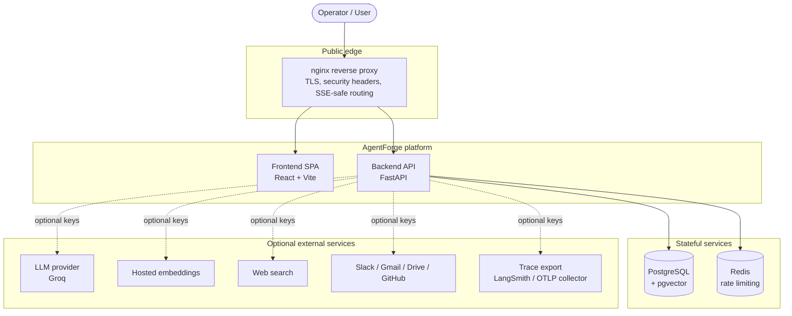
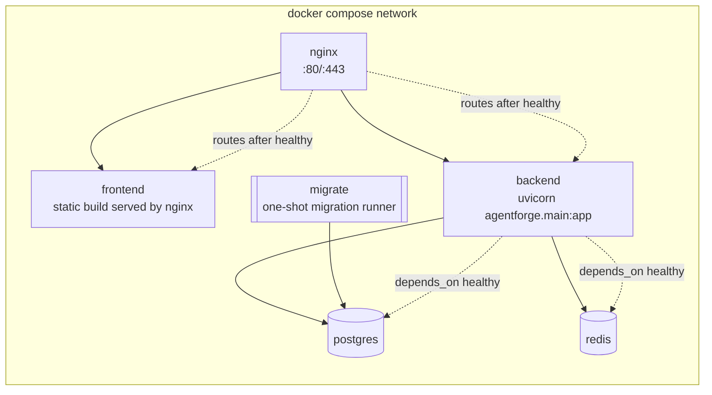
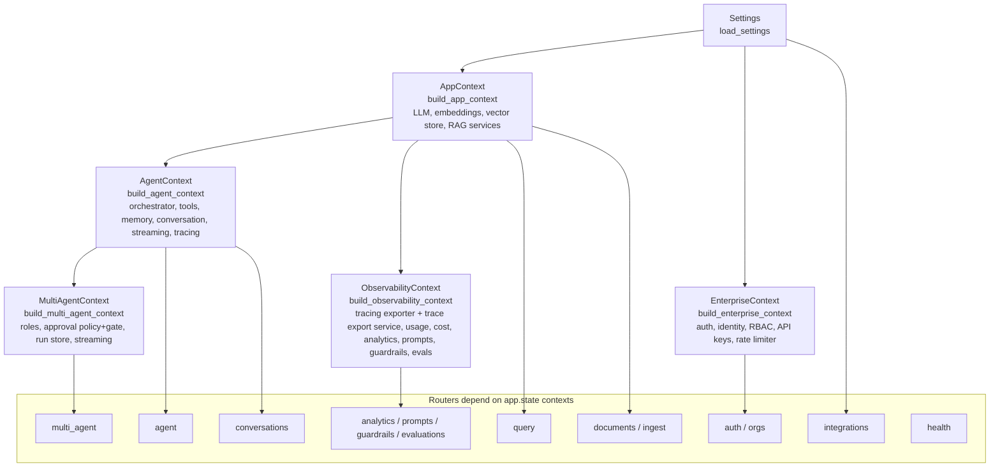
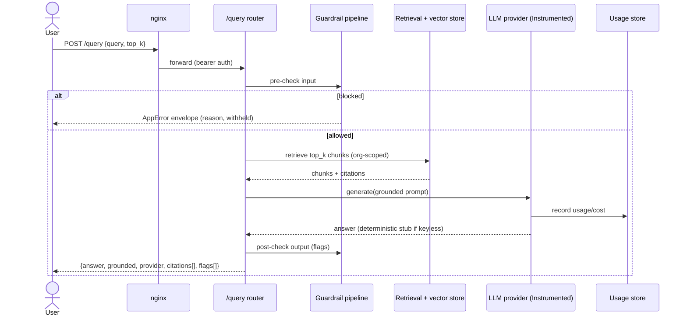
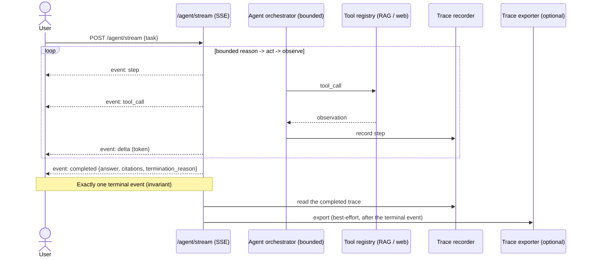
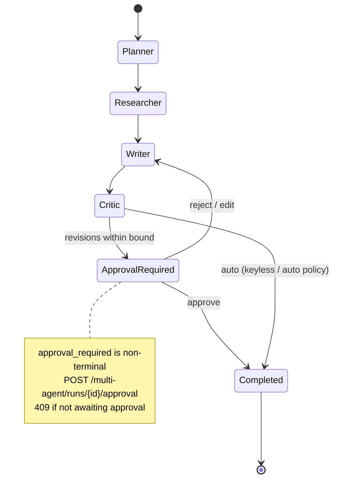
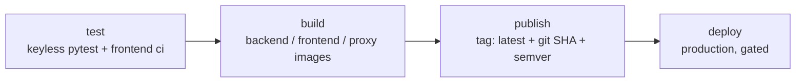

# AgentForge — Architecture Overview

> A visual, high-level tour of the v1.0 architecture. Diagrams are rendered with Mermaid. This document is descriptive of the merged `main` codebase; it does not change any behavior.

## 1. System context

Dashed edges are **optional** and inactive in keyless mode.

## 2. Deployment topology (docker compose)

- One command: `docker compose up --build` brings up the full stack, keyless, with migrations applied automatically (both on backend startup and via the one-shot `migrate` service).
- `docker-compose.production.yml` overlays secrets, TLS, and GHCR-published images without changing application code.

## 3. Backend composition root & context graph

The FastAPI `lifespan` builds nine object graphs once at startup via the single composition root `config/container.py`, and shares them on `app.state`. Tests pre-inject keyless in-memory doubles, which the lifespan respects.

Key principle: concrete implementations live only in `config/container.py`; every call site depends on an interface/seam, which is why keyless doubles can be swapped in transparently.

## 4. Request flow — RAG query

## 5. Streaming — single-agent SSE loop

**Post-run trace export.** Every finished run is handed to the configured
`Tracing_Exporter` (NoOp / LangSmith / OTLP) through the `Trace_Export_Service`, which reads
the assembled trace back from the recorder — the same trace the API serves. The attachment
point differs per path, and the reason is always the same: the run must already be complete
and its result already delivered.

| Run path | How export attaches |
|---|---|
| `POST /agent/run`, `POST /multi-agent/runs`, terminating approval decision | FastAPI **background task** — runs after the response is sent |
| `POST /agent/stream` | the streaming service's **completion hook** — after the single terminal event |
| `POST /multi-agent/runs/{id}/stream` | after the service's frame iterator is exhausted |

Every failure is swallowed (a broken exporter, an unreachable collector, a failing trace
read), the export short-circuits before touching the trace store when it is off, and
`GET /observability/status` reports which destination — if any — is active.

## 6. Multi-agent supervisor with human approval

## 7. Data model & migrations

Fourteen additive SQL migrations, one per phase area, applied in order on startup (halting and naming the failing id on error):

```mermaid
flowchart LR
    m1[0001 pgvector] --> m2[0002 core tables] --> m3[0003 conversations]
    m3 --> m4[0004 agent traces] --> m5[0005 multi-agent runs]
    m5 --> m6[0006 enterprise identity] --> m7[0007 org_id tenancy]
    m7 --> m8[0008 usage records] --> m9[0009 prompt registry]
    m9 --> m10[0010 evaluations] --> m11[0011 integration connections]
    m11 --> m12[0012 document content hash] --> m13[0013 audit events]
    m13 --> m14[0014 spend budgets]
```

All resources are `org_id`-scoped; cross-tenant access resolves to 404, never 403. Two tables
carry deliberate non-cascade rules: `usage_records.user_id` and `audit_events.actor_user_id`
are `ON DELETE SET NULL`, so deleting a user cannot erase the cost it incurred or the record
of what it did.

## 8. CI/CD pipeline

- Four independent jobs with dependencies; `deploy` and `publish` are skipped on PRs.
- Images tagged with `latest`, the git SHA, and a semantic version when available, enabling immediate rollback by pinning a prior tag.

## Architectural invariants (enforced across the codebase)

1. **Keyless-by-default** — full boot and demo with zero credentials.
2. **Single composition root** — concretes only in `config/container.py`.
3. **Tenancy** — `org_id` scoping; cross-tenant → 404.
4. **Secrets** — typed `SecretStr`, never logged.
5. **Uniform errors** — `AppError { error: {code, message, details} }`.
6. **Additive migrations** — never rewrite existing ones.
7. **Governance side channels never fail the work they govern** — trace export runs after the
   response, an audit write is fail-open by default (fail-closed reports `503
   audit_unavailable` on an *applied* change rather than pretending to roll it back), and a
   spend check that cannot compute spend allows the run.
7. **Streaming invariant** — exactly one terminal SSE event per run.
